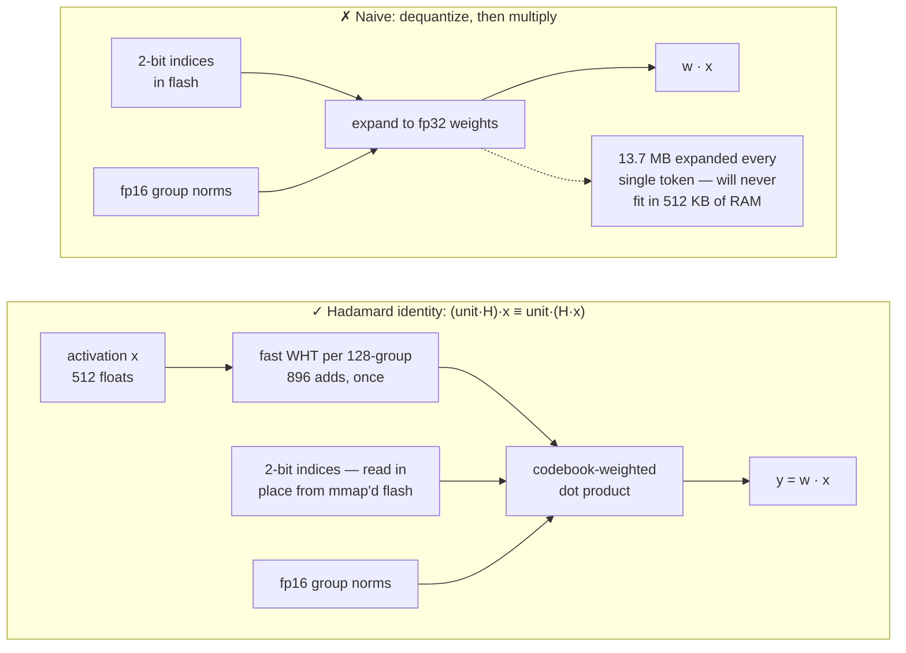
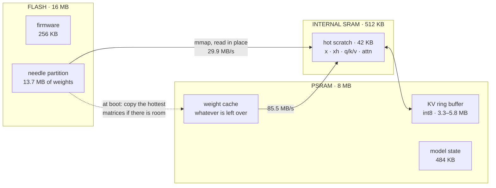
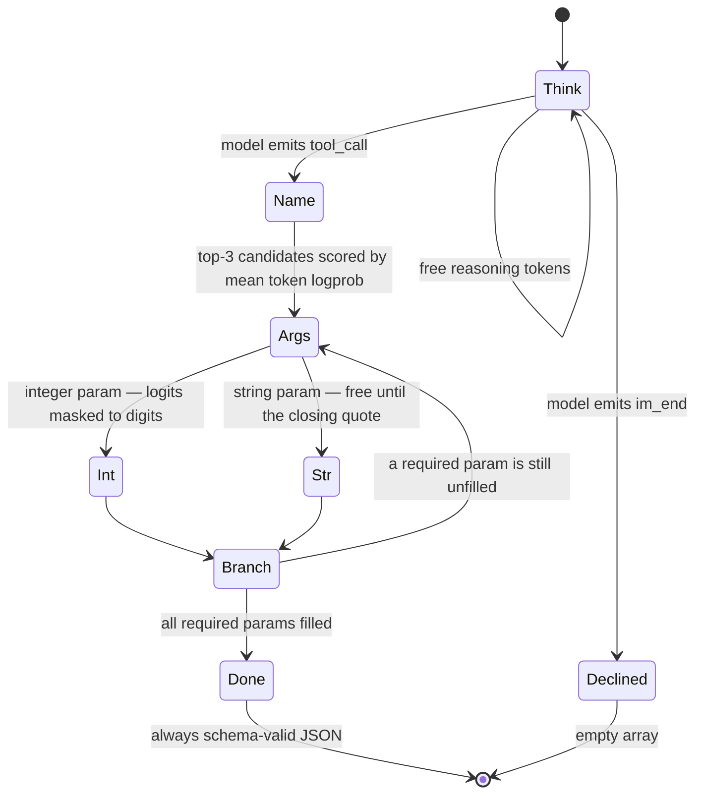
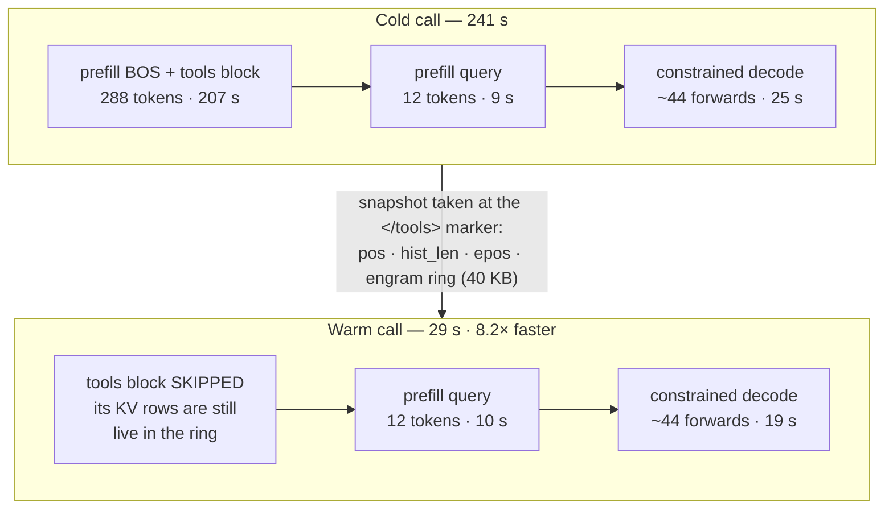
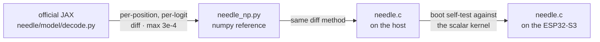

# mimimodel — a 45M-parameter tool-calling LLM running offline on a $5 ESP32-S3

A from-scratch, single-file C inference engine for [Cactus Compute's Needle 2](https://github.com/cactus-compute/needle),
running entirely on an ESP32-S3 microcontroller. No Linux, no Python, no network.
The 13.7 MB of weights live in flash and are **never** loaded into RAM.

🇺🇸 English · [🇯🇵 日本語](README_JA.md) · [🇪🇸 Español](README_ES.md) · [🇨🇳 中文](README_CN.md)

```
$ turn on pin 5
[{"name":"gpio_on","arguments":{"pin":5}}]
```

| | |
|---|---|
| **Model** | Needle 2 — 45M params, CQ 2-bit, 13.7 MB single file |
| **Hardware** | ESP32-S3, 240 MHz Xtensa LX7, 16 MB flash, 8 MB PSRAM (~$5) |
| **Engine** | one C99 file, ~2,000 lines, no dependencies beyond `libm` |
| **Speed** | warm tool call **29 s** · cold **241 s** · 1.4 tok/s prefill |
| **Memory** | 13.7 MB flash (memory-mapped) · ~7.7 MB PSRAM · 256 KB firmware |
| **Accuracy** | 50.4% on google/mobile-actions (961 cases, strict exact match) — the official engine scores 76.9% |

> **Honesty first:** this is slower than a cloud API by roughly 5×, it does not understand
> Chinese, it will happily call a tool when you say hello, and it scores well below the
> official engine on the same eval. See [Benchmark](#benchmark) and [Limitations](#limitations).
> What it buys you is a language model that works with the network cable pulled out.

---

## Why this wasn't just "compile the engine for Xtensa"

Cactus publishes both an [inference engine](https://github.com/cactus-compute/cactus) and the
[Needle model](https://github.com/cactus-compute/needle), and their site lists ESP32-S3 as a
supported target. The obvious plan — cross-compile the engine — turned out to be a dead end,
for two reasons found by reading the source:

1. **The open engine does not contain the Needle compute core.** Grepping the whole `cactus`
   repository for `engram` (a core component of the architecture) returns nothing. The engine
   knows the *name* `ModelType::NEEDLE` and how to format its prompts, but the layers themselves
   live in the prebuilt per-platform binaries shipped on Hugging Face.
2. **The kernels are ARM-only.** All 15 kernel source files `#include <arm_neon.h>` and use
   ~125 NEON intrinsics with no scalar fallback. Xtensa GCC also supports neither `_Float16`
   nor `__fp16`, which the kernels use ~770 times.

But the *model itself* is fully open. `needle/needle/model/` contains the architecture, the
quantizer, the decode loop, and — crucially — `export.py`, whose docstring is a complete byte-level
specification of the `.cact` weight format. That made a bespoke engine the right path, and a
much smaller one than a general-purpose runtime.

## How it works

### 1. The `.cact` format

A 120-byte header carries the full architecture geometry, followed by the shared Lloyd-Max
codebooks, a *nameless* tensor directory (tensors are positional, in a fixed canonical order),
then 64-byte-aligned blobs. Because the geometry rides in the header, one binary loads any
configuration of the architecture. Parsing it is ~150 lines of C.

### 2. Cactus Quants, and the trick that keeps weights in flash

A CQ-quantized `[out, in]` matrix is stored as 2-bit indices into a shared codebook on the unit
sphere, plus one fp16 L2 norm per 128-element group. Reconstruction per group is:

```
w_group = (codebook[idx] * norm) @ H        # H = normalized Walsh–Hadamard matrix
```

Dequantizing to compute `w · x` would mean expanding all 13.7 MB every single token. Instead the
engine exploits the fact that `H` is symmetric and orthogonal:

```
(unit · H) · x  ==  unit · (H · x)
```

So we transform the **activation** once per 128-wide group with a fast Walsh–Hadamard transform
(O(n log n), 896 adds), and then the matrix-vector product is a plain codebook-weighted dot
product read **directly off the packed 2-bit bytes**. The weights are never expanded, never
copied, and stay memory-mapped in flash via `esp_partition_mmap`. Model load takes **48 ms**.




### 3. Bounded memory

Needle uses a 256-token sliding attention window. The KV cache is int8 (the width the model was
post-trained for, per its own header) and lives in a **ring buffer** sized to the window plus a
small slack, so RAM is constant no matter how long the prompt is. A row is only overwritten
`kv_alloc` positions later, so any `kv_alloc > kv_window` keeps every in-window row intact.




### 4. Grammar-constrained decoding

A 45M model left to free-run produces almost-JSON. The engine instead drives the decode against
the tool schema, mirroring what the closed engine's grammar compiler does:

- structural text (`[{"name":"`, `","arguments":{`) is **forced**, but by masking logits to tokens
  that are a prefix of the required string — never by splicing token IDs — so the model's context
  stays canonical;
- the **tool name** is chosen by scoring each candidate's full mean token log-probability
  (teacher-forced with a cheap counter rewind), after a free first-token pre-rank keeps only the
  top 3 candidates;
- **integer arguments** are digit-masked; **required parameters** are forced to appear.




The payoff is that the output is always schema-valid — a 45M model left to free-run is not.
It does not close the gap to the official engine, which runs the same weights through its own
grammar compiler; see [Benchmark](#benchmark).

### 5. KV prefix cache — the single biggest win

In a tool-calling agent the `<tools>` block is byte-identical on every call and dominates the
prompt (288 of 300 tokens). Its KV rows stay live in the ring, so only the query needs prefilling.
The split point is the `</tools>` marker — markers are atomic tokens, so the prefix's tokenization
is provably a prefix of the whole prompt's.

**Cold call 241 s → warm call 29 s (8.2×).**




## The optimization log

Raw engine throughput, measured on hardware:

| Change | Effect |
|---|---|
| Baseline scalar C | 0.64 tok/s prefill, 0.59 decode |
| Dual-core split (matvec by rows, attention by KV heads) | ~1.8× |
| Skip the 8192×512 logits head during prefill | +10% prefill |
| Byte-LUT weight decode + quad-row kernel (4 rows share each activation load) | +18% |
| Hot scratch in internal SRAM, not PSRAM | +5% |
| PSRAM weight cache (opportunistic) | +8% |
| **Total** | **1.72 tok/s prefill (2.7×), 1.38 decode (2.3×)** |
| KV prefix cache (costs ~20% raw speed for a bigger ring) | **end-to-end 8.2×** |

### What did not work

- **ESP32-S3 PIE 128-bit SIMD.** Implemented in assembly (`ee.vmulas.s16.accx`, 8 MACs per
  instruction) with an int16 quantized activation path. Numerically correct (self-test relative
  error 5.5e-5) and **0.32× the speed** — 3× *slower*. The bottleneck is unpacking 2-bit weights
  into int16 lanes, not the multiply-accumulates, and PIE has no 2-bit unpack. The code is kept
  behind `-DNEEDLE_PIE`, off by default.
- **int16 arithmetic on the host.** 2.3× slower than float on ARM/x86, because the compiler
  auto-vectorizes the float loops. SIMD is not unconditionally a win.
- **Linear-space Sinkhorn.** Mathematically equivalent to the log-space version, but underflows
  to NaN. Keep the log-space one.

## Limitations

- **~29 s per call.** A cloud API answers the same question in 3–8 s. The value here is offline
  operation, zero API cost, and data never leaving the device — not latency.
- **Chinese does not work.** 0/5 on Chinese device commands. The official engine fails identically,
  so this is the model's boundary, not the port's. Its confidence score does drop to 0.02–0.22 on
  these, so they are at least detectable.
- **It will not decline.** Asked to tell a joke, the model still emits a tool call. Any production
  routing needs a confidence gate plus a text pre-filter.
- **Boolean/semantic arguments are unreliable.** `gpio_write(pin, state)` gets `state` wrong about
  half the time. Splitting it into `gpio_on(pin)` / `gpio_off(pin)` — matching the model's actual
  strengths, name selection and integer extraction — takes write accuracy from 1/5 to 5/6.
- **The confidence head is not implemented yet.** Its weights are present in the `.cact` file; the
  engine currently skips the probe heads.

## Build and run

### On a host (macOS / Linux)

```bash
mkdir -p model && cd model
curl -LO https://huggingface.co/Cactus-Compute/needle2/resolve/main/needle2.cact
cd ..
cc -O3 -o needle needle.c -lm
./needle model/needle2.cact "Set a timer for 10 minutes" \
  '[{"name":"set_timer","description":"Set a countdown timer","parameters":{"type":"object","properties":{"minutes":{"type":"integer","description":"Minutes"}},"required":["minutes"]}}]'
# [{"name":"set_timer","arguments":{"minutes":10}}]
```

Set `NEEDLE_FREE=1` for unconstrained decoding, `NEEDLE_REPEAT=n` to exercise the prefix cache.

### On the ESP32-S3

Requires ESP-IDF v5.5+, a board with 16 MB flash and 8 MB PSRAM.

```bash
cd needle-esp32s3
idf.py set-target esp32s3
idf.py build
./scripts/flash_weights.sh /dev/ttyUSB0        # 13.7 MB into the raw `needle` partition @ 0x210000
idf.py -p /dev/ttyUSB0 flash monitor
```

Boot runs a demo tool call, then drops into a serial REPL: type a query, press enter.

> ⚠️ Flash the app **before or together with** the weights. Any firmware whose partition table
> puts a SPIFFS region over the weight area will auto-format it on first boot and silently corrupt
> the model (this cost us an afternoon: flash read back `0xFFFF`, which becomes `NaN`).

### Files

| Path | What |
|---|---|
| `needle.c` | the engine — parser, kernels, tokenizer, constrained decoder, CLI |
| `needle_np.py` | numpy reference implementation, validated against the official JAX decode |
| `needle-esp32s3/` | ESP-IDF project (partition table, weight flasher, REPL demo) |
| `bench/` | evaluation harnesses: google/mobile-actions accuracy, speed, and the ESP32-S3 serial driver ([docs](bench/README.md)) |

### Development setup

The engine itself has no dependencies. The reference implementation and the benchmark do:

```bash
# the numpy reference and the JAX cross-check read the upstream package's source
git clone https://github.com/cactus-compute/needle
pip install numpy sentencepiece jax flax

# the benchmark additionally uses the official closed-source engine as an oracle
pip install cactus-needle
```

`needle_np.py` is a standalone numpy implementation of the model. `compare_jax.py` diffs it
against the official JAX decode loop inside the cloned `needle/` tree — that is the check that
caught both of the bugs described under [Correctness](#correctness).

## Benchmark

Scored on [google/mobile-actions](https://huggingface.co/datasets/google/mobile-actions)
(CC-BY-4.0) — the 961-case on-device function-calling eval published alongside
FunctionGemma — using its own metric, ordered strict exact match: function names,
call order and every argument must match.

| | this engine | official engine, same prompts | published |
|---|---|---|---|
| accuracy | 50.4% | 76.9% | 63.7% |
| tool-name accuracy | 78.9% | 99.2% | 98.3% |
| 1-call cases (640) | 60.8% | 75.6% | 71.3% |
| 2-call cases (320) | 29.7% | 79.4% | 48.4% |
| latency, median | 1748 ms | 530 ms | — |
| prefill · decode | 166 · 59 tok/s | 1504 · 869 tok/s | — |
| peak RSS | 20 MB | 165 MB | — |

The official closed-source engine, measured through this same harness, lands
within 0.9 points of its published tool-name accuracy. That agreement is what
says the harness is sound and the remaining gap is this engine's, not the
model's or the data's. Both measured columns sit above the published *accuracy*
because argument values are compared case-insensitively, which is more lenient
than the leaderboard and applies to both engines equally.

**Where the gap is, precisely.** Tool *selection* is close to matched on
single-call turns (94.7% against 99.8%). The gap is concentrated in the third of
the eval that expects more than one call: 29.7% against 79.4%. Splitting those
320 cases by how many calls each engine actually emitted isolates it further —
on the turns where this engine does emit two calls, it gets both names right 98%
of the time and the whole answer exact 61%, in line with its own single-call
rate. It just only reaches two calls on 48% of them, where the official engine
reaches it on 97%. The entire deficit is one binary stop-or-continue decision,
made here from a single logit comparison.
[`bench/README.md`](bench/README.md#multi-call) has the breakdown, the tuning
sweep, and the two bugs that had to be fixed before that number moved off zero.

On the host the engine is 3.3× slower end-to-end but 9–15× slower per token; it
is scalar C99 against a NEON-optimised ARM64 build, so most of that is
instruction set, not design.

**On the ESP32-S3**, the same cases take a median of 294 s each and the board's
answers are byte-for-byte identical to the host's on 11 of 12 sampled cases. That
parity is what lets the 961-case host accuracy stand as the device's accuracy —
running the full eval on the board would take about three days. The one
disagreement is not a porting bug: recompiling the *host* with `-ffast-math` flips
it to the board's exact answer, because the two candidate tools are 0.57 nats apart
and the greedy argmax is on a knife edge. The 294 s is this benchmark's worst case:
every record carries a different date, so the KV prefix cache never hits. With a
stable system prompt the same board answers in about 30 s.

[`bench/README.md`](bench/README.md) has the commands, the raw per-case results,
and what to avoid getting wrong when re-running any of it.

## Correctness

The engine was not written and hoped for. It was built as a chain of verified equivalences:

1. `needle_np.py` (numpy) was diffed **per position, per logit** against the official JAX
   `_forward_cached` from the `needle` package. Max difference: 3e-4.
2. `needle.c` was diffed against `needle_np.py` the same way.
3. On device, the firmware self-tests the SIMD kernel against the scalar one at boot.




Two bugs were found only because of this: the mHC `a_pre`/`a_post`/`a_res` tensors are per-layer
*scalars* (broadcasting hid it in numpy, it was an out-of-bounds read in C), and the engram `taps`
are per-channel `(4, 512)` vectors, not 4 scalars.

## Credits

This project is an *engine*. The model, the architecture, the quantization scheme and the format
are all other people's work.

- **[Cactus Compute](https://cactuscompute.com)** — the [Needle 2 model](https://huggingface.co/Cactus-Compute/needle2)
  (Apache-2.0), the [`needle` Python package](https://github.com/cactus-compute/needle) (MIT) whose
  `export.py` / `decode.py` / `architecture.py` are the specification this engine implements, and
  the [`cactus` engine](https://github.com/cactus-compute/cactus). Cactus Quants and the `.cact`
  format are theirs.
- **Ndubuaku, H., Mosoyan, K., Mroz, J., Cylich, N., Kumar, S., Sandhu, P., Shemet, R., & Lee, J. H.**
  *A Controlled Study of Attention-Only Transformers.* [arXiv:2607.18363](https://arxiv.org/abs/2607.18363)
  — the Simple Attention Network architecture Needle is built on.
- **[slvDev/esp32-ai](https://github.com/slvDev/esp32-ai)** — prior art that demonstrated a
  28.9M-parameter LLM on an ESP32-S3 at 9.9 tok/s using Per-Layer Embeddings. It is what made this
  look worth attempting.
- **[Andrej Karpathy, llama2.c](https://github.com/karpathy/llama2.c)** — the single-file,
  dependency-free C inference engine this one is shaped after.
- **[Espressif](https://github.com/espressif/esp-idf)** — ESP-IDF, and
  [esp-dsp](https://github.com/espressif/esp-dsp), whose `dspi_dotprod_s16_aes3.S` was the working
  reference for ESP32-S3 PIE vector instruction syntax.
- **[SentencePiece](https://github.com/google/sentencepiece)** — the BPE tokenizer model the
  `.cact` tokenizer blob is a dump of.
- Walsh–Hadamard transforms and Lloyd-Max quantization are classical; the specific application of
  the Hadamard identity to avoid dequantization is Cactus's design, described in `export.py`.

## License

The engine code in this repository is MIT-licensed. The Needle 2 weights are Apache-2.0 and are
**not** redistributed here — download them from Hugging Face. The `needle` and `cactus`
repositories retain their own licenses.
