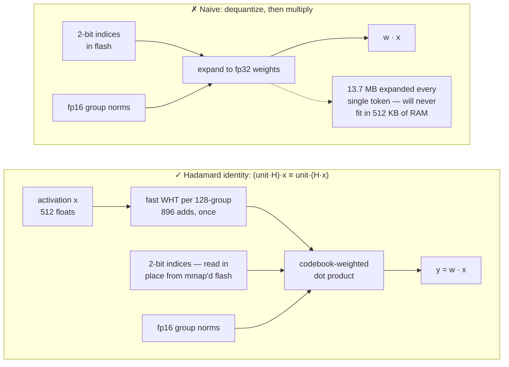
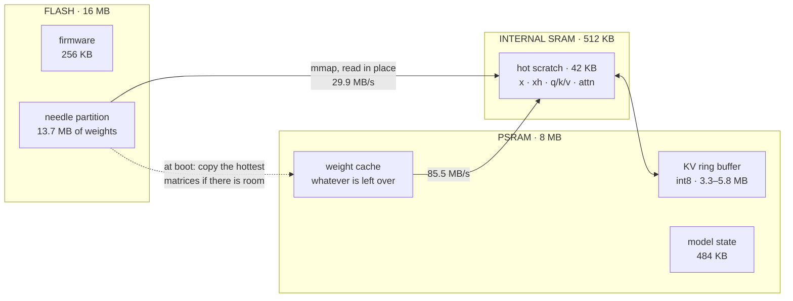
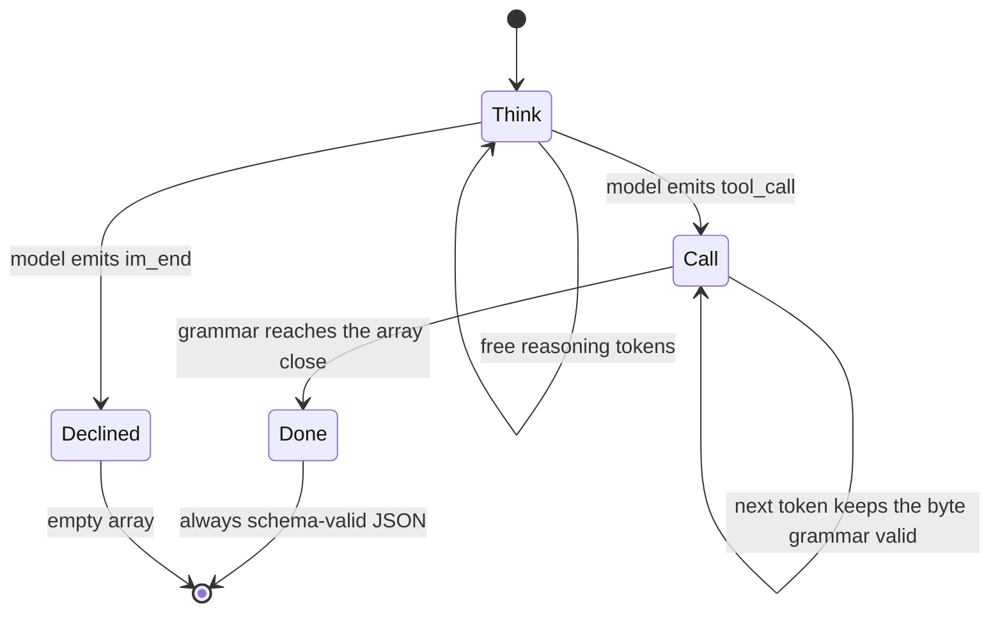
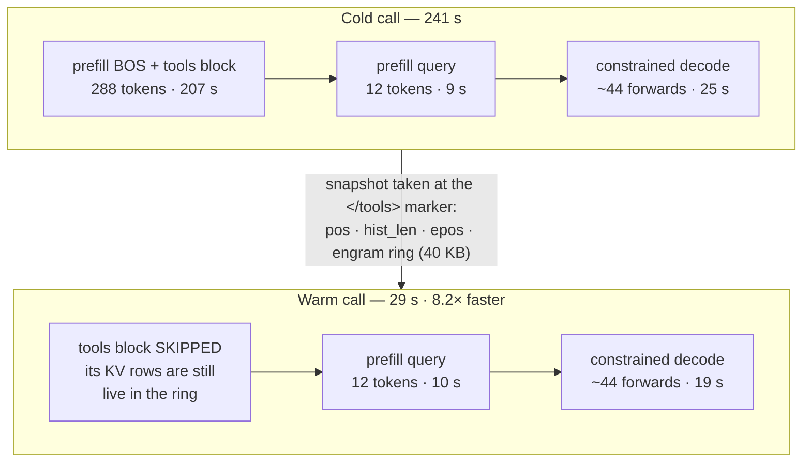
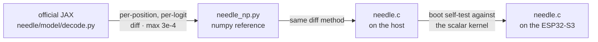

# MimiModel: Tool calling LLM on a $5 chip.


<p>
  <a href="LICENSE"></a>
  <a href="https://discord.gg/r8ZxSvB8Yr"></a>
  <a href="https://x.com/ssslvky"></a>
</p>

MimiModel is an engine that runs a 45M-parameter LLM for tool calling, device control, and
structured extraction on a $5 ESP32-S3.

A from-scratch, single-file C inference engine for [Cactus Compute's Needle 2](https://github.com/cactus-compute/needle),
running entirely on an ESP32-S3 microcontroller. No Linux, no Python, no network.
The 13.7 MB of weights live in flash and are **never** loaded into RAM.

🇺🇸 English · [🇯🇵 日本語](README_JA.md) · [🇪🇸 Español](README_ES.md) · [🇨🇳 中文](README_CN.md)

```
$ turn on pin 5
[{"name":"gpio_on","arguments":{"pin":5}}]
```

| | |
|---|---|
| **Model** | Needle 2 — 45M params, CQ 2-bit, 13.7 MB single file |
| **Hardware** | ESP32-S3, 240 MHz Xtensa LX7, 16 MB flash, 8 MB PSRAM (~$5) |
| **Engine** | one C99 file, ~2,000 lines, no dependencies beyond `libm` |
| **ESP32 speed** | fixed one-tool: **2.07 tok/s prefill · 1.69 tok/s decode** · 15.266 s warm · 33.382 s cold |
| **Memory** | 13.7 MB flash (memory-mapped) · ~7.7 MB PSRAM · 256 KB firmware |
| **Accuracy** | **69.6%** on google/mobile-actions (961 cases, strict) — official engine 2.0.2: 69.2% on identical inputs |

> **Honesty first:** this is several times slower than a cloud API, it does not understand
> Chinese, and it will happily call a tool when you say hello. Its strict score now matches the
> official engine, but its name and error distributions still differ. See [Benchmark](#benchmark) and [Limitations](#limitations).
> What it buys you is a language model that works with the network cable pulled out.

---

## How Cactus fails here?

The published engine reaches two Xtensa blockers: Needle's compute core ships in prebuilt
binaries, and the open kernels target ARM NEON. The open `.cact` model specification still
provides enough information to build a compact ESP32-S3 engine directly.

[Read the source-level breakdown](docs/how-it-fails.md).

## Quickstart

### 1. Install the host CLI

```bash
python3 -m venv .venv
. .venv/bin/activate
python -m pip install -e .
```

Run `mimimodel` from a macOS or Linux host terminal. The CLI keeps one serial connection open so
the ESP32-S3 can reuse its KV prefix cache between commands.

### 2. Build and flash once

Requires ESP-IDF v5.5+, a board with 16 MB flash and 8 MB PSRAM, and
`model/needle2.cact` downloaded from [Hugging Face](https://huggingface.co/Cactus-Compute/needle2).
Replace `/dev/ttyUSB0` with the board's port; macOS ports usually begin with `/dev/cu.usbmodem`.

```bash
cd needle-esp32s3
idf.py set-target esp32s3
idf.py -DNEEDLE_FAST_MATH=ON build
idf.py -p /dev/ttyUSB0 flash
./scripts/flash_weights.sh /dev/ttyUSB0        # 13.7 MB into `needle` @ 0x210000
cd ..
```

Do not leave `idf.py monitor` running: the CLI needs the serial port.
Fast math is the default for maximum device speed. Use `-DNEEDLE_FAST_MATH=OFF` only when
reproducing the IEEE-style parity baseline.
The accuracy-aligned defaults keep 160 prefix tokens, allow 256 reasoning tokens, and use the
continuous byte grammar. ESP-IDF exposes them as `NEEDLE_PREFIX_SINK_TOKENS`,
`NEEDLE_REASON_MAX_TOKENS`, and `NEEDLE_BYTE_GRAMMAR`.

### 3. Add tools

```bash
mimimodel tools import examples/tools/demo.json --profile demo --activate
mimimodel tools list
```

Tool schemas are configured at runtime. The firmware has seven fallback mobile-action schemas in
[`DEMO_TOOLS`](needle-esp32s3/main/main.c#L19-L22), and the CLI sends the active profile with every
request. Edit a JSON file and run `mimimodel tools add FILE`, `tools remove NAME`, or
`tools import FILE` to change tools without rebuilding the firmware or replacing the weights.
Use `mimimodel tools validate FILE` before importing a new schema.
The bundled three-tool profile stays below the engine's 180-token retrieval budget. Larger profiles
remain valid, but query-dependent tool pruning can change the effective prefix and prevent a cache
hit.

### 4. Run

```bash
# Simple tool call
mimimodel run "Turn on the flashlight."
# [{"name":"turn_on_flashlight","arguments":{}}]

# Multi-tool call with structured extraction
mimimodel run 'Create a calendar event titled "ESP32 demo" for 2026-08-21 at 14:30, then email ada@example.com with the subject "Demo confirmed".'
# [{"name":"create_calendar_event","arguments":{"title":"ESP32 demo","datetime":"2026-08-21T14:30:00"}},{"name":"send_email","arguments":{"subject":"Demo confirmed","to":"ada@example.com"}}]
```

The first `run` starts a background serial daemon and resets the board once. Later calls with the
same tool profile keep the connection and cached prefix. `mimimodel status` shows the port, firmware
build, and prefix hash; `mimimodel daemon stop` releases the port. The model expects English
input. The command returns tool-call JSON but does not execute the selected tools.

The multi-tool output selects both tools and extracts the timestamp, email address, event title,
and subject. Latency depends on the selected schema, query length, and generated calls. For a
reproducible reference, the default fastest build (`fast_math=1`) with one fixed tool took **33.382 s**
cold and **15.266 s** after a prefix-cache hit on the board above (2026-08-22). Both runs returned
the same JSON shown in the simple example. See [Benchmark](#benchmark) for the exact conditions.

> ⚠️ Flash the app **before or together with** the weights. Any firmware whose partition table
> puts a SPIFFS region over the weight area will auto-format it on first boot and silently corrupt
> the model (this cost us an afternoon: flash read back `0xFFFF`, which becomes `NaN`).

## How it works

### 1. The `.cact` format

A 120-byte header carries the full architecture geometry, followed by the shared Lloyd-Max
codebooks, a *nameless* tensor directory (tensors are positional, in a fixed canonical order),
then 64-byte-aligned blobs. Because the geometry rides in the header, one binary loads any
configuration of the architecture. Parsing it is ~150 lines of C.

### 2. Cactus Quants, and the trick that keeps weights in flash

A CQ-quantized `[out, in]` matrix is stored as 2-bit indices into a shared codebook on the unit
sphere, plus one fp16 L2 norm per 128-element group. Reconstruction per group is:

```
w_group = (codebook[idx] * norm) @ H        # H = normalized Walsh–Hadamard matrix
```

Dequantizing to compute `w · x` would mean expanding all 13.7 MB every single token. Instead the
engine exploits the fact that `H` is symmetric and orthogonal:

```
(unit · H) · x  ==  unit · (H · x)
```

So we transform the **activation** once per 128-wide group with a fast Walsh–Hadamard transform
(O(n log n), 896 adds), and then the matrix-vector product is a plain codebook-weighted dot
product read **directly off the packed 2-bit bytes**. The weights are never expanded, never
copied, and stay memory-mapped in flash via `esp_partition_mmap`. Model load takes **48 ms**.




### 3. Bounded memory

Needle uses a 256-token recent attention window. MimiModel protects the first 160 prompt tokens
as an attention sink and keeps the latest 256 beside them. The int8 KV cache therefore stays at
416 physical rows, the same allocation as the old ring, while retaining system instructions and
the start of the tool block throughout decode.




### 4. Grammar-constrained decoding

A 45M model left to free-run produces almost-JSON. MimiModel validates every byte of each
candidate token against one continuous grammar compiled from the active tool schemas. Tokens may
cross JSON structural boundaries naturally, tool and parameter names stay within the schema,
required parameters must appear, and integer values remain numeric. No structural fragment is
teacher-forced in a separate model step.




The payoff is schema-valid output without changing the model's natural token history. This was
the largest accuracy fix in the official-engine attribution; see [Benchmark](#benchmark).

### 5. KV prefix cache — the single biggest win

In a tool-calling agent the `<tools>` block is byte-identical on every call and dominates the
prompt (288 of 300 tokens). Its KV rows stay live in the ring, so only the query needs prefilling.
The split point is the `</tools>` marker — markers are atomic tokens, so the prefix's tokenization
is provably a prefix of the whole prompt's.

**Historical three-tool trace: cold 241 s → warm 29 s (8.2×).** The current TIE728 build is
faster; this trace remains useful because it shows where the cache removes work phase by phase.




## The optimization log

Raw engine throughput, measured on hardware:

| Change | Effect |
|---|---|
| Baseline scalar C | 0.64 tok/s prefill, 0.59 decode |
| Dual-core split (matvec by rows, attention by KV heads) | ~1.8× |
| Skip the 8192×512 logits head during prefill | +10% prefill |
| Byte-LUT weight decode + quad-row kernel (4 rows share each activation load) | +18% |
| Hot scratch moved to internal SRAM | +5% |
| PSRAM weight cache (opportunistic) | +8% |
| TIE728 aligned float loads + 2-row/8-accumulator CQ2 kernel | 512×512 matvec: 5.272 → 3.781 ms single-core; 2.700 → 1.960 ms dual-core |
| Cross-operator scheduling (mHC/Sinkhorn and gate work run during independent core-0 work) | 5.9% lower cold latency; 5.6% lower warm latency |
| **Default fastest one-tool run** | **2.07 tok/s prefill, 1.69 decode; 33.382 s cold, 15.266 s warm** |
| KV prefix cache (costs ~20% raw speed for a bigger ring) | **end-to-end 8.2×** |

### What did not work

- **Dense int16 PIE path.** Implemented in assembly (`ee.vmulas.s16.accx`, 8 MACs per
  instruction) with an int16 quantized activation path. Numerically correct (self-test relative
  error 5.5e-5) and **0.32× the speed** — 3× *slower*. Unpacking 2-bit weights into int16 lanes
  dominates runtime, while PIE has no 2-bit unpack instruction and multiply-accumulates account
  for a smaller share. The code is kept
  behind `-DNEEDLE_PIE`, off by default. The current TIE728 kernel succeeds by keeping CQ2 decode
  in its byte-LUT form and using vector float loads and accumulators instead of widening weights.
- **int16 arithmetic on the host.** 2.3× slower than float on ARM/x86, because the compiler
  auto-vectorizes the float loops. SIMD gains depend on data layout and instruction coverage.
- **Linear-space Sinkhorn.** Mathematically equivalent to the log-space version, but underflows
  to NaN. Keep the log-space one.
- **Two-token blocked CQ2 kernel.** Reusing each packed weight load across two activation vectors
  was numerically correct but only 1.11× faster for the paired matvec. A complete blocked target
  path for DFlash-style verification would add substantially more state and causal-attention work.
  The prototype was removed; the measurements are in the
  [operator-overlap audit](docs/esp32s3-overlap-audit.md).

## Limitations

- **Latency is schema-dependent.** The controlled one-tool workload takes 15.266 s warm and
  33.382 s cold; larger schemas and multi-call outputs can take minutes. A cloud API remains much
  faster. The value here comes from offline operation, zero API cost, and keeping data on-device.
- **Chinese is unsupported by the model.** Chinese device commands score 0/5, with identical
  failures in the official engine. This places the limitation in the model itself. Confidence
  still drops to 0.02–0.22 on these cases, making them detectable.
- **It will not decline.** Asked to tell a joke, the model still emits a tool call. Any production
  routing needs a confidence gate plus a text pre-filter.
- **Boolean/semantic arguments are unreliable.** `gpio_write(pin, state)` gets `state` wrong about
  half the time. Splitting it into `gpio_on(pin)` / `gpio_off(pin)` — matching the model's actual
  strengths, name selection and integer extraction — takes write accuracy from 1/5 to 5/6.
- **The confidence head is not implemented yet.** Its weights are present in the `.cact` file; the
  engine currently skips the probe heads.

## Development

### Files

| Path | What |
|---|---|
| `needle.c` | the engine — parser, kernels, tokenizer, constrained decoder, CLI |
| `mimimodel_cli.py` | host CLI, tool profiles, and persistent serial daemon |
| `examples/tools/demo.json` | editable runtime tool-schema example |
| `needle_np.py` | numpy reference implementation, validated against the official JAX decode |
| `needle-esp32s3/` | ESP-IDF project (partition table, weight flasher, REPL demo) |
| `bench/` | evaluation harnesses: google/mobile-actions accuracy, speed, and the ESP32-S3 serial driver ([docs](bench/README.md)) |

### Development setup

The C engine itself has no dependencies. `pip install -e .` installs the host CLI and pyserial.
The reference implementation and benchmark need the additional packages below:

```bash
# the numpy reference and the JAX cross-check read the upstream package's source
git clone https://github.com/cactus-compute/needle
pip install numpy sentencepiece jax flax

# the benchmark additionally uses the official closed-source engine as an oracle
pip install cactus-needle
```

`needle_np.py` is a standalone numpy implementation of the model. `compare_jax.py` diffs it
against the official JAX decode loop inside the cloned `needle/` tree — that is the check that
caught both of the bugs described under [Correctness](#correctness).

## Benchmark

Scored on [google/mobile-actions](https://huggingface.co/datasets/google/mobile-actions)
(CC-BY-4.0) — the 961-case on-device function-calling eval published alongside
FunctionGemma — scored here with ordered strict exact match: function names, call
order and every argument must match. The current engine was rerun on 2026-08-22;
the official column reuses its directly comparable artifact because the engine and
dataset hashes are unchanged. Both use each record's own tool order, native retrieval,
separate developer/user turns, and preserved whitespace.

| | this engine | official engine, same records/schemas |
|---|---|---|
| accuracy | **69.6%** | 69.2% |
| tool-name accuracy | 90.8% | **98.1%** |
| 1-call cases (640) | **76.2%** | 73.6% |
| 2-call cases (320) | 56.2% | **60.3%** |

The old engine scored 469/961 (48.8%). The official dylib and this repo contain
byte-identical weights, so the loss was traced through paired ablations: a
90-token reasoning cutoff recovered 44 rows when raised to 256, preserving the
prompt prefix recovered another 63, and replacing segmented teacher-forcing with
one continuous byte grammar recovered 96. The 160-token prefix cap loses three
rows versus a full prefix while fitting the existing ESP32 KV allocation.

Strict accuracy is now slightly above the official run, but the engines do not
make the same mistakes. MimiModel still has lower name accuracy and more
under-calls, while it wins more argument rows. The full evidence chain and raw
paired reports are in
[Official Needle accuracy gap: root-cause report](docs/official-engine-accuracy-gap.md).

Cactus publishes 63.7% exact and 98.3% name accuracy for Needle 2 on the same
named split and metric. The current public Python package (2.0.6, engine 2.0.2)
scores 69.2%/98.1% through this harness. Because the site does not publish its
prompt/schema conversion, selected-tool traces, raw rows, or binary hash, the
5.5-point exact-match difference is not attributable; the site value is kept as
an external reference, not merged with the directly comparable columns above.

**Local M4 benchmark (2026-08-22):** 200 canonical-order, native-retrieval cases,
run serially on an Apple M4 with 16 GB RAM. This engine measured 191 prefill / 141
decode tok/s with 2259 ms median completion latency. The unchanged official engine
2.0.2 measured 1204/702 tok/s, 665 ms completion, or 948 ms including its 293 ms
median initialization. These are actual phase timers; the old numbers incorrectly
divided phase token counts by whole-request time.
[Commands, hashes, raw artifacts, and attribution](docs/benchmark-20260822.md)
are recorded separately.

**Current real ESP32-S3 speed (2026-08-22):** the default fastest build
(`fast_math=1`, `profile=0`) ran a fixed one-tool prompt in 33.382 s cold
and 15.266 s warm. Cold prefill/decode reached 2.07/1.69 tok/s; all five runs
emitted identical flashlight calls. Its TIE728 boot self-test passed with maximum
absolute error 8.583e-06. A 252-token mobile-actions row completed strict exact in
158.111 s, 6.5% faster than the previous firmware, and matched the host byte for byte.
A complex 333-token mobile-actions input completed two
strict-exact tool calls in 413.742 s and matched the current host output byte for
byte. Three earlier selected rows took 169.1/319.6/255.4 s and also matched the
host; these device samples are parity checks, not an accuracy estimate.
[Overlap design, settings, rejected experiments, and raw evidence](docs/esp32s3-overlap-audit.md)
are preserved separately.

**Pre-TIE728 audit (2026-08-19):** the same 240 MHz rev 0.2 board with 8 MB octal
PSRAM measured 42.895/20.067 s cold/warm on the fixed one-tool workload. Its
then-optional `-ffast-math` reached 41.541/19.444 s. Two corrected-protocol rows matched the
standard host byte-for-byte. Full raw data is in
[`bench/results/device_protocol_audit_20260819.json`](bench/results/device_protocol_audit_20260819.json).

The standard fair build was also run on a fixed-seed proportional sample (8
single-call + 4 two-call rows): 5/12 strict exact, 9/12 names, median 315.5 s,
and median 1.39/1.11 prefill/decode tok/s. The exact 95% Wilson interval is
19.3-68.0%, so this is not a population estimate. Raw output matched arm64 on
10/12 rows, while strict/name pass-fail matched on 12/12. One request exceeded
650 s after eight continuous rows but completed in 355.9 s after reset; the
excluded timeout is retained as a stability finding.

[`bench/README.md`](bench/README.md) has the commands, the raw per-case results,
and what to avoid getting wrong when re-running any of it.

## Correctness

The engine follows a chain of verified equivalences:

1. `needle_np.py` (numpy) was diffed **per position, per logit** against the official JAX
   `_forward_cached` from the `needle` package. Max difference: 3e-4.
2. `needle.c` was diffed against `needle_np.py` the same way.
3. On device, the firmware self-tests the SIMD kernel against the scalar one at boot.




Two bugs were found only because of this: the mHC `a_pre`/`a_post`/`a_res` tensors are per-layer
*scalars* (broadcasting hid it in numpy, it was an out-of-bounds read in C), and the engram `taps`
use a per-channel `(4, 512)` vector layout that the original implementation read as 4 scalars.

## Credits

This project is an *engine*. The model, the architecture, the quantization scheme and the format
are all other people's work.

- **[Cactus Compute](https://cactuscompute.com)** — the [Needle 2 model](https://huggingface.co/Cactus-Compute/needle2)
  (Apache-2.0), the [`needle` Python package](https://github.com/cactus-compute/needle) (MIT) whose
  `export.py` / `decode.py` / `architecture.py` are the specification this engine implements, and
  the [`cactus` engine](https://github.com/cactus-compute/cactus). Cactus Quants and the `.cact`
  format are theirs.
- **Ndubuaku, H., Mosoyan, K., Mroz, J., Cylich, N., Kumar, S., Sandhu, P., Shemet, R., & Lee, J. H.**
  *A Controlled Study of Attention-Only Transformers.* [arXiv:2607.18363](https://arxiv.org/abs/2607.18363)
  — the Simple Attention Network architecture Needle is built on.
- **[slvDev/esp32-ai](https://github.com/slvDev/esp32-ai)** — prior art that demonstrated a
  28.9M-parameter LLM on an ESP32-S3 at 9.9 tok/s using Per-Layer Embeddings. It is what made this
  look worth attempting.
- **[Andrej Karpathy, llama2.c](https://github.com/karpathy/llama2.c)** — the single-file,
  dependency-free C inference engine this one is shaped after.
- **[Espressif](https://github.com/espressif/esp-idf)** — ESP-IDF,
  [esp-dsp](https://github.com/espressif/esp-dsp), and
  [esp-dl](https://github.com/espressif/esp-dl). Their Xtensa assembly provided working references
  for ESP32-S3 PIE/TIE728 syntax, aligned vector loads, and accumulator scheduling.
- **[SentencePiece](https://github.com/google/sentencepiece)** — the BPE tokenizer model the
  `.cact` tokenizer blob is a dump of.
- Walsh–Hadamard transforms and Lloyd-Max quantization are classical; the specific application of
  the Hadamard identity to avoid dequantization is Cactus's design, described in `export.py`.

## License

The engine code in this repository is MIT-licensed. The Needle 2 weights are Apache-2.0 and are
**not** redistributed here — download them from Hugging Face. The `needle` and `cactus`
repositories retain their own licenses.
