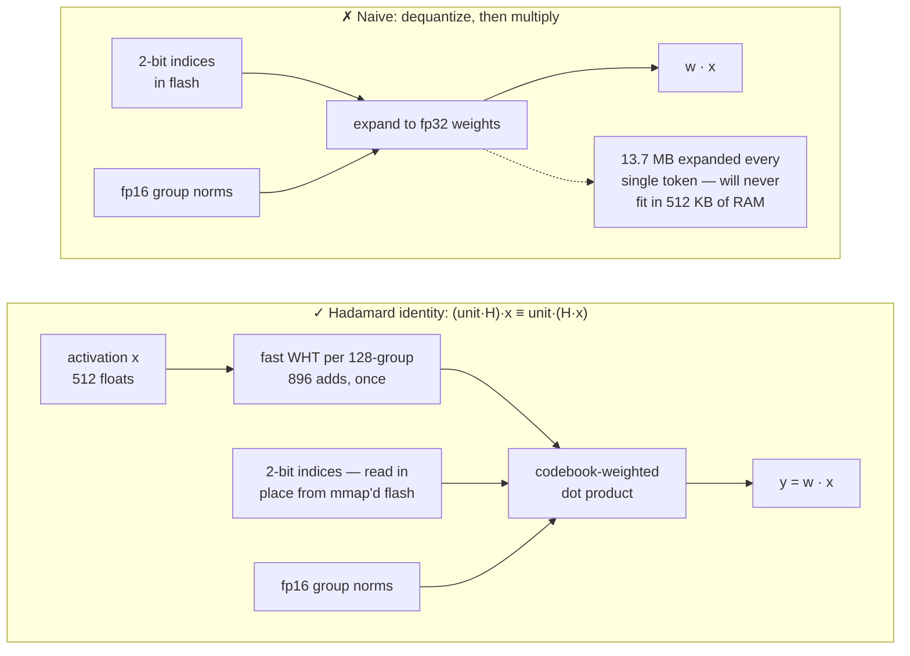
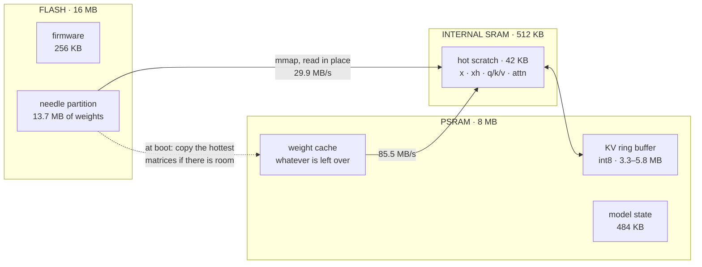
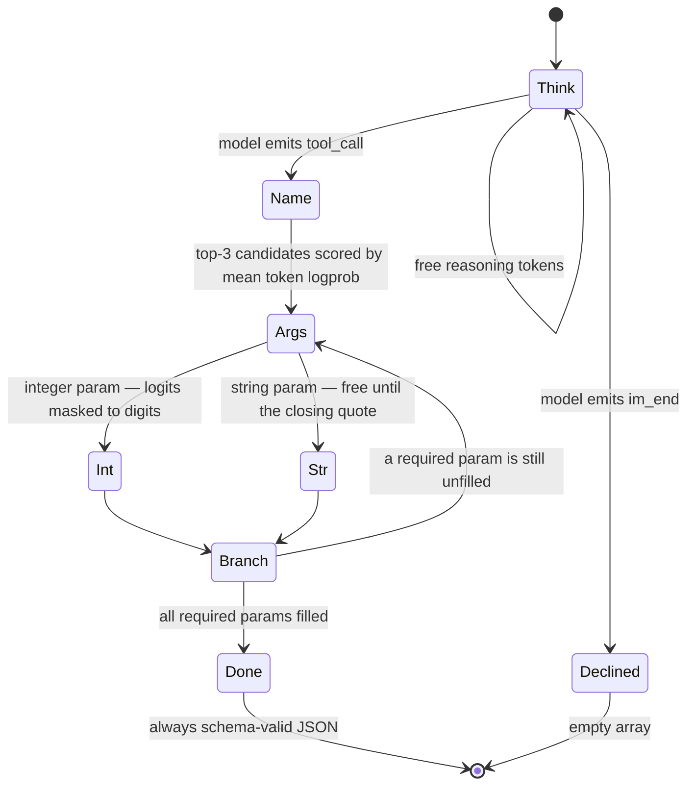
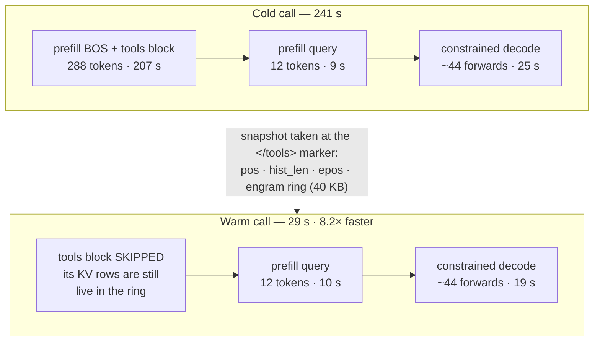
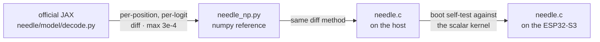

# mimimodel — a 45M-parameter tool-calling LLM running offline on a $5 ESP32-S3

A from-scratch, single-file C inference engine for [Cactus Compute's Needle 2](https://github.com/cactus-compute/needle),
running entirely on an ESP32-S3 microcontroller. No Linux, no Python, no network.
The 13.7 MB of weights live in flash and are **never** loaded into RAM.

🇺🇸 English · [🇯🇵 日本語](README_JA.md) · [🇪🇸 Español](README_ES.md) · [🇨🇳 中文](README_CN.md)

```
$ turn on pin 5
[{"name":"gpio_on","arguments":{"pin":5}}]
```

| | |
|---|---|
| **Model** | Needle 2 — 45M params, CQ 2-bit, 13.7 MB single file |
| **Hardware** | ESP32-S3, 240 MHz Xtensa LX7, 16 MB flash, 8 MB PSRAM (~$5) |
| **Engine** | one C99 file, ~2,000 lines, no dependencies beyond `libm` |
| **Speed** | warm tool call **29 s** · cold **241 s** · 1.4 tok/s prefill |
| **Memory** | 13.7 MB flash (memory-mapped) · ~7.7 MB PSRAM · 256 KB firmware |
| **Accuracy** | 49.3% on google/mobile-actions (961 cases, strict) — official engine 2.0.2 scores 69.2% on identical inputs |

> **Honesty first:** this is slower than a cloud API by roughly 5×, it does not understand
> Chinese, it will happily call a tool when you say hello, and it scores well below the
> official engine on the same eval. See [Benchmark](#benchmark) and [Limitations](#limitations).
> What it buys you is a language model that works with the network cable pulled out.

---

## How it fails?

The published engine reaches two Xtensa blockers: Needle's compute core ships in prebuilt
binaries, and the open kernels target ARM NEON. The open `.cact` model specification still
provides enough information to build a compact ESP32-S3 engine directly.

[Read the source-level breakdown](docs/how-it-fails.md).

## How it works

### 1. The `.cact` format

A 120-byte header carries the full architecture geometry, followed by the shared Lloyd-Max
codebooks, a *nameless* tensor directory (tensors are positional, in a fixed canonical order),
then 64-byte-aligned blobs. Because the geometry rides in the header, one binary loads any
configuration of the architecture. Parsing it is ~150 lines of C.

### 2. Cactus Quants, and the trick that keeps weights in flash

A CQ-quantized `[out, in]` matrix is stored as 2-bit indices into a shared codebook on the unit
sphere, plus one fp16 L2 norm per 128-element group. Reconstruction per group is:

```
w_group = (codebook[idx] * norm) @ H        # H = normalized Walsh–Hadamard matrix
```

Dequantizing to compute `w · x` would mean expanding all 13.7 MB every single token. Instead the
engine exploits the fact that `H` is symmetric and orthogonal:

```
(unit · H) · x  ==  unit · (H · x)
```

So we transform the **activation** once per 128-wide group with a fast Walsh–Hadamard transform
(O(n log n), 896 adds), and then the matrix-vector product is a plain codebook-weighted dot
product read **directly off the packed 2-bit bytes**. The weights are never expanded, never
copied, and stay memory-mapped in flash via `esp_partition_mmap`. Model load takes **48 ms**.




### 3. Bounded memory

Needle uses a 256-token sliding attention window. The KV cache is int8 (the width the model was
post-trained for, per its own header) and lives in a **ring buffer** sized to the window plus a
small slack, so RAM is constant no matter how long the prompt is. A row is only overwritten
`kv_alloc` positions later, so any `kv_alloc > kv_window` keeps every in-window row intact.




### 4. Grammar-constrained decoding

A 45M model left to free-run produces almost-JSON. The engine instead drives the decode against
the tool schema, mirroring what the closed engine's grammar compiler does:

- structural text (`[{"name":"`, `","arguments":{`) is **forced**. The decoder masks logits to
  tokens that are a prefix of the required string, avoiding direct token-ID splicing and keeping
  the model's context canonical;
- the **tool name** is chosen by scoring each candidate's full mean token log-probability
  (teacher-forced with a cheap counter rewind), after a free first-token pre-rank keeps only the
  top 3 candidates;
- **integer arguments** are digit-masked; **required parameters** are forced to appear.




The payoff is that the output is always schema-valid — a 45M model left to free-run is not.
It does not close the gap to the official engine, which runs the same weights through its own
grammar compiler; see [Benchmark](#benchmark).

### 5. KV prefix cache — the single biggest win

In a tool-calling agent the `<tools>` block is byte-identical on every call and dominates the
prompt (288 of 300 tokens). Its KV rows stay live in the ring, so only the query needs prefilling.
The split point is the `</tools>` marker — markers are atomic tokens, so the prefix's tokenization
is provably a prefix of the whole prompt's.

**Cold call 241 s → warm call 29 s (8.2×).**




## The optimization log

Raw engine throughput, measured on hardware:

| Change | Effect |
|---|---|
| Baseline scalar C | 0.64 tok/s prefill, 0.59 decode |
| Dual-core split (matvec by rows, attention by KV heads) | ~1.8× |
| Skip the 8192×512 logits head during prefill | +10% prefill |
| Byte-LUT weight decode + quad-row kernel (4 rows share each activation load) | +18% |
| Hot scratch moved to internal SRAM | +5% |
| PSRAM weight cache (opportunistic) | +8% |
| **Total** | **1.72 tok/s prefill (2.7×), 1.38 decode (2.3×)** |
| KV prefix cache (costs ~20% raw speed for a bigger ring) | **end-to-end 8.2×** |

### What did not work

- **ESP32-S3 PIE 128-bit SIMD.** Implemented in assembly (`ee.vmulas.s16.accx`, 8 MACs per
  instruction) with an int16 quantized activation path. Numerically correct (self-test relative
  error 5.5e-5) and **0.32× the speed** — 3× *slower*. Unpacking 2-bit weights into int16 lanes
  dominates runtime, while PIE has no 2-bit unpack instruction and multiply-accumulates account
  for a smaller share. The code is kept
  behind `-DNEEDLE_PIE`, off by default.
- **int16 arithmetic on the host.** 2.3× slower than float on ARM/x86, because the compiler
  auto-vectorizes the float loops. SIMD gains depend on data layout and instruction coverage.
- **Linear-space Sinkhorn.** Mathematically equivalent to the log-space version, but underflows
  to NaN. Keep the log-space one.

## Limitations

- **~29 s per call.** A cloud API answers the same question in 3–8 s. The value here comes from
  offline operation, zero API cost, and keeping data on the device; latency remains well above a
  cloud API.
- **Chinese is unsupported by the model.** Chinese device commands score 0/5, with identical
  failures in the official engine. This places the limitation in the model itself. Confidence
  still drops to 0.02–0.22 on these cases, making them detectable.
- **It will not decline.** Asked to tell a joke, the model still emits a tool call. Any production
  routing needs a confidence gate plus a text pre-filter.
- **Boolean/semantic arguments are unreliable.** `gpio_write(pin, state)` gets `state` wrong about
  half the time. Splitting it into `gpio_on(pin)` / `gpio_off(pin)` — matching the model's actual
  strengths, name selection and integer extraction — takes write accuracy from 1/5 to 5/6.
- **The confidence head is not implemented yet.** Its weights are present in the `.cact` file; the
  engine currently skips the probe heads.

## Build and run

### On a host (macOS / Linux)

```bash
mkdir -p model && cd model
curl -LO https://huggingface.co/Cactus-Compute/needle2/resolve/main/needle2.cact
cd ..
cc -O3 -o needle needle.c -lm
./needle model/needle2.cact "Set a timer for 10 minutes" \
  '[{"name":"set_timer","description":"Set a countdown timer","parameters":{"type":"object","properties":{"minutes":{"type":"integer","description":"Minutes"}},"required":["minutes"]}}]'
# [{"name":"set_timer","arguments":{"minutes":10}}]
```

Set `NEEDLE_FREE=1` for unconstrained decoding, `NEEDLE_REPEAT=n` to exercise the prefix cache.

### On the ESP32-S3

Requires ESP-IDF v5.5+, a board with 16 MB flash and 8 MB PSRAM.

```bash
cd needle-esp32s3
idf.py set-target esp32s3
idf.py build
./scripts/flash_weights.sh /dev/ttyUSB0        # 13.7 MB into the raw `needle` partition @ 0x210000
idf.py -p /dev/ttyUSB0 flash monitor
```

Boot runs a demo tool call, then drops into a serial REPL: type a query, press enter.

> ⚠️ Flash the app **before or together with** the weights. Any firmware whose partition table
> puts a SPIFFS region over the weight area will auto-format it on first boot and silently corrupt
> the model (this cost us an afternoon: flash read back `0xFFFF`, which becomes `NaN`).

### Files

| Path | What |
|---|---|
| `needle.c` | the engine — parser, kernels, tokenizer, constrained decoder, CLI |
| `needle_np.py` | numpy reference implementation, validated against the official JAX decode |
| `needle-esp32s3/` | ESP-IDF project (partition table, weight flasher, REPL demo) |
| `bench/` | evaluation harnesses: google/mobile-actions accuracy, speed, and the ESP32-S3 serial driver ([docs](bench/README.md)) |

### Development setup

The engine itself has no dependencies. The reference implementation and the benchmark do:

```bash
# the numpy reference and the JAX cross-check read the upstream package's source
git clone https://github.com/cactus-compute/needle
pip install numpy sentencepiece jax flax

# the benchmark additionally uses the official closed-source engine as an oracle
pip install cactus-needle
```

`needle_np.py` is a standalone numpy implementation of the model. `compare_jax.py` diffs it
against the official JAX decode loop inside the cloned `needle/` tree — that is the check that
caught both of the bugs described under [Correctness](#correctness).

## Benchmark

Scored on [google/mobile-actions](https://huggingface.co/datasets/google/mobile-actions)
(CC-BY-4.0) — the 961-case on-device function-calling eval published alongside
FunctionGemma — scored here with ordered strict exact match: function names, call
order and every argument must match. These are fresh runs using each record's own
tool order, native retrieval, separate developer/user turns, and preserved whitespace.

| | this engine | official engine, same records/schemas |
|---|---|---|
| accuracy | 49.3% | 69.2% |
| tool-name accuracy | 79.1% | 98.1% |
| 1-call cases (640) | 60.3% | 73.6% |
| 2-call cases (320) | 27.5% | 60.3% |

The old custom-engine artifact scores 48.8% strict or 50.4% after lowercasing and
trimming string arguments. The old 76.9% official figure summed stale flags:
63 rows disagree with their own raw output, whose strict score is 70.7%. The new
artifacts score 49.3%/69.2% and have zero saved-flag mismatches. The harness now
reads the saved metric from the sidecar before auditing flags.

**Where the gap is.** It is 13.3 points on single-call rows and 32.8 points on
two-call rows. Single-call name selection is much closer (95.8% against 99.2%);
the larger deficit is multi-call continuation, followed by argument extraction.
The historical emitted-call breakdown reaches the same diagnosis: once this
engine actually emits two calls, the main remaining loss is in their arguments;
too many turns stop after the first call. The continuation decision here comes
from one `,` versus `]` logit comparison.
[`bench/README.md`](bench/README.md#multi-call) has the breakdown, the tuning
sweep, and the two bugs that had to be fixed before that number moved off zero.

Cactus publishes 63.7% exact and 98.3% name accuracy for Needle 2 on the same
named split and metric. The current public Python package (2.0.6, engine 2.0.2)
scores 69.2%/98.1% through this harness. Because the site does not publish its
prompt/schema conversion, selected-tool traces, raw rows, or binary hash, the
5.5-point exact-match difference is not attributable; the site value is kept as
an external reference, not merged with the directly comparable columns above.

The old per-phase speed numbers also divided each phase's token count by total
request time. With the actual phase timers wired through, a 100-case protocol
audit measured this engine at 244 prefill / 195 decode tok/s, versus 1664 / 996
for the official engine. Median request latency was 1711 ms versus 667 ms when
the official engine's schema/RAG initialization is included.

**Real ESP32-S3 audit (2026-08-19):** on a 240 MHz rev 0.2 board with 8 MB octal
PSRAM, two corrected-protocol mobile-actions rows took 364/292 s at baseline and
352.4/282.8 s with optional `-ffast-math` (about 3.2% faster); all outputs matched
the standard host byte-for-byte. A third, host-correct row took 189.2 s and was
both strict-exact and host-identical. A fixed one-tool workload measured
42.895/20.067 s cold/warm at baseline and 41.541/19.444 s with fast math. This is
a timing/parity audit, not an accuracy estimate; fast math stays opt-in because
near-tie greedy decisions can change. Full data and rejected optimizations are in
[`bench/results/device_protocol_audit_20260819.json`](bench/results/device_protocol_audit_20260819.json).

The standard fair build was also run on a fixed-seed proportional sample (8
single-call + 4 two-call rows): 5/12 strict exact, 9/12 names, median 315.5 s,
and median 1.39/1.11 prefill/decode tok/s. The exact 95% Wilson interval is
19.3-68.0%, so this is not a population estimate. Raw output matched arm64 on
10/12 rows, while strict/name pass-fail matched on 12/12. One request exceeded
650 s after eight continuous rows but completed in 355.9 s after reset; the
excluded timeout is retained as a stability finding.

[`bench/README.md`](bench/README.md) has the commands, the raw per-case results,
and what to avoid getting wrong when re-running any of it.

## Correctness

The engine follows a chain of verified equivalences:

1. `needle_np.py` (numpy) was diffed **per position, per logit** against the official JAX
   `_forward_cached` from the `needle` package. Max difference: 3e-4.
2. `needle.c` was diffed against `needle_np.py` the same way.
3. On device, the firmware self-tests the SIMD kernel against the scalar one at boot.




Two bugs were found only because of this: the mHC `a_pre`/`a_post`/`a_res` tensors are per-layer
*scalars* (broadcasting hid it in numpy, it was an out-of-bounds read in C), and the engram `taps`
use a per-channel `(4, 512)` vector layout that the original implementation read as 4 scalars.

## Credits

This project is an *engine*. The model, the architecture, the quantization scheme and the format
are all other people's work.

- **[Cactus Compute](https://cactuscompute.com)** — the [Needle 2 model](https://huggingface.co/Cactus-Compute/needle2)
  (Apache-2.0), the [`needle` Python package](https://github.com/cactus-compute/needle) (MIT) whose
  `export.py` / `decode.py` / `architecture.py` are the specification this engine implements, and
  the [`cactus` engine](https://github.com/cactus-compute/cactus). Cactus Quants and the `.cact`
  format are theirs.
- **Ndubuaku, H., Mosoyan, K., Mroz, J., Cylich, N., Kumar, S., Sandhu, P., Shemet, R., & Lee, J. H.**
  *A Controlled Study of Attention-Only Transformers.* [arXiv:2607.18363](https://arxiv.org/abs/2607.18363)
  — the Simple Attention Network architecture Needle is built on.
- **[slvDev/esp32-ai](https://github.com/slvDev/esp32-ai)** — prior art that demonstrated a
  28.9M-parameter LLM on an ESP32-S3 at 9.9 tok/s using Per-Layer Embeddings. It is what made this
  look worth attempting.
- **[Andrej Karpathy, llama2.c](https://github.com/karpathy/llama2.c)** — the single-file,
  dependency-free C inference engine this one is shaped after.
- **[Espressif](https://github.com/espressif/esp-idf)** — ESP-IDF, and
  [esp-dsp](https://github.com/espressif/esp-dsp), whose `dspi_dotprod_s16_aes3.S` was the working
  reference for ESP32-S3 PIE vector instruction syntax.
- **[SentencePiece](https://github.com/google/sentencepiece)** — the BPE tokenizer model the
  `.cact` tokenizer blob is a dump of.
- Walsh–Hadamard transforms and Lloyd-Max quantization are classical; the specific application of
  the Hadamard identity to avoid dequantization is Cactus's design, described in `export.py`.

## License

The engine code in this repository is MIT-licensed. The Needle 2 weights are Apache-2.0 and are
**not** redistributed here — download them from Hugging Face. The `needle` and `cactus`
repositories retain their own licenses.
