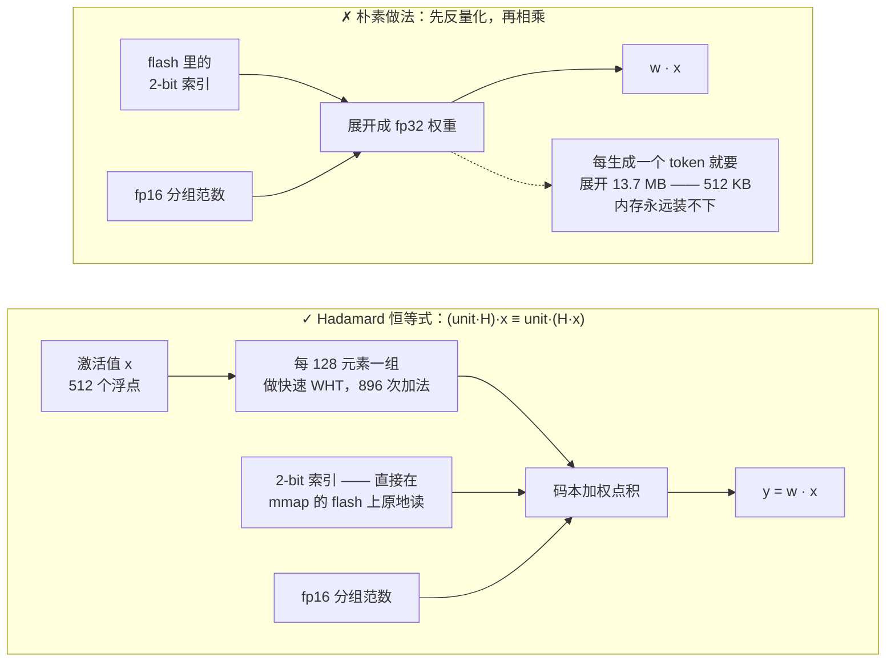
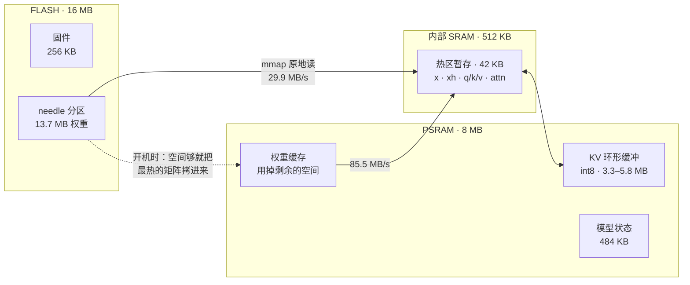
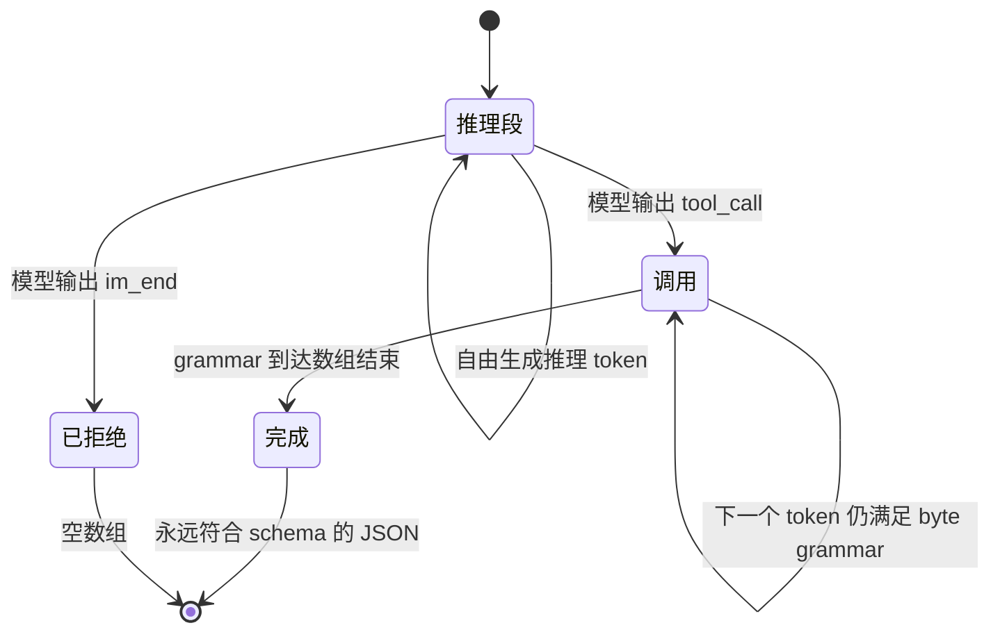
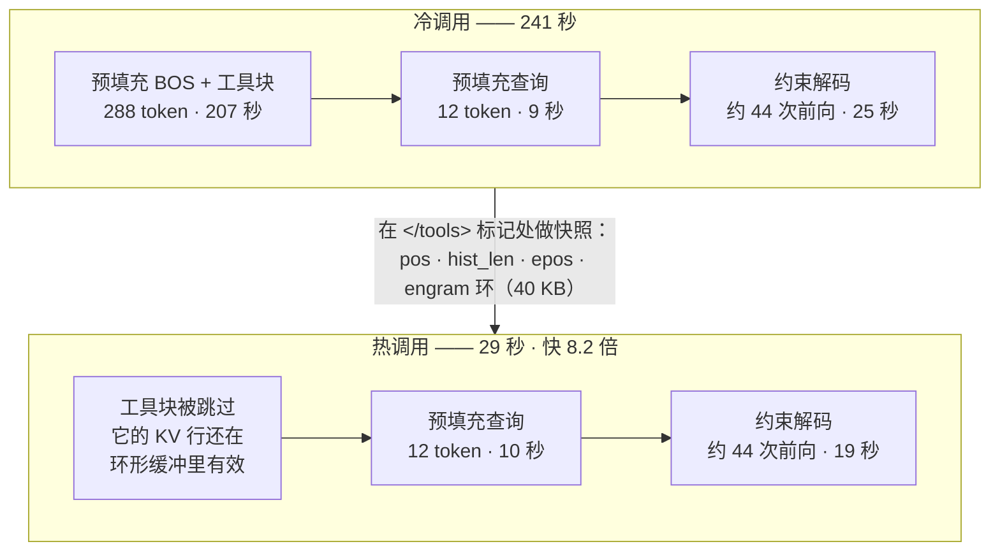
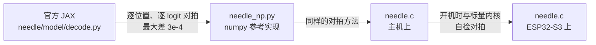

# MimiModel: Tool calling LLM on a $5 chip.


<p>
  <a href="LICENSE"></a>
  <a href="https://discord.gg/r8ZxSvB8Yr"></a>
  <a href="https://x.com/ssslvky"></a>
</p>

MimiModel 是一个在 5 美元 ESP32-S3 上运行 45M 参数大模型的引擎，面向工具调用、设备控制和
结构化信息提取。

为 [Cactus Compute 的 Needle 2](https://github.com/cactus-compute/needle) 从零手写的单文件 C 推理引擎，
完全跑在 ESP32-S3 单片机上。不需要 Linux，不需要 Python，不需要联网。
13.7 MB 的权重常驻 flash，**从不**加载进内存。

[🇺🇸 English](README.md) · [🇯🇵 日本語](README_JA.md) · [🇪🇸 Español](README_ES.md) · 🇨🇳 中文

```
$ turn on pin 5
[{"name":"gpio_on","arguments":{"pin":5}}]
```

| | |
|---|---|
| **模型** | Needle 2 — 45M 参数，CQ 2-bit 量化，13.7 MB 单文件 |
| **硬件** | ESP32-S3，240 MHz Xtensa LX7，16 MB flash，8 MB PSRAM（约 ¥35） |
| **引擎** | 单个 C99 文件，约 2000 行，除 `libm` 外零依赖 |
| **ESP32 速度** | 固定单工具：**预填充 1.94 tok/s · 解码 1.60 tok/s** · 热 16.170 秒 · 冷 35.480 秒 |
| **内存** | 13.7 MB flash（内存映射）· 约 7.7 MB PSRAM · 固件 256 KB |
| **准确率** | google/mobile-actions 961 条 strict **69.6%** —— 相同输入下官方 engine 2.0.2 为 69.2% |

> **先说实话：** 它比云端 API 慢数倍，不懂中文，你跟它打招呼它也会给你调一个工具，
> strict 分数已经与官方引擎对齐，但工具名和错误分布仍不相同。详见[评测](#评测)与[局限](#局限)。
> 它换来的是——把网线拔掉之后依然能用的语言模型。

---

## Cactus 在这里为什么会失败？

官方引擎在 Xtensa 上遇到两个阻碍：Needle 计算核心随预编译二进制发布，开源算子则面向 ARM NEON。
开放的 `.cact` 模型规格仍足以直接构建一个紧凑的 ESP32-S3 引擎。

[查看源码层面的详细分析（英文）](docs/how-it-fails.md)。

## 快速开始

### 1. 安装主机 CLI

```bash
python3 -m venv .venv
. .venv/bin/activate
python -m pip install -e .
```

`mimimodel` 是运行在 macOS 或 Linux 主机终端上的 CLI。它保持一个常驻串口连接，使 ESP32-S3 能在
多次命令间复用 KV 前缀缓存。

### 2. 构建并烧录一次

需要 ESP-IDF v5.5+、16 MB flash + 8 MB PSRAM 的开发板，以及从
[Hugging Face](https://huggingface.co/Cactus-Compute/needle2) 下载到 `model/needle2.cact` 的权重。
请把 `/dev/ttyUSB0` 替换成开发板的端口；macOS 上通常以 `/dev/cu.usbmodem` 开头。

```bash
cd needle-esp32s3
idf.py set-target esp32s3
idf.py -DNEEDLE_FAST_MATH=ON build
idf.py -p /dev/ttyUSB0 flash
./scripts/flash_weights.sh /dev/ttyUSB0        # 13.7 MB 烧进 0x210000 处的 `needle` 分区
cd ..
```

不要让 `idf.py monitor` 保持运行，因为 CLI 需要占用该串口。
默认开启 fast math 以获得最高板端速度。只有复现 IEEE 风格的一致性基线时，才传
`-DNEEDLE_FAST_MATH=OFF`。
精度对齐的默认配置会保护 160 个前缀 token、允许最多 256 个 reasoning token，并启用连续 byte grammar。
ESP-IDF 对应选项是 `NEEDLE_PREFIX_SINK_TOKENS`、`NEEDLE_REASON_MAX_TOKENS` 和
`NEEDLE_BYTE_GRAMMAR`。

### 3. 添加工具

```bash
mimimodel tools import examples/tools/demo.json --profile demo --activate
mimimodel tools list
```

工具 schema 在运行时配置。固件的
[`DEMO_TOOLS`](needle-esp32s3/main/main.c#L19-L22) 提供 7 个移动操作后备 schema，CLI 会在每次请求
中发送当前 profile。修改 JSON 文件后，可用 `mimimodel tools add FILE`、`tools remove NAME` 或
`tools import FILE` 更换工具，无需重编译固件或重新烧权重。导入前可运行
`mimimodel tools validate FILE` 检查 schema。
仓库附带的 3 工具 profile 低于引擎的 180-token 检索预算。更大的 profile 仍可使用，但按 query 进行的
工具裁剪可能改变实际前缀，因此不能保证命中缓存。

### 4. 运行

```bash
# 简单工具调用
mimimodel run "Turn on the flashlight."
# [{"name":"turn_on_flashlight","arguments":{}}]

# 带结构化提取的双工具调用
mimimodel run 'Create a calendar event titled "ESP32 demo" for 2026-08-21 at 14:30, then email ada@example.com with the subject "Demo confirmed".'
# [{"name":"create_calendar_event","arguments":{"title":"ESP32 demo","datetime":"2026-08-21T14:30:00"}},{"name":"send_email","arguments":{"subject":"Demo confirmed","to":"ada@example.com"}}]
```

第一次 `run` 会启动后台串口进程，并只重启一次开发板。之后使用相同工具 profile 的调用会保留连接和
前缀缓存。`mimimodel status` 显示端口、固件 build 和前缀 hash；`mimimodel daemon stop` 释放串口。
模型输入需要使用英文。命令返回工具调用 JSON，但不会实际执行工具。

双工具输出会选中两个工具，并提取时间、邮箱地址、事件标题和邮件主题。耗时取决于实际选中的 schema、
查询长度和生成的调用数。作为可复现参照，默认最快构建（`fast_math=1`）在固定单工具 schema 下，
冷调用为 **35.480 秒**，前缀缓存命中后为 **16.170 秒**（2026-08-22 真机实测）；两次输出都与上面的
简单示例完全一致。精确测试条件见[评测](#评测)。

> ⚠️ 先烧（或同时烧）app，再烧权重。任何分区表把 SPIFFS 区盖在权重区上的固件，都会在首次开机时
> 自动格式化并悄无声息地损坏模型（这个坑让我们搭进去一个下午：flash 读回来是 `0xFFFF`，
> 解释成浮点就是 `NaN`）。

## 原理

### 1. `.cact` 格式

120 字节的头部携带完整的架构几何信息，其后是共享的 Lloyd-Max 码本、一份**无名**张量目录
（张量按固定的规范顺序定位），再之后是 64 字节对齐的数据块。因为几何信息在头部里，同一个二进制
可以加载该架构的任意配置。解析它只要约 150 行 C。

### 2. Cactus Quants，以及让权重留在 flash 的那个技巧

一个 CQ 量化的 `[out, in]` 矩阵，存的是指向单位球面上共享码本的 2-bit 索引，外加每 128 个元素
一组的 fp16 L2 范数。逐组重建是：

```
w_group = (codebook[idx] * norm) @ H        # H 是归一化 Walsh–Hadamard 矩阵
```

如果为了算 `w · x` 而先反量化，就意味着每生成一个 token 都要把 13.7 MB 全部展开。引擎转而利用
`H` 既对称又正交这一点：

```
(unit · H) · x  ==  unit · (H · x)
```

于是我们对**激活值**每 128 元素一组做一次快速 Walsh–Hadamard 变换（O(n log n)，896 次加法），
之后的矩阵向量乘就退化成**直接在打包的 2-bit 字节上**做码本加权点积。权重从不展开、从不拷贝，
通过 `esp_partition_mmap` 一直内存映射在 flash 里。模型加载耗时 **48 毫秒**。




### 3. 有界内存

Needle 使用 256 token 的近期注意力窗口。MimiModel 额外保护 prompt 开头 160 个 token，并同时保留
最近 256 个 token。int8 KV cache 仍为 416 个物理行，与旧环形缓冲的分配相同，但系统指令和工具块开头
在整个解码阶段都不会被滑出窗口。




### 4. 语法约束解码

45M 模型自由生成时只能产出「几乎是 JSON」。MimiModel 会用当前工具 schema 编译出一套连续 byte grammar，
逐字节验证每个候选 token。token 可以自然跨越 JSON 结构边界；工具名和参数名不能越出 schema，必填参数
必须出现，整数值保持为数字。结构片段不会再被拆开 teacher-force 到不同模型步骤里。




这样既保证输出符合 schema，又不改变模型自然的 token 历史；它也是本次官方精度归因里收益最大的修复。

### 5. KV 前缀缓存 —— 单项收益最大的优化

在工具调用型 agent 里，`<tools>` 块每次调用都逐字节相同，而且占了 prompt 的绝大部分
（300 token 里有 288 个）。它的 KV 行在环形缓冲里一直有效，所以只有查询部分需要预填充。
切分点选在 `</tools>` 标记处——标记是原子 token，因此前缀的分词结果**可证明**是完整 prompt 分词的前缀。

**历史三工具 trace：冷调用 241 秒 → 热调用 29 秒（8.2 倍）。** 当前 TIE728 构建更快；这里保留该
trace，用于展示前缀缓存逐阶段省掉了哪些计算。




## 优化记录

引擎原始吞吐，均为真机实测：

| 改动 | 效果 |
|---|---|
| 基线标量 C | 预填充 0.64 tok/s，解码 0.59 |
| 双核拆分（matvec 按行分，attention 按 KV 头分） | 约 1.8 倍 |
| 预填充阶段跳过 8192×512 的 logits 头 | 预填充 +10% |
| 字节查表反量化 + 四行内核（4 行共享同一次激活加载） | +18% |
| 热区暂存迁入内部 SRAM | +5% |
| PSRAM 权重缓存（机会主义地填满剩余空间） | +8% |
| TIE728 对齐浮点加载 + 双行/八累加器 CQ2 内核 | 512×512 matvec：单核 5.272 → 3.781 ms；双核 2.700 → 1.960 ms |
| **默认最快单工具实测** | **预填充 1.94 tok/s，解码 1.60；冷 35.480 秒，热 16.170 秒** |
| KV 前缀缓存（为放大环形缓冲，牺牲约 20% 原始速度） | **端到端 8.2 倍** |

### 没有奏效的尝试

- **密集 int16 PIE 路径。** 用汇编实现了（`ee.vmulas.s16.accx`，单指令 8 次乘加）
  外加 int16 量化激活路径。数值完全正确（自检相对误差 5.5e-5），速度是 **0.32 倍**——慢了 3 倍。
  性能瓶颈集中在 2-bit 权重到 int16 通道的解包；乘加并不占主导，PIE 也缺少 2-bit 解包指令。代码保留在
  `-DNEEDLE_PIE` 之后，默认关闭。当前 TIE728 内核继续使用 CQ2 字节查表解码，并通过向量浮点加载和
  累加器调度提速，避开了权重扩宽。
- **主机端用 int16 运算。** 在 ARM/x86 上比浮点慢 2.3 倍，因为编译器会自动向量化浮点循环。
  SIMD 的收益取决于数据布局和指令覆盖。
- **线性空间的 Sinkhorn。** 与对数空间版本数学等价，但会下溢成 NaN。老实用对数空间那版。

## 局限

- **延迟取决于 schema。** 受控单工具用例热调用 16.170 秒、冷调用 35.480 秒；更大的 schema 和多调用
  输出可能需要数分钟。云端 API 仍然快得多。这里的价值在于离线可用、零 API 费用和数据留在设备内。
- **中文不可用。** 中文设备指令 0/5。官方引擎同样失败，问题来自模型本身的能力边界。
  好在这些用例的置信度会掉到 0.02–0.22，至少是可检测的。
- **它不会拒绝。** 你让它讲个笑话，它照样吐一个工具调用。任何生产环境的路由都需要置信度门限
  外加一道文本预过滤。
- **布尔/语义参数不可靠。** `gpio_write(pin, state)` 的 `state` 大约一半会搞错。把它拆成
  `gpio_on(pin)` / `gpio_off(pin)`——顺着模型真正的强项（选名字、抽整数）来设计——
  写操作准确率从 1/5 提升到 5/6。
- **置信度头还没实现。** 它的权重就在 `.cact` 文件里，引擎目前跳过了 probe heads。

## 开发

### 文件

| 路径 | 内容 |
|---|---|
| `needle.c` | 引擎本体——解析器、算子、分词器、约束解码器、命令行 |
| `mimimodel_cli.py` | 主机 CLI、工具 profile 和常驻串口进程 |
| `examples/tools/demo.json` | 可编辑的运行时工具 schema 示例 |
| `needle_np.py` | numpy 参考实现，已与官方 JAX 解码对拍验证 |
| `needle-esp32s3/` | ESP-IDF 工程（分区表、权重烧录脚本、REPL 演示） |
| `bench/` | 评测脚本：google/mobile-actions 准确率、速度、ESP32-S3 串口驱动（[说明](bench/README.md)）|

### 开发环境

C 引擎本身零依赖。`pip install -e .` 会安装主机 CLI 和 pyserial。参考实现与评测还需要：

```bash
# numpy 参考实现和 JAX 对拍要读上游包的源码
git clone https://github.com/cactus-compute/needle
pip install numpy sentencepiece jax flax

# 评测还需要官方闭源引擎作为 oracle
pip install cactus-needle
```

`needle_np.py` 是模型的独立 numpy 实现；`compare_jax.py` 把它和克隆下来的 `needle/` 里官方
JAX 解码循环逐位置对拍——[正确性](#正确性)那一节讲的两个 bug 就是这么抓到的。

## 评测

在 [google/mobile-actions](https://huggingface.co/datasets/google/mobile-actions)
(CC-BY-4.0)上评测——这是随 FunctionGemma 一同发布的 961 条端侧函数调用评测集——
这里采用 ordered strict exact match：函数名、调用顺序和每个参数都必须匹配。本引擎于 2026-08-22
重跑；官方 engine 与数据集 hash 未变化，因此复用可逐条对比的产物。两边都保留每条记录自己的工具顺序、
developer/user 分离、原始空白和各自原生检索。

| | 本引擎 | 官方引擎(同一记录/schema) |
|---|---|---|
| 准确率 | **69.6%** | 69.2% |
| 工具名准确率 | 90.8% | **98.1%** |
| 单调用用例(640) | **76.2%** | 73.6% |
| 双调用用例(320) | 56.2% | **60.3%** |

旧引擎为 469/961（48.8%）。官方 dylib 内嵌权重与仓库权重逐字节相同，因此对 961 行做了配对消融：
reasoning 上限从 90 提到 256 恢复 44 行，保留 prompt 前缀再恢复 63 行，把分段 teacher-forcing
换成连续 byte grammar 再恢复 96 行。为适配 ESP32，将受保护前缀限制为 160 token，相比完整前缀只少 3 行，
并继续使用原来的 KV 内存。

strict 总分略高于官方不代表逐 token 等价。本引擎工具名准确率仍较低、少调用更多，但参数行赢得更多。
完整归因和逐行原始报告见[官方 Needle 精度差距根因报告](docs/official-engine-accuracy-gap.md)。

Cactus 页面发布值是同名 split/metric 下 63.7% exact、98.3% name。本机当前官方包
2.0.6/engine 2.0.2 在本脚本得到 69.2%/98.1%。页面未提供 prompt/schema 转换、检索
选中项、逐条原始输出或二进制哈希，因此 exact 多出的 5.5 点无法归因；发布值只作为
外部参照，不与上表两个可逐条对比的列合并。

**本机 M4 评测（2026-08-22）。** Apple M4、16 GB RAM，200 条 canonical 工具顺序、native retrieval
请求串行执行。本引擎 prefill/decode 为 191/141 tok/s，completion 延迟中位 2259 ms；未变化的
官方 engine 2.0.2 为 1204/702 tok/s，completion 665 ms，计入 293 ms 初始化后为 948 ms。
这些值来自真实阶段计时；旧数据曾错误地用整次请求时间作分母。
[命令、hash、原始产物和归因](docs/benchmark-20260822.md)已单独保存。

**当前开发板速度（2026-08-22）。** 默认最快构建（`fast_math=1`、`profile=0`）在固定 51-token
单工具 prompt 上，冷调用 35.480 秒，热调用 16.170 秒；冷调用的 prefill/decode 为
1.94/1.60 tok/s，两次均输出完全一致的 flashlight 调用。TIE728 开机自检相对标量 C 的最大绝对
误差为 8.583e-06。一条 333-token 的复杂 mobile-actions 输入在 413.742 秒内完成两个 strict-exact
工具调用，且与当前 host 输出逐字节一致。此前三条指定用例耗时 169.1/319.6/255.4 秒，也与 host
一致；这些开发板样例用于确认速度和一致性，不代表总体准确率。
[完整 payload、构建设置和原始串口输出](docs/esp32s3-tie728-audit.md)已单独保存。

**TIE728 前审计（2026-08-19）。** 同一块 ESP32-S3 rev 0.2、240 MHz、8 MB 80 MHz Octal
PSRAM 开发板，在固定单工具 schema 下测得冷/热 42.895/20.067 秒。当时可选的 `-ffast-math` 为
41.541/19.444 秒。两条修正协议后的
mobile-actions 输出均与标准主机逐字节一致。完整原始数据见
[`bench/results/device_protocol_audit_20260819.json`](bench/results/device_protocol_audit_20260819.json)。

标准公平构建还跑了固定 seed 的比例分层样本（8 条单调用 + 4 条双调用）：strict exact
5/12，name 9/12，耗时中位 315.5 秒，prefill/decode 中位 1.39/1.11 tok/s。exact 的
95% Wilson 区间为 19.3–68.0%，因此不能当作总体准确率。原始输出 10/12 与 arm64
完全一致，strict/name 成败则 12/12 一致。连续跑完 8 条后有一条超过 650 秒，复位后
同一条 355.9 秒完成；这次排除的超时作为稳定性问题保留在原始产物中。

板端 profile 显示 Q/K/V/gate 占 48–52%，out+Hadamard 占 17–18%，mHC 占
16–17%，attention 只有 6–9%。现有双核矩阵乘实测 1.96×；PIE int16、八行 float
kernel 和 8 轮 Sinkhorn 都在真机或输出对齐测试中变慢/失真，已否决。完整原始审计见
[`bench/results/device_protocol_audit_20260819.json`](bench/results/device_protocol_audit_20260819.json)。

[`bench/README.md`](bench/README.md) 给出了运行命令、逐条原始结果,
以及重跑时哪些地方容易弄错。

## 正确性

这个引擎沿着一条逐级验证的等价链构建：

1. `needle_np.py`（numpy）与 `needle` 包里官方的 JAX `_forward_cached` **逐位置、逐 logit** 对拍。
   最大差异 3e-4。
2. `needle.c` 用同样的方式与 `needle_np.py` 对拍。
3. 在设备上，固件开机时用标量内核自检 SIMD 内核。




有两个 bug 只有靠这条链才抓得出来：mHC 的 `a_pre`/`a_post`/`a_res` 是逐层的*标量*
（numpy 的广播把它藏住了，到 C 里就是越界读）；以及 engram 的 `taps` 采用逐通道的 `(4, 512)` 向量布局，
原实现误读成 4 个标量。

## 致谢与引用

这个项目是一个*引擎*。模型、架构、量化方案和格式，全部是别人的工作。

- **[Cactus Compute](https://cactuscompute.com)** —— [Needle 2 模型](https://huggingface.co/Cactus-Compute/needle2)
  （Apache-2.0）、[`needle` Python 包](https://github.com/cactus-compute/needle)（MIT，其
  `export.py` / `decode.py` / `architecture.py` 就是本引擎所实现的规格），以及
  [`cactus` 引擎](https://github.com/cactus-compute/cactus)。Cactus Quants 和 `.cact` 格式都是他们的。
- **Ndubuaku, H., Mosoyan, K., Mroz, J., Cylich, N., Kumar, S., Sandhu, P., Shemet, R., & Lee, J. H.**
  *A Controlled Study of Attention-Only Transformers.* [arXiv:2607.18363](https://arxiv.org/abs/2607.18363)
  —— Needle 所基于的 Simple Attention Network 架构。
- **[slvDev/esp32-ai](https://github.com/slvDev/esp32-ai)** —— 先行工作，用 Per-Layer Embeddings
  在 ESP32-S3 上以 9.9 tok/s 跑通了 28.9M 参数的模型。是它让这件事看起来值得一试。
- **[Andrej Karpathy, llama2.c](https://github.com/karpathy/llama2.c)** —— 单文件、零依赖的 C
  推理引擎范式，本引擎的形态即脱胎于此。
- **[Espressif](https://github.com/espressif/esp-idf)** —— ESP-IDF、
  [esp-dsp](https://github.com/espressif/esp-dsp) 与
  [esp-dl](https://github.com/espressif/esp-dl)。其中的 Xtensa 汇编为 ESP32-S3 PIE/TIE728
  指令语法、对齐向量加载和累加器调度提供了可运行参考。
- **[SentencePiece](https://github.com/google/sentencepiece)** —— `.cact` 里的 tokenizer 数据块
  就是它的 BPE 模型导出。
- Walsh–Hadamard 变换和 Lloyd-Max 量化都是经典方法；而「用 Hadamard 恒等式规避反量化」这一具体
  应用是 Cactus 的设计，记载于 `export.py`。

## 许可证

本仓库中的引擎代码采用 MIT 许可证。Needle 2 权重为 Apache-2.0，**未**在此二次分发——请从
Hugging Face 下载。`needle` 与 `cactus` 仓库各自保留其原有许可证。
