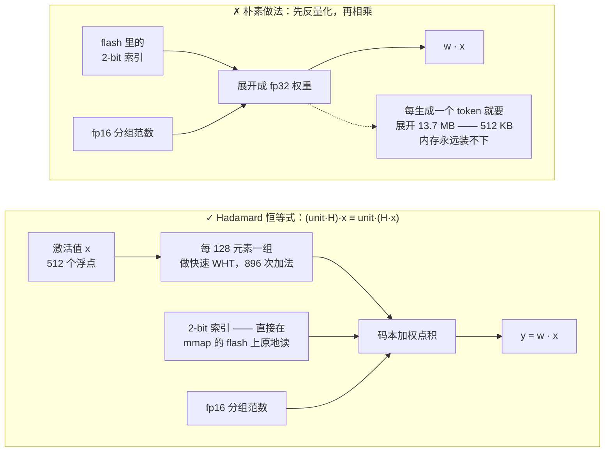
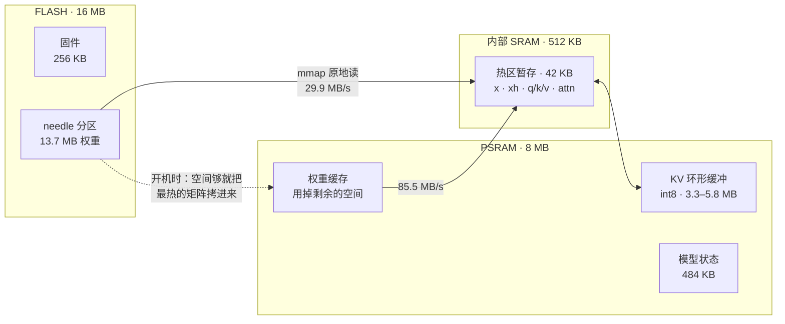
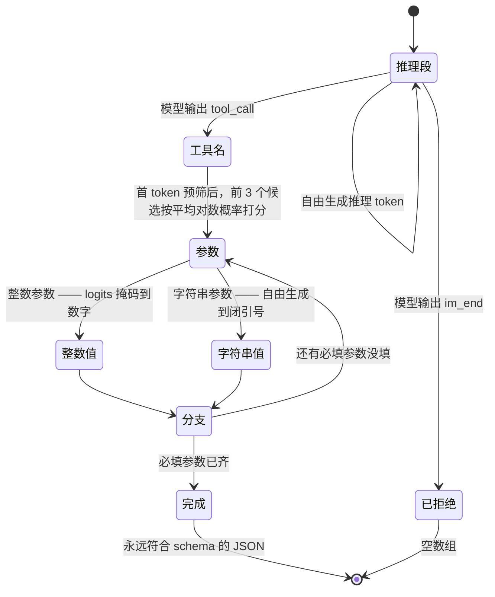
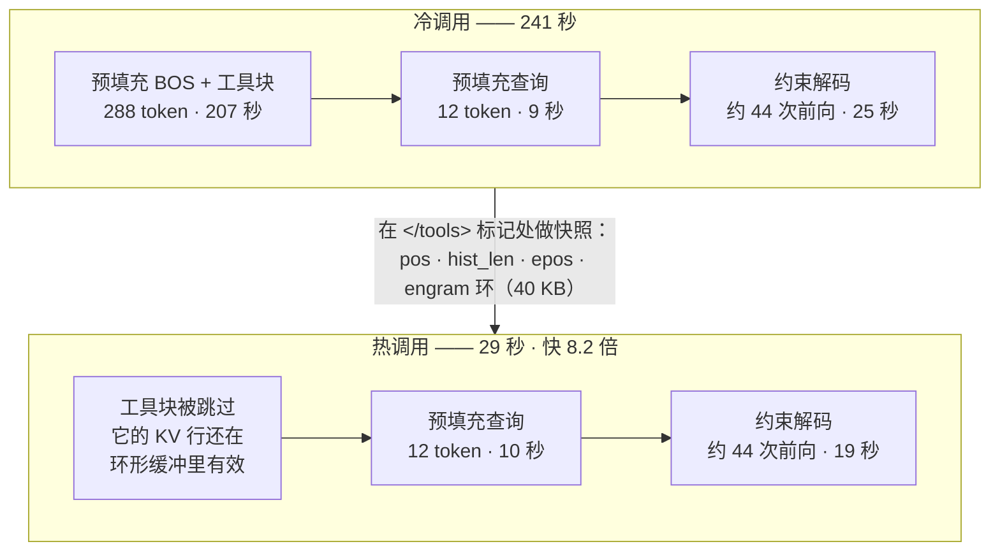
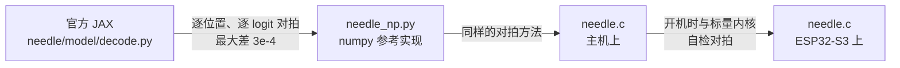

# mimimodel — 在 5 美元的 ESP32-S3 上离线运行 45M 参数的工具调用大模型

为 [Cactus Compute 的 Needle 2](https://github.com/cactus-compute/needle) 从零手写的单文件 C 推理引擎，
完全跑在 ESP32-S3 单片机上。不需要 Linux，不需要 Python，不需要联网。
13.7 MB 的权重常驻 flash，**从不**加载进内存。

[🇺🇸 English](README.md) · [🇯🇵 日本語](README_JA.md) · [🇪🇸 Español](README_ES.md) · 🇨🇳 中文

```
$ turn on pin 5
[{"name":"gpio_on","arguments":{"pin":5}}]
```

| | |
|---|---|
| **模型** | Needle 2 — 45M 参数，CQ 2-bit 量化，13.7 MB 单文件 |
| **硬件** | ESP32-S3，240 MHz Xtensa LX7，16 MB flash，8 MB PSRAM（约 ¥35） |
| **引擎** | 单个 C99 文件，约 2000 行，除 `libm` 外零依赖 |
| **速度** | 热调用 **29 秒** · 冷调用 **241 秒** · 预填充 1.4 tok/s |
| **内存** | 13.7 MB flash（内存映射）· 约 7.7 MB PSRAM · 固件 256 KB |
| **准确率** | 工具调用评测 15/24 —— 官方闭源引擎为 14/24 |

> **先说实话：** 它比云端 API 慢大约 5 倍，不懂中文，你跟它打招呼它也会给你调一个工具。
> 详见[局限](#局限)。它换来的是——把网线拔掉之后依然能用的语言模型。

---

## 为什么不是「把引擎交叉编译到 Xtensa」就完事了

Cactus 同时开源了[推理引擎](https://github.com/cactus-compute/cactus)和 [Needle 模型](https://github.com/cactus-compute/needle)，
官网也把 ESP32-S3 列为支持目标。最直觉的方案——交叉编译引擎——读完源码发现是条死路，两个原因：

1. **开源引擎里并没有 Needle 的计算核心。** 在整个 `cactus` 仓库里搜 `engram`（该架构的核心组件）
   一个结果都没有。引擎知道 `ModelType::NEEDLE` 这个*名字*、知道怎么拼它的提示词，但层本身在
   Hugging Face 上分平台预编译的二进制里。
2. **算子只有 ARM 版。** 15 个 kernel 源文件全部 `#include <arm_neon.h>`，用了约 125 个 NEON
   intrinsic，且没有标量回退路径。Xtensa GCC 还既不支持 `_Float16` 也不支持 `__fp16`，
   而 kernel 里用了约 770 次。

但**模型本身是完全开放的**。`needle/needle/model/` 里有架构、量化器、解码循环，以及最关键的
`export.py`——它的文档字符串就是 `.cact` 权重格式完整的字节级规格。这让「自己写一个专用引擎」
成为正确路径，而且比通用运行时小得多。

## 原理

### 1. `.cact` 格式

120 字节的头部携带完整的架构几何信息，其后是共享的 Lloyd-Max 码本、一份**无名**张量目录
（张量按固定的规范顺序定位），再之后是 64 字节对齐的数据块。因为几何信息在头部里，同一个二进制
可以加载该架构的任意配置。解析它只要约 150 行 C。

### 2. Cactus Quants，以及让权重留在 flash 的那个技巧

一个 CQ 量化的 `[out, in]` 矩阵，存的是指向单位球面上共享码本的 2-bit 索引，外加每 128 个元素
一组的 fp16 L2 范数。逐组重建是：

```
w_group = (codebook[idx] * norm) @ H        # H 是归一化 Walsh–Hadamard 矩阵
```

如果为了算 `w · x` 而先反量化，就意味着每生成一个 token 都要把 13.7 MB 全部展开。引擎转而利用
`H` 既对称又正交这一点：

```
(unit · H) · x  ==  unit · (H · x)
```

于是我们对**激活值**每 128 元素一组做一次快速 Walsh–Hadamard 变换（O(n log n)，896 次加法），
之后的矩阵向量乘就退化成**直接在打包的 2-bit 字节上**做码本加权点积。权重从不展开、从不拷贝，
通过 `esp_partition_mmap` 一直内存映射在 flash 里。模型加载耗时 **48 毫秒**。




### 3. 有界内存

Needle 使用 256 token 的滑动注意力窗口。KV cache 用 int8（这是模型自己头部声明的、后训练所用的
位宽），并放在一个按「窗口 + 少量余量」定尺寸的**环形缓冲**里，所以无论 prompt 多长，内存占用恒定。
一行要过 `kv_alloc` 个位置之后才会被覆盖，因此只要 `kv_alloc > kv_window`，窗口内的每一行都完好。




### 4. 语法约束解码

45M 的模型放开了自由生成，产出的是「几乎是 JSON」。引擎转而让解码全程贴着工具 schema 走，
对标闭源引擎里那个 grammar compiler 的做法：

- 结构性文本（`[{"name":"`、`","arguments":{`）是**强制**的，但做法是把 logits 掩码到「是目标
  字符串前缀」的 token 上——而不是直接拼接 token id——这样模型的上下文始终是规范的；
- **工具名**通过给每个候选打「完整平均 token 对数概率」分来选（teacher-forcing + 廉价的计数器回退），
  之前还有一道免费的首 token 预筛，只保留前 3 个候选；
- **整数参数**做数字掩码；**必填参数**强制出现。




这就是为什么在权重完全相同的情况下，本引擎在评测上反而超过官方引擎：输出永远符合 schema。

### 5. KV 前缀缓存 —— 单项收益最大的优化

在工具调用型 agent 里，`<tools>` 块每次调用都逐字节相同，而且占了 prompt 的绝大部分
（300 token 里有 288 个）。它的 KV 行在环形缓冲里一直有效，所以只有查询部分需要预填充。
切分点选在 `</tools>` 标记处——标记是原子 token，因此前缀的分词结果**可证明**是完整 prompt 分词的前缀。

**冷调用 241 秒 → 热调用 29 秒（8.2 倍）。**




## 优化记录

引擎原始吞吐，均为真机实测：

| 改动 | 效果 |
|---|---|
| 基线标量 C | 预填充 0.64 tok/s，解码 0.59 |
| 双核拆分（matvec 按行分，attention 按 KV 头分） | 约 1.8 倍 |
| 预填充阶段跳过 8192×512 的 logits 头 | 预填充 +10% |
| 字节查表反量化 + 四行内核（4 行共享同一次激活加载） | +18% |
| 热区暂存放内部 SRAM 而非 PSRAM | +5% |
| PSRAM 权重缓存（机会主义地填满剩余空间） | +8% |
| **合计** | **预填充 1.72 tok/s（2.7 倍），解码 1.38（2.3 倍）** |
| KV 前缀缓存（为放大环形缓冲，牺牲约 20% 原始速度） | **端到端 8.2 倍** |

### 没有奏效的尝试

- **ESP32-S3 的 PIE 128-bit SIMD。** 用汇编实现了（`ee.vmulas.s16.accx`，单指令 8 次乘加）
  外加 int16 量化激活路径。数值完全正确（自检相对误差 5.5e-5），速度是 **0.32 倍**——慢了 3 倍。
  瓶颈是把 2-bit 权重解包成 int16 通道，不是乘加，而 PIE 没有 2-bit 解包指令。代码保留在
  `-DNEEDLE_PIE` 之后，默认关闭。
- **主机端用 int16 运算。** 在 ARM/x86 上比浮点慢 2.3 倍，因为编译器会自动向量化浮点循环。
  SIMD 不是无条件的赢。
- **线性空间的 Sinkhorn。** 与对数空间版本数学等价，但会下溢成 NaN。老实用对数空间那版。

## 局限

- **每次约 29 秒。** 同样的问题云端 API 3–8 秒就答完了。这里的价值是离线可用、零 API 费用、
  数据不出设备——不是延迟。
- **中文不work。** 中文设备指令 0/5。官方引擎同样失败，所以这是模型的能力边界，不是移植的问题。
  好在这些用例的置信度会掉到 0.02–0.22，至少是可检测的。
- **它不会拒绝。** 你让它讲个笑话，它照样吐一个工具调用。任何生产环境的路由都需要置信度门限
  外加一道文本预过滤。
- **布尔/语义参数不可靠。** `gpio_write(pin, state)` 的 `state` 大约一半会搞错。把它拆成
  `gpio_on(pin)` / `gpio_off(pin)`——顺着模型真正的强项（选名字、抽整数）来设计——
  写操作准确率从 1/5 提升到 5/6。
- **置信度头还没实现。** 它的权重就在 `.cact` 文件里，引擎目前跳过了 probe heads。

## 构建与运行

### 在主机上（macOS / Linux）

```bash
mkdir -p model && cd model
curl -LO https://huggingface.co/Cactus-Compute/needle2/resolve/main/needle2.cact
cd ..
cc -O3 -o needle needle.c -lm
./needle model/needle2.cact "Set a timer for 10 minutes" \
  '[{"name":"set_timer","description":"Set a countdown timer","parameters":{"type":"object","properties":{"minutes":{"type":"integer","description":"Minutes"}},"required":["minutes"]}}]'
# [{"name":"set_timer","arguments":{"minutes":10}}]
```

设 `NEEDLE_FREE=1` 走非约束解码，设 `NEEDLE_REPEAT=n` 可以验证前缀缓存。

### 在 ESP32-S3 上

需要 ESP-IDF v5.5+，以及 16 MB flash + 8 MB PSRAM 的板子。

```bash
cd needle-esp32s3
idf.py set-target esp32s3
idf.py build
./scripts/flash_weights.sh /dev/ttyUSB0        # 13.7 MB 烧进 0x210000 处的 `needle` 裸分区
idf.py -p /dev/ttyUSB0 flash monitor
```

开机会跑一次演示工具调用，然后进入串口 REPL：输入问题，回车。

> ⚠️ 先烧（或同时烧）app，再烧权重。任何分区表把 SPIFFS 区盖在权重区上的固件，都会在首次开机时
> 自动格式化并悄无声息地损坏模型（这个坑让我们搭进去一个下午：flash 读回来是 `0xFFFF`，
> 解释成浮点就是 `NaN`）。

### 文件

| 路径 | 内容 |
|---|---|
| `needle.c` | 引擎本体——解析器、算子、分词器、约束解码器、命令行 |
| `needle_np.py` | numpy 参考实现，已与官方 JAX 解码对拍验证 |
| `needle-esp32s3/` | ESP-IDF 工程（分区表、权重烧录脚本、REPL 演示） |
| `bench/` | 24 例工具调用评测，以官方引擎为基准打分 |

### 开发环境

引擎本身零依赖。参考实现和评测脚本需要装东西：

```bash
# numpy 参考实现和 JAX 对拍要读上游包的源码
git clone https://github.com/cactus-compute/needle
pip install numpy sentencepiece jax flax

# 评测还需要官方闭源引擎作为 oracle
pip install cactus-needle
```

`needle_np.py` 是模型的独立 numpy 实现；`compare_jax.py` 把它和克隆下来的 `needle/` 里官方
JAX 解码循环逐位置对拍——[正确性](#正确性)那一节讲的两个 bug 就是这么抓到的。

## 评测

`bench/run_bench.py` 跑 24 个用例（单工具、参数抽取、多工具歧义、中文、复合指令、闲聊），
同时对本引擎和作为 oracle 的官方闭源库打分。

```
=== ours 15/24 (62%) | oracle 14/24 (58%) | tool-choice agreement 16/24 (66%)
```

两个引擎失败的用例高度重合——中文、复合指令、拒绝闲聊——这正是「共用同一个 45M 模型」
应有的特征，而不是实现差距。

## 正确性

这个引擎不是写完就祈祷它能跑，而是搭在一条逐级验证的等价链上：

1. `needle_np.py`（numpy）与 `needle` 包里官方的 JAX `_forward_cached` **逐位置、逐 logit** 对拍。
   最大差异 3e-4。
2. `needle.c` 用同样的方式与 `needle_np.py` 对拍。
3. 在设备上，固件开机时用标量内核自检 SIMD 内核。




有两个 bug 只有靠这条链才抓得出来：mHC 的 `a_pre`/`a_post`/`a_res` 是逐层的*标量*
（numpy 的广播把它藏住了，到 C 里就是越界读）；以及 engram 的 `taps` 是逐通道的 `(4, 512)` 向量，
不是 4 个标量。

## 致谢与引用

这个项目是一个*引擎*。模型、架构、量化方案和格式，全部是别人的工作。

- **[Cactus Compute](https://cactuscompute.com)** —— [Needle 2 模型](https://huggingface.co/Cactus-Compute/needle2)
  （Apache-2.0）、[`needle` Python 包](https://github.com/cactus-compute/needle)（MIT，其
  `export.py` / `decode.py` / `architecture.py` 就是本引擎所实现的规格），以及
  [`cactus` 引擎](https://github.com/cactus-compute/cactus)。Cactus Quants 和 `.cact` 格式都是他们的。
- **Ndubuaku, H., Mosoyan, K., Mroz, J., Cylich, N., Kumar, S., Sandhu, P., Shemet, R., & Lee, J. H.**
  *A Controlled Study of Attention-Only Transformers.* [arXiv:2607.18363](https://arxiv.org/abs/2607.18363)
  —— Needle 所基于的 Simple Attention Network 架构。
- **[slvDev/esp32-ai](https://github.com/slvDev/esp32-ai)** —— 先行工作，用 Per-Layer Embeddings
  在 ESP32-S3 上以 9.9 tok/s 跑通了 28.9M 参数的模型。是它让这件事看起来值得一试。
- **[Andrej Karpathy, llama2.c](https://github.com/karpathy/llama2.c)** —— 单文件、零依赖的 C
  推理引擎范式，本引擎的形态即脱胎于此。
- **[Espressif](https://github.com/espressif/esp-idf)** —— ESP-IDF，以及
  [esp-dsp](https://github.com/espressif/esp-dsp)，其 `dspi_dotprod_s16_aes3.S` 是我们确认
  ESP32-S3 PIE 向量指令语法的可用参考。
- **[SentencePiece](https://github.com/google/sentencepiece)** —— `.cact` 里的 tokenizer 数据块
  就是它的 BPE 模型导出。
- Walsh–Hadamard 变换和 Lloyd-Max 量化都是经典方法；而「用 Hadamard 恒等式规避反量化」这一具体
  应用是 Cactus 的设计，记载于 `export.py`。

## 许可证

本仓库中的引擎代码采用 MIT 许可证。Needle 2 权重为 Apache-2.0，**未**在此二次分发——请从
Hugging Face 下载。`needle` 与 `cactus` 仓库各自保留其原有许可证。
