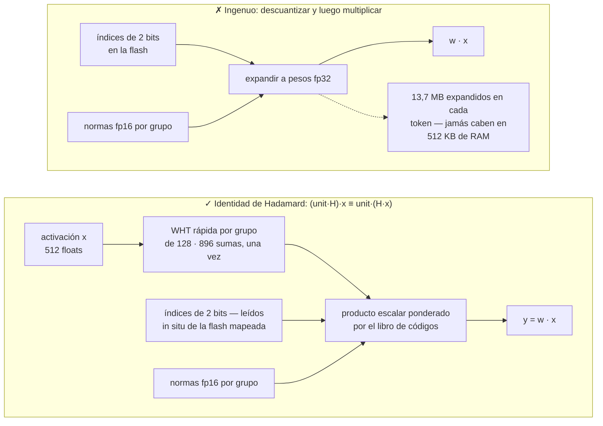
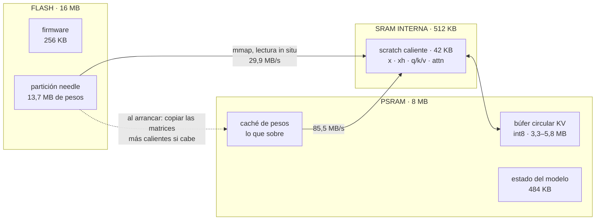
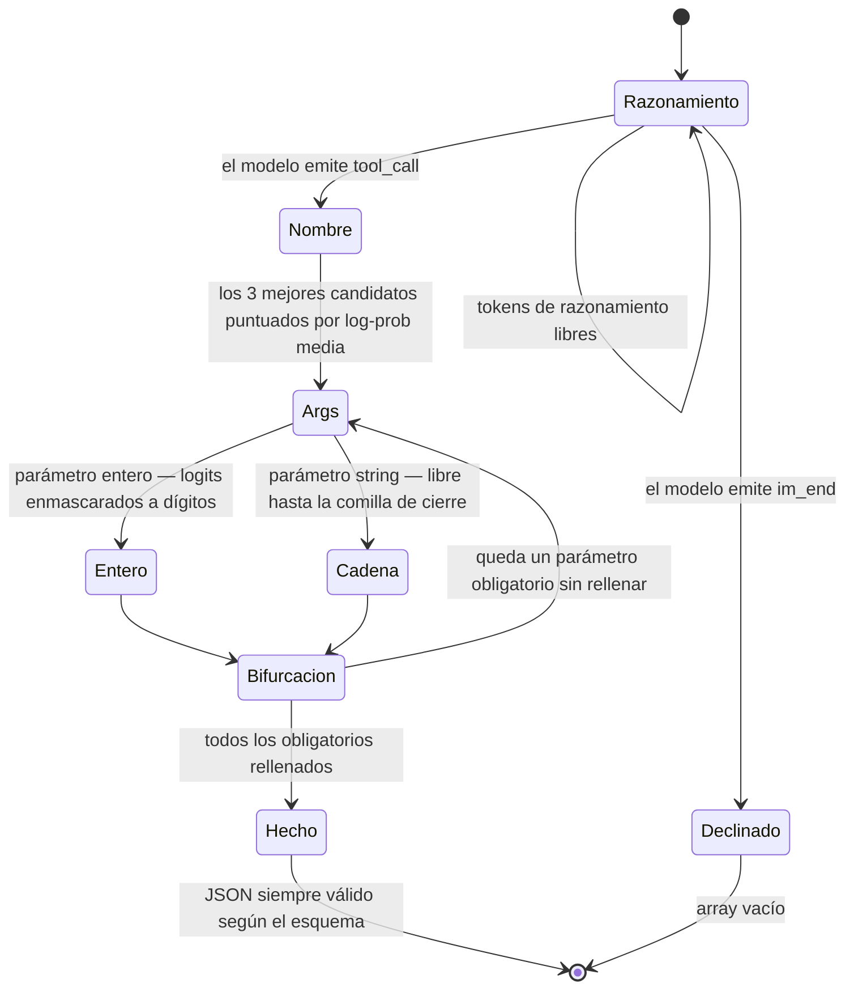
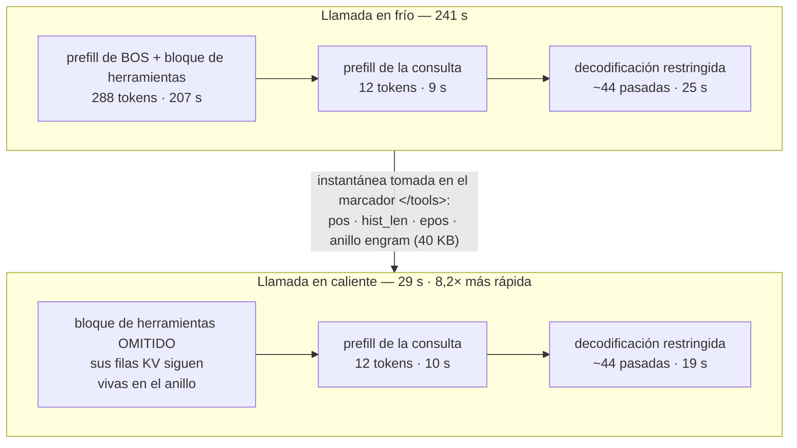
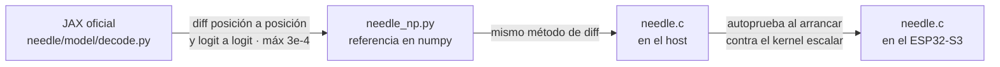

# MimiModel: Tool calling LLM on a $5 chip.


<p>
  <a href="LICENSE"></a>
  <a href="https://discord.gg/r8ZxSvB8Yr"></a>
  <a href="https://x.com/ssslvky"></a>
</p>

MimiModel es un motor que ejecuta un LLM de 45M de parámetros para llamadas a herramientas,
control de dispositivos y extracción estructurada en un ESP32-S3 de 5 $.

Un motor de inferencia en C, escrito desde cero en un solo archivo, para
[Needle 2 de Cactus Compute](https://github.com/cactus-compute/needle), ejecutándose por completo
en un microcontrolador ESP32-S3. Sin Linux, sin Python, sin red. Los 13,7 MB de pesos viven en la
flash y **nunca** se cargan en RAM.

[🇺🇸 English](README.md) · [🇯🇵 日本語](README_JA.md) · 🇪🇸 Español · [🇨🇳 中文](README_CN.md)

```
$ turn on pin 5
[{"name":"gpio_on","arguments":{"pin":5}}]
```

| | |
|---|---|
| **Modelo** | Needle 2 — 45M parámetros, CQ de 2 bits, archivo único de 13,7 MB |
| **Hardware** | ESP32-S3, Xtensa LX7 a 240 MHz, 16 MB flash, 8 MB PSRAM (~5 $) |
| **Motor** | un archivo C99, ~2.000 líneas, sin más dependencias que `libm` |
| **Velocidad** | llamada en caliente **29 s** · en frío **241 s** · prefill 1,4 tok/s |
| **Memoria** | 13,7 MB flash (mapeada en memoria) · ~7,7 MB PSRAM · firmware de 256 KB |
| **Precisión** | 49,3% en google/mobile-actions (961 casos, strict) — engine oficial 2.0.2: 69,2% con entradas idénticas |

> **Honestidad por delante:** esto es unas 5 veces más lento que una API en la nube, no entiende
> chino, si le saludas te llamará una herramienta igualmente, y queda bastante por debajo del
> motor oficial en la misma evaluación. Véanse el [benchmark](#benchmark) y las
> [limitaciones](#limitaciones). Lo que ganas es un modelo de lenguaje que funciona con el
> cable de red desenchufado.

---

## ¿Cómo falla?

El motor publicado encuentra dos obstáculos en Xtensa: el núcleo de cómputo de Needle se distribuye
en binarios precompilados y los kernels abiertos apuntan a ARM NEON. La especificación abierta de
`.cact` aún permite construir directamente un motor compacto para ESP32-S3.

[Consulta el análisis detallado del código fuente (en inglés)](docs/how-it-fails.md).

## Cómo funciona

### 1. El formato `.cact`

Una cabecera de 120 bytes lleva toda la geometría de la arquitectura, seguida de los libros de
códigos Lloyd-Max compartidos, un directorio de tensores **sin nombres** (los tensores son
posicionales, en un orden canónico fijo) y luego bloques alineados a 64 bytes. Como la geometría
viaja en la cabecera, un mismo binario carga cualquier configuración de la arquitectura. Analizarlo
son unas 150 líneas de C.

### 2. Cactus Quants, y el truco que mantiene los pesos en la flash

Una matriz `[out, in]` cuantizada con CQ se almacena como índices de 2 bits a un libro de códigos
compartido sobre la esfera unidad, más una norma L2 en fp16 por cada grupo de 128 elementos. La
reconstrucción por grupo es:

```
w_group = (codebook[idx] * norm) @ H        # H = matriz de Walsh–Hadamard normalizada
```

Descuantizar para calcular `w · x` significaría expandir los 13,7 MB enteros en cada token. En su
lugar, el motor aprovecha que `H` es simétrica y ortogonal:

```
(unit · H) · x  ==  unit · (H · x)
```

Así que transformamos la **activación** una sola vez por grupo de 128 con una transformada rápida de
Walsh–Hadamard (O(n log n), 896 sumas), y entonces el producto matriz-vector se reduce a un producto
escalar ponderado por el libro de códigos leído **directamente sobre los bytes empaquetados de 2 bits**.
Los pesos nunca se expanden, nunca se copian y siguen mapeados en memoria desde la flash mediante
`esp_partition_mmap`. Cargar el modelo tarda **48 ms**.




### 3. Memoria acotada

Needle usa una ventana de atención deslizante de 256 tokens. La caché KV es int8 (el ancho para el
que el modelo fue post-entrenado, según su propia cabecera) y vive en un **búfer circular**
dimensionado a la ventana más un pequeño margen, de modo que la RAM es constante sea cual sea la
longitud del prompt. Una fila solo se sobrescribe `kv_alloc` posiciones más tarde, así que cualquier
`kv_alloc > kv_window` deja intactas todas las filas dentro de la ventana.




### 4. Decodificación restringida por gramática

Un modelo de 45M en carrera libre produce algo *casi* JSON. En vez de eso, el motor guía la
decodificación contra el esquema de herramientas, replicando lo que hace el compilador de gramáticas
del motor cerrado:

- el texto estructural (`[{"name":"`, `","arguments":{`) se **fuerza**. El decodificador enmascara
  los logits a los tokens que son prefijo de la cadena requerida, evita insertar IDs de token
  directamente y mantiene canónico el contexto del modelo;
- el **nombre de la herramienta** se elige puntuando la log-probabilidad media completa de cada
  candidato (con teacher-forcing y un rebobinado de contador muy barato), después de que un
  preordenamiento gratuito por el primer token deje solo los 3 mejores candidatos;
- los **argumentos enteros** se enmascaran a dígitos; los **parámetros obligatorios** se fuerzan a aparecer.




La recompensa es que la salida siempre es válida según el esquema — un modelo de 45M en carrera
libre no lo consigue. No cierra la diferencia con el motor oficial, que ejecuta los mismos pesos
con su propio compilador de gramáticas; véase el [benchmark](#benchmark).

### 5. Caché de prefijo KV — la mayor ganancia individual

En un agente de llamada a herramientas, el bloque `<tools>` es idéntico byte a byte en cada llamada
y domina el prompt (288 de 300 tokens). Sus filas KV siguen vivas en el anillo, así que solo hay que
prellenar la consulta. El punto de corte es el marcador `</tools>`: los marcadores son tokens
atómicos, de modo que la tokenización del prefijo es **demostrablemente** un prefijo de la del prompt
completo.

**Llamada en frío 241 s → en caliente 29 s (8,2×).**




## Registro de optimización

Rendimiento bruto del motor, medido sobre hardware real:

| Cambio | Efecto |
|---|---|
| C escalar de partida | prefill 0,64 tok/s, decode 0,59 |
| Reparto en dos núcleos (matvec por filas, atención por cabezas KV) | ~1,8× |
| Omitir la cabeza de logits de 8192×512 durante el prefill | +10% prefill |
| Decodificación de pesos por LUT de byte + kernel de 4 filas (4 filas comparten cada lectura de activación) | +18% |
| Scratch caliente trasladado a SRAM interna | +5% |
| Caché de pesos en PSRAM (oportunista) | +8% |
| **Total** | **prefill 1,72 tok/s (2,7×), decode 1,38 (2,3×)** |
| Caché de prefijo KV (cuesta ~20% de velocidad bruta por agrandar el anillo) | **8,2× extremo a extremo** |

### Lo que no funcionó

- **SIMD PIE de 128 bits del ESP32-S3.** Implementado en ensamblador (`ee.vmulas.s16.accx`, 8 MAC
  por instrucción) con una ruta de activaciones cuantizadas a int16. Numéricamente correcto
  (error relativo 5,5e-5 en la autoprueba) y **0,32× la velocidad**: 3 veces *más lento*. Desempaquetar
  los pesos de 2 bits en carriles int16 concentra el coste; PIE carece de una instrucción de
  desempaquetado de 2 bits y las multiplicaciones-acumulaciones representan una parte menor. El
  código se conserva tras `-DNEEDLE_PIE`, desactivado por defecto.
- **Aritmética int16 en el host.** 2,3× más lenta que en float sobre ARM/x86, porque el compilador
  vectoriza automáticamente los bucles en float. El beneficio de SIMD depende de la disposición
  de los datos y de las instrucciones disponibles.
- **Sinkhorn en espacio lineal.** Matemáticamente equivalente a la versión en espacio logarítmico,
  pero sufre underflow y da NaN. Quédate con la logarítmica.

## Limitaciones

- **~29 s por llamada.** Una API en la nube responde lo mismo en 3–8 s. El valor está en el
  funcionamiento sin conexión, el coste cero de API y mantener los datos en el dispositivo; la
  latencia sigue siendo muy superior a la de una API en la nube.
- **El modelo no admite chino.** Las órdenes de dispositivo en chino obtienen 0/5 y el motor oficial
  presenta los mismos fallos. La limitación pertenece al propio modelo. La puntuación de confianza
  cae a 0,02–0,22 en estos casos, lo que permite detectarlos.
- **No sabe declinar.** Si le pides un chiste, el modelo emite una llamada a herramienta igualmente.
  Cualquier enrutado en producción necesita una puerta de confianza más un prefiltro de texto.
- **Los argumentos booleanos/semánticos no son fiables.** `gpio_write(pin, state)` acierta el `state`
  solo alrededor de la mitad de las veces. Dividirlo en `gpio_on(pin)` / `gpio_off(pin)` —ajustándose
  a lo que el modelo realmente hace bien: elegir nombres y extraer enteros— lleva la precisión en
  escritura de 1/5 a 5/6.
- **La cabeza de confianza aún no está implementada.** Sus pesos están presentes en el archivo
  `.cact`; el motor omite de momento las probe heads.

## Compilar y ejecutar

### En un host (macOS / Linux)

```bash
mkdir -p model && cd model
curl -LO https://huggingface.co/Cactus-Compute/needle2/resolve/main/needle2.cact
cd ..
cc -O3 -o needle needle.c -lm
./needle model/needle2.cact "Set a timer for 10 minutes" \
  '[{"name":"set_timer","description":"Set a countdown timer","parameters":{"type":"object","properties":{"minutes":{"type":"integer","description":"Minutes"}},"required":["minutes"]}}]'
# [{"name":"set_timer","arguments":{"minutes":10}}]
```

Usa `NEEDLE_FREE=1` para decodificación sin restricciones y `NEEDLE_REPEAT=n` para ejercitar la
caché de prefijo.

### En el ESP32-S3

Requiere ESP-IDF v5.5+ y una placa con 16 MB de flash y 8 MB de PSRAM.

```bash
cd needle-esp32s3
idf.py set-target esp32s3
idf.py build
./scripts/flash_weights.sh /dev/ttyUSB0        # 13,7 MB en la partición cruda `needle` en 0x210000
idf.py -p /dev/ttyUSB0 flash monitor
```

Al arrancar ejecuta una llamada a herramienta de demostración y luego entra en un REPL por serie:
escribe una consulta y pulsa Enter.

> ⚠️ Graba la app **antes o junto con** los pesos. Cualquier firmware cuya tabla de particiones
> coloque una región SPIFFS sobre la zona de pesos la formateará automáticamente en el primer
> arranque y corromperá el modelo en silencio (esto nos costó una tarde: la flash devolvía `0xFFFF`,
> que interpretado como coma flotante es `NaN`).

### Archivos

| Ruta | Qué es |
|---|---|
| `needle.c` | el motor: parser, kernels, tokenizador, decodificador restringido, CLI |
| `needle_np.py` | implementación de referencia en numpy, validada contra la decodificación JAX oficial |
| `needle-esp32s3/` | proyecto ESP-IDF (tabla de particiones, grabador de pesos, demo REPL) |
| `bench/` | arneses de evaluación: precisión en google/mobile-actions, velocidad y el driver serie del ESP32-S3 ([docs](bench/README.md)) |

### Entorno de desarrollo

El motor en sí no tiene dependencias. La implementación de referencia y el benchmark sí:

```bash
# la referencia en numpy y el contraste con JAX leen el código del paquete original
git clone https://github.com/cactus-compute/needle
pip install numpy sentencepiece jax flax

# el benchmark además usa el motor oficial cerrado como oráculo
pip install cactus-needle
```

`needle_np.py` es una implementación independiente del modelo en numpy. `compare_jax.py` la
compara contra el bucle de decodificación oficial en JAX dentro del árbol `needle/` clonado: esa
es la comprobación que detectó los dos errores descritos en [Corrección](#corrección).

## Benchmark

Evaluado sobre [google/mobile-actions](https://huggingface.co/datasets/google/mobile-actions)
(CC-BY-4.0) — el conjunto de 961 casos de llamada a funciones en dispositivo
publicado junto a FunctionGemma — puntuado aquí con *ordered strict exact match*:
los nombres de función, el orden de las llamadas y cada argumento deben coincidir.
La nueva ejecución conserva el orden de herramientas de cada registro, los turnos
developer/user separados y los espacios originales; ambos motores usan su recuperación nativa.

| | este motor | motor oficial, mismos registros/esquemas |
|---|---|---|
| precisión | 49,3% | 69,2% |
| precisión de nombre | 79,1% | 98,1% |
| casos de 1 llamada (640) | 60,3% | 73,6% |
| casos de 2 llamadas (320) | 27,5% | 60,3% |

El artefacto histórico de este motor puntúa 48,8% estricto y 50,4% solo tras
normalizar mayúsculas y espacios. El 76,9% oficial sumaba indicadores obsoletos:
63 filas contradicen su propia salida, cuya puntuación estricta es 70,7%. Los
nuevos artefactos puntúan 49,3%/69,2% y no tienen indicadores inconsistentes.

**Dónde está la diferencia.** Son 13,3 puntos en filas de una llamada y 32,8 en
filas de dos llamadas. La selección de nombre en filas de una llamada está más
cerca (95,8% frente a 99,2%); el principal déficit es detenerse antes de la segunda
llamada, seguido de la extracción de argumentos. El desglose,
la curva de ajuste y los dos errores que hubo que corregir están en
[`bench/README.md`](bench/README.md#multi-call).

Cactus publica 63,7% exacto y 98,3% de nombres. El paquete público actual
2.0.6/engine 2.0.2 obtiene 69,2%/98,1% en este arnés. Como la web no publica la
conversión de prompts/esquemas, las herramientas recuperadas, las filas crudas ni
el hash binario, esa diferencia de 5,5 puntos no es atribuible.

Con los temporizadores de fase reales, una auditoría de 100 casos midió 244/195
tok/s de prefill/decode frente a 1664/996; la latencia total fue 1711 ms frente a
667 ms incluyendo la inicialización oficial.

**Auditoría real ESP32-S3 (2026-08-19):** en una placa rev 0.2 a 240 MHz con 8 MB
de PSRAM octal, dos filas mobile-actions con el protocolo corregido tardaron
364/292 s de base y 352,4/282,8 s con `-ffast-math` opcional (aprox. 3,2% menos),
siempre idénticas byte a byte al host estándar. Una tercera fila correcta tardó
189,2 s y fue exacta y también idéntica al host. Una carga fija de una herramienta
midió 42,895/20,067 s en frío/caliente y 41,541/19,444 s con fast math. Es una
auditoría de tiempo y paridad, no una estimación de precisión; fast math sigue
siendo opcional porque puede cambiar decisiones voraces casi empatadas. Datos en
[`bench/results/device_protocol_audit_20260819.json`](bench/results/device_protocol_audit_20260819.json).

La compilación justa también ejecutó una muestra proporcional de semilla fija
(8 filas de una llamada + 4 de dos): 5/12 exactas, 9/12 nombres, mediana 315,5 s
y 1,39/1,11 tok/s. El intervalo Wilson exacto es 19,3-68,0%, por lo que no estima
la población. La salida cruda coincidió con arm64 en 10/12 y el aprobado/fallo en
12/12. Una solicitud superó 650 s tras ocho filas continuas y terminó en 355,9 s
después de reiniciar; se conserva como hallazgo de estabilidad.

[`bench/README.md`](bench/README.md) tiene los comandos, los resultados crudos por
caso y qué conviene no equivocar al volver a ejecutarlos.

## Corrección

El motor sigue una cadena de equivalencias verificadas:

1. `needle_np.py` (numpy) se comparó **posición a posición y logit a logit** con el `_forward_cached`
   oficial en JAX del paquete `needle`. Diferencia máxima: 3e-4.
2. `needle.c` se comparó del mismo modo contra `needle_np.py`.
3. En el dispositivo, el firmware autocomprueba el kernel SIMD contra el escalar al arrancar.




Dos errores aparecieron solo gracias a esto: los tensores mHC `a_pre`/`a_post`/`a_res` son *escalares*
por capa (el broadcasting de numpy lo ocultaba; en C era una lectura fuera de rango), y los `taps` del
engram siguen una disposición vectorial `(4, 512)` por canal que la implementación original interpretaba
como 4 escalares.

## Créditos

Este proyecto es un *motor*. El modelo, la arquitectura, el esquema de cuantización y el formato son
trabajo de otras personas.

- **[Cactus Compute](https://cactuscompute.com)** — el [modelo Needle 2](https://huggingface.co/Cactus-Compute/needle2)
  (Apache-2.0), el [paquete Python `needle`](https://github.com/cactus-compute/needle) (MIT), cuyos
  `export.py` / `decode.py` / `architecture.py` son la especificación que este motor implementa, y el
  [motor `cactus`](https://github.com/cactus-compute/cactus). Cactus Quants y el formato `.cact` son suyos.
- **Ndubuaku, H., Mosoyan, K., Mroz, J., Cylich, N., Kumar, S., Sandhu, P., Shemet, R. y Lee, J. H.**
  *A Controlled Study of Attention-Only Transformers.* [arXiv:2607.18363](https://arxiv.org/abs/2607.18363)
  — la arquitectura Simple Attention Network sobre la que se construye Needle.
- **[slvDev/esp32-ai](https://github.com/slvDev/esp32-ai)** — trabajo previo que demostró un LLM de
  28,9M parámetros en un ESP32-S3 a 9,9 tok/s usando Per-Layer Embeddings. Es lo que hizo que esto
  pareciera merecer el intento.
- **[Andrej Karpathy, llama2.c](https://github.com/karpathy/llama2.c)** — el motor de inferencia en C
  de un solo archivo y sin dependencias al que este se parece.
- **[Espressif](https://github.com/espressif/esp-idf)** — ESP-IDF y
  [esp-dsp](https://github.com/espressif/esp-dsp), cuyo `dspi_dotprod_s16_aes3.S` fue la referencia
  funcional para la sintaxis de las instrucciones vectoriales PIE del ESP32-S3.
- **[SentencePiece](https://github.com/google/sentencepiece)** — el modelo de tokenizador BPE del que
  el blob de tokenizador de `.cact` es un volcado.
- Las transformadas de Walsh–Hadamard y la cuantización de Lloyd-Max son clásicas; la aplicación
  concreta de la identidad de Hadamard para evitar la descuantización es diseño de Cactus, descrito
  en `export.py`.

## Licencia

El código del motor de este repositorio está bajo licencia MIT. Los pesos de Needle 2 son Apache-2.0
y **no** se redistribuyen aquí: descárgalos de Hugging Face. Los repositorios `needle` y `cactus`
conservan sus propias licencias.
