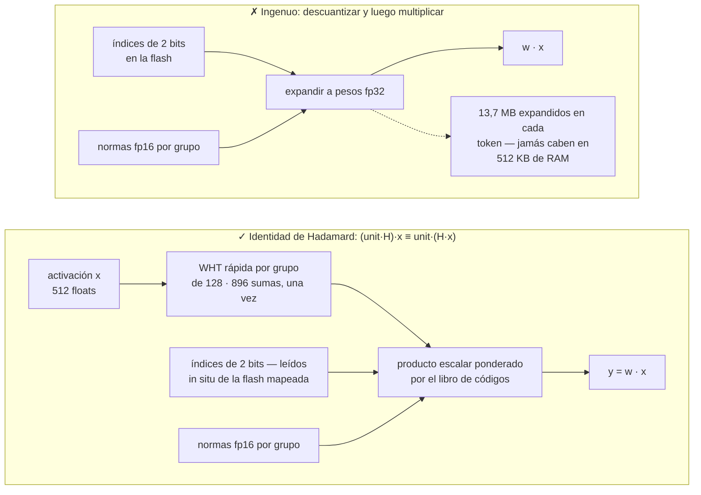
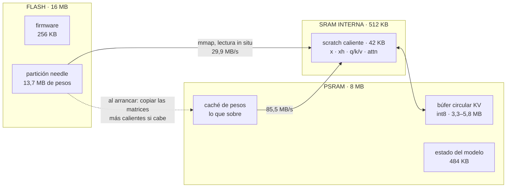
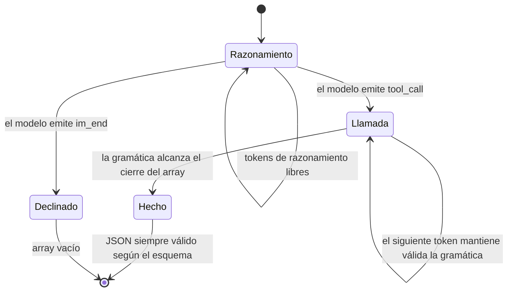
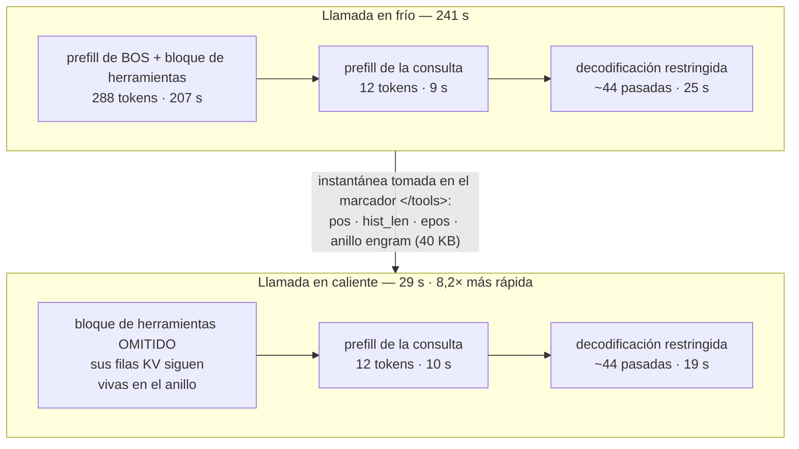
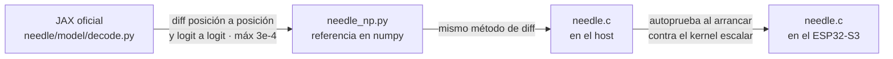

# MimiModel: Tool calling LLM on a $5 chip.


<p>
  <a href="LICENSE"></a>
  <a href="https://discord.gg/r8ZxSvB8Yr"></a>
  <a href="https://x.com/ssslvky"></a>
</p>

MimiModel es un motor que ejecuta un LLM de 45M de parámetros para llamadas a herramientas,
control de dispositivos y extracción estructurada en un ESP32-S3 de 5 $.

Un motor de inferencia en C, escrito desde cero en un solo archivo, para
[Needle 2 de Cactus Compute](https://github.com/cactus-compute/needle), ejecutándose por completo
en un microcontrolador ESP32-S3. Sin Linux, sin Python, sin red. Los 13,7 MB de pesos viven en la
flash y **nunca** se cargan en RAM.

[🇺🇸 English](README.md) · [🇯🇵 日本語](README_JA.md) · 🇪🇸 Español · [🇨🇳 中文](README_CN.md)

```
$ turn on pin 5
[{"name":"gpio_on","arguments":{"pin":5}}]
```

| | |
|---|---|
| **Modelo** | Needle 2 — 45M parámetros, CQ de 2 bits, archivo único de 13,7 MB |
| **Hardware** | ESP32-S3, Xtensa LX7 a 240 MHz, 16 MB flash, 8 MB PSRAM (~5 $) |
| **Motor** | un archivo C99, ~2.000 líneas, sin más dependencias que `libm` |
| **Velocidad ESP32** | una herramienta fija: **prefill 2,11 tok/s · decode 1,73 tok/s** · 14,914 s caliente · 32,770 s fría |
| **Memoria** | 13,7 MB flash (mapeada en memoria) · ~7,7 MB PSRAM · firmware de 256 KB |
| **Precisión** | **69,6%** en google/mobile-actions (961 casos, strict) — engine oficial 2.0.2: 69,2% con entradas idénticas |

> **Honestidad por delante:** esto es varias veces más lento que una API en la nube, no entiende
> chino y, si le saludas, llamará una herramienta igualmente. La puntuación strict ya iguala al
> motor oficial, aunque la precisión de nombres y la distribución de errores difieren. Véanse el [benchmark](#benchmark) y las
> [limitaciones](#limitaciones). Lo que ganas es un modelo de lenguaje que funciona con el
> cable de red desenchufado.

---

## ¿Cómo falla Cactus aquí?

El motor publicado encuentra dos obstáculos en Xtensa: el núcleo de cómputo de Needle se distribuye
en binarios precompilados y los kernels abiertos apuntan a ARM NEON. La especificación abierta de
`.cact` aún permite construir directamente un motor compacto para ESP32-S3.

[Consulta el análisis detallado del código fuente (en inglés)](docs/how-it-fails.md).

## Inicio rápido

### 1. Instalar la CLI del host

```bash
python3 -m venv .venv
. .venv/bin/activate
python -m pip install -e .
```

`mimimodel` se ejecuta en un terminal host de macOS o Linux. La CLI mantiene abierta una conexión
serie para reutilizar la caché de prefijo KV entre comandos.

### 2. Compilar y grabar una vez

Requiere ESP-IDF v5.5+, una placa con 16 MB de flash y 8 MB de PSRAM, y los pesos descargados desde
[Hugging Face](https://huggingface.co/Cactus-Compute/needle2) en `model/needle2.cact`. Sustituye
`/dev/ttyUSB0` por el puerto de la placa; en macOS suele comenzar por `/dev/cu.usbmodem`.

```bash
cd needle-esp32s3
idf.py set-target esp32s3
idf.py -DNEEDLE_FAST_MATH=ON build
idf.py -p /dev/ttyUSB0 flash
./scripts/flash_weights.sh /dev/ttyUSB0        # 13,7 MB en `needle` en 0x210000
cd ..
```

No dejes `idf.py monitor` abierto: la CLI necesita el puerto serie.
Fast math está activado por defecto para obtener la máxima velocidad. Usa
`-DNEEDLE_FAST_MATH=OFF` solo para reproducir la referencia con semántica IEEE.
Los valores por defecto alineados en precisión protegen 160 tokens de prefijo, permiten 256 tokens
de reasoning y activan la gramática byte continua. Las opciones ESP-IDF son
`NEEDLE_PREFIX_SINK_TOKENS`, `NEEDLE_REASON_MAX_TOKENS` y `NEEDLE_BYTE_GRAMMAR`.

### 3. Añadir herramientas

```bash
mimimodel tools import examples/tools/demo.json --profile demo --activate
mimimodel tools list
```

Los esquemas de herramientas se configuran en tiempo de ejecución. El firmware incluye siete
esquemas móviles de respaldo en [`DEMO_TOOLS`](needle-esp32s3/main/main.c#L19-L22), y la CLI envía
el perfil activo en cada petición. Edita un archivo JSON y usa `mimimodel tools add FILE`,
`tools remove NAME` o `tools import FILE` para cambiar herramientas sin recompilar ni volver a
grabar los pesos. `mimimodel tools validate FILE` comprueba un esquema antes de importarlo.
El perfil incluido de tres herramientas queda por debajo del presupuesto de recuperación de 180
tokens. Los perfiles mayores son válidos, pero la poda dependiente de la petición puede cambiar el
prefijo efectivo e impedir un acierto de caché.

### 4. Ejecutar

```bash
# Llamada simple
mimimodel run "Turn on the flashlight."
# [{"name":"turn_on_flashlight","arguments":{}}]

# Dos herramientas con extracción estructurada
mimimodel run 'Create a calendar event titled "ESP32 demo" for 2026-08-21 at 14:30, then email ada@example.com with the subject "Demo confirmed".'
# [{"name":"create_calendar_event","arguments":{"title":"ESP32 demo","datetime":"2026-08-21T14:30:00"}},{"name":"send_email","arguments":{"subject":"Demo confirmed","to":"ada@example.com"}}]
```

El primer `run` inicia un daemon serie en segundo plano y reinicia la placa una sola vez. Las
llamadas posteriores con el mismo perfil conservan la conexión y el prefijo. `mimimodel status`
muestra el puerto, la compilación del firmware y el hash del prefijo; `mimimodel daemon stop`
libera el puerto. La entrada debe estar en inglés. El comando devuelve JSON, pero no ejecuta las
herramientas.

La salida doble selecciona ambas herramientas y extrae la fecha y hora, el correo, el título y el
asunto. La latencia depende del esquema seleccionado, la longitud de la consulta y las llamadas
generadas. Como referencia reproducible, la compilación más rápida por defecto (`fast_math=1`) con una herramienta
fija tardó **32,770 s** en frío y **14,914 s** tras acertar la caché de prefijo en la placa anterior
(2026-08-22). Ambas ejecuciones devolvieron el mismo JSON del ejemplo simple. Las condiciones exactas
están en el [benchmark](#benchmark).

> ⚠️ Graba la app **antes o junto con** los pesos. Cualquier firmware cuya tabla de particiones
> coloque una región SPIFFS sobre la zona de pesos la formateará automáticamente en el primer
> arranque y corromperá el modelo en silencio (esto nos costó una tarde: la flash devolvía `0xFFFF`,
> que interpretado como coma flotante es `NaN`).

## Cómo funciona

### 1. El formato `.cact`

Una cabecera de 120 bytes lleva toda la geometría de la arquitectura, seguida de los libros de
códigos Lloyd-Max compartidos, un directorio de tensores **sin nombres** (los tensores son
posicionales, en un orden canónico fijo) y luego bloques alineados a 64 bytes. Como la geometría
viaja en la cabecera, un mismo binario carga cualquier configuración de la arquitectura. Analizarlo
son unas 150 líneas de C.

### 2. Cactus Quants, y el truco que mantiene los pesos en la flash

Una matriz `[out, in]` cuantizada con CQ se almacena como índices de 2 bits a un libro de códigos
compartido sobre la esfera unidad, más una norma L2 en fp16 por cada grupo de 128 elementos. La
reconstrucción por grupo es:

```
w_group = (codebook[idx] * norm) @ H        # H = matriz de Walsh–Hadamard normalizada
```

Descuantizar para calcular `w · x` significaría expandir los 13,7 MB enteros en cada token. En su
lugar, el motor aprovecha que `H` es simétrica y ortogonal:

```
(unit · H) · x  ==  unit · (H · x)
```

Así que transformamos la **activación** una sola vez por grupo de 128 con una transformada rápida de
Walsh–Hadamard (O(n log n), 896 sumas), y entonces el producto matriz-vector se reduce a un producto
escalar ponderado por el libro de códigos leído **directamente sobre los bytes empaquetados de 2 bits**.
Los pesos nunca se expanden, nunca se copian y siguen mapeados en memoria desde la flash mediante
`esp_partition_mmap`. Cargar el modelo tarda **48 ms**.




### 3. Memoria acotada

Needle usa una ventana de atención con los 256 tokens más recientes. MimiModel protege además los
primeros 160 tokens del prompt. La caché KV int8 conserva 416 filas físicas, la misma asignación que
el anillo anterior, mientras mantiene visibles las instrucciones de sistema y el inicio de tools.




### 4. Decodificación restringida por gramática

Un modelo de 45M en carrera libre produce algo *casi* JSON. MimiModel compila una gramática byte
continua desde los esquemas activos y valida todos los bytes de cada token candidato. Los tokens
pueden cruzar límites estructurales de JSON; nombres, parámetros obligatorios y enteros permanecen
dentro del esquema sin teacher-forcing fragmentado.




La salida queda válida sin cambiar el historial natural de tokens. Fue la mayor mejora de la
atribución frente al motor oficial; véase el [benchmark](#benchmark).

### 5. Caché de prefijo KV — la mayor ganancia individual

En un agente de llamada a herramientas, el bloque `<tools>` es idéntico byte a byte en cada llamada
y domina el prompt (288 de 300 tokens). Sus filas KV siguen vivas en el anillo, así que solo hay que
prellenar la consulta. El punto de corte es el marcador `</tools>`: los marcadores son tokens
atómicos, de modo que la tokenización del prefijo es **demostrablemente** un prefijo de la del prompt
completo.

**Traza histórica con tres herramientas: 241 s en frío → 29 s en caliente (8,2×).** La compilación
TIE728 actual es más rápida; la traza se conserva para mostrar qué trabajo elimina la caché en cada fase.




## Registro de optimización

Rendimiento bruto del motor, medido sobre hardware real:

| Cambio | Efecto |
|---|---|
| C escalar de partida | prefill 0,64 tok/s, decode 0,59 |
| Reparto en dos núcleos (matvec por filas, atención por cabezas KV) | ~1,8× |
| Omitir la cabeza de logits de 8192×512 durante el prefill | +10% prefill |
| Decodificación de pesos por LUT de byte + kernel de 4 filas (4 filas comparten cada lectura de activación) | +18% |
| Scratch caliente trasladado a SRAM interna | +5% |
| Caché de pesos en PSRAM (oportunista) | +8% |
| Cargas float alineadas TIE728 + kernel CQ2 de 2 filas/8 acumuladores | matvec 512×512: 5,272 → 3,781 ms en un núcleo; 2,700 → 1,960 ms en dos |
| Planificación entre operadores (mHC/Sinkhorn y gate durante trabajo independiente del núcleo 0) | latencia en frío -5,9%; en caliente -5,6% |
| Nivel de pesos PSRAM dimensionado por solicitud, ordenado según el coste medido de las proyecciones | latencia en caliente -2,3%; se libera antes de redimensionar KV |
| **Medición más rápida por defecto con una herramienta fija** | **prefill 2,11 tok/s, decode 1,73; 32,770 s en frío, 14,914 s en caliente** |
| Caché de prefijo KV (cuesta ~20% de velocidad bruta por agrandar el anillo) | **8,2× extremo a extremo** |

### Lo que no funcionó

- **Ruta PIE int16 densa.** Implementada en ensamblador (`ee.vmulas.s16.accx`, 8 MAC
  por instrucción) con una ruta de activaciones cuantizadas a int16. Numéricamente correcto
  (error relativo 5,5e-5 en la autoprueba) y **0,32× la velocidad**: 3 veces *más lento*. Desempaquetar
  los pesos de 2 bits en carriles int16 concentra el coste; PIE carece de una instrucción de
  desempaquetado de 2 bits y las multiplicaciones-acumulaciones representan una parte menor. El
  código se conserva tras `-DNEEDLE_PIE`, desactivado por defecto. El kernel TIE728 actual mantiene
  la decodificación CQ2 mediante LUT de bytes y acelera cargas y acumuladores float sin ensanchar pesos.
- **Aritmética int16 en el host.** 2,3× más lenta que en float sobre ARM/x86, porque el compilador
  vectoriza automáticamente los bucles en float. El beneficio de SIMD depende de la disposición
  de los datos y de las instrucciones disponibles.
- **Sinkhorn en espacio lineal.** Matemáticamente equivalente a la versión en espacio logarítmico,
  pero sufre underflow y da NaN. Quédate con la logarítmica.
- **Kernel CQ2 bloqueado de dos tokens.** Reutilizar cada lectura de pesos para dos vectores fue
  numéricamente correcto, pero el par de matvec solo aceleró 1,11×. Una ruta target completa para
  verificación tipo DFlash exigiría además estado y atención causal. Se retiró el prototipo; las
  mediciones están en la [auditoría de overlap](docs/esp32s3-overlap-audit.md).

## Limitaciones

- **La latencia depende del esquema.** La carga controlada de una herramienta tarda 14,914 s en
  caliente y 32,770 s en frío; los esquemas mayores y las salidas con varias llamadas pueden tardar
  minutos. Una API en la nube sigue siendo mucho más rápida. El valor está en trabajar sin conexión,
  sin coste de API y con los datos en el dispositivo.
- **El modelo no admite chino.** Las órdenes de dispositivo en chino obtienen 0/5 y el motor oficial
  presenta los mismos fallos. La limitación pertenece al propio modelo. La puntuación de confianza
  cae a 0,02–0,22 en estos casos, lo que permite detectarlos.
- **No sabe declinar.** Si le pides un chiste, el modelo emite una llamada a herramienta igualmente.
  Cualquier enrutado en producción necesita una puerta de confianza más un prefiltro de texto.
- **Los argumentos booleanos/semánticos no son fiables.** `gpio_write(pin, state)` acierta el `state`
  solo alrededor de la mitad de las veces. Dividirlo en `gpio_on(pin)` / `gpio_off(pin)` —ajustándose
  a lo que el modelo realmente hace bien: elegir nombres y extraer enteros— lleva la precisión en
  escritura de 1/5 a 5/6.
- **La cabeza de confianza aún no está implementada.** Sus pesos están presentes en el archivo
  `.cact`; el motor omite de momento las probe heads.

## Desarrollo

### Archivos

| Ruta | Qué es |
|---|---|
| `needle.c` | el motor: parser, kernels, tokenizador, decodificador restringido, CLI |
| `mimimodel_cli.py` | CLI del host, perfiles de herramientas y daemon serie persistente |
| `examples/tools/demo.json` | ejemplo editable de esquemas de herramientas en tiempo de ejecución |
| `needle_np.py` | implementación de referencia en numpy, validada contra la decodificación JAX oficial |
| `needle-esp32s3/` | proyecto ESP-IDF (tabla de particiones, grabador de pesos, demo REPL) |
| `bench/` | arneses de evaluación: precisión en google/mobile-actions, velocidad y el driver serie del ESP32-S3 ([docs](bench/README.md)) |

### Entorno de desarrollo

El motor C no tiene dependencias. `pip install -e .` instala la CLI del host y pyserial. La
implementación de referencia y el benchmark necesitan además:

```bash
# la referencia en numpy y el contraste con JAX leen el código del paquete original
git clone https://github.com/cactus-compute/needle
pip install numpy sentencepiece jax flax

# el benchmark además usa el motor oficial cerrado como oráculo
pip install cactus-needle
```

`needle_np.py` es una implementación independiente del modelo en numpy. `compare_jax.py` la
compara contra el bucle de decodificación oficial en JAX dentro del árbol `needle/` clonado: esa
es la comprobación que detectó los dos errores descritos en [Corrección](#corrección).

## Benchmark

Evaluado sobre [google/mobile-actions](https://huggingface.co/datasets/google/mobile-actions)
(CC-BY-4.0) — el conjunto de 961 casos de llamada a funciones en dispositivo
publicado junto a FunctionGemma — puntuado aquí con *ordered strict exact match*:
los nombres de función, el orden de las llamadas y cada argumento deben coincidir.
Este motor se volvió a ejecutar el 2026-08-22. La columna oficial reutiliza el
artefacto directamente comparable porque los hashes del engine y del dataset no
cambiaron. Ambos conservan el orden de herramientas de cada registro, los turnos
developer/user separados, los espacios originales y su recuperación nativa.

| | este motor | motor oficial, mismos registros/esquemas |
|---|---|---|
| precisión | **69,6%** | 69,2% |
| precisión de nombre | 90,8% | **98,1%** |
| casos de 1 llamada (640) | **76,2%** | 73,6% |
| casos de 2 llamadas (320) | 56,2% | **60,3%** |

El motor anterior puntuaba 469/961 (48,8%). Los pesos del dylib oficial y los del
repositorio son idénticos byte a byte. En ablaciones pareadas de las 961 filas,
subir el límite de reasoning de 90 a 256 recuperó 44 filas, conservar el prefijo
otras 63 y sustituir el teacher-forcing segmentado por una gramática byte continua
otras 96. El límite de 160 tokens para ESP32 pierde solo 3 filas frente al prefijo
completo y conserva la asignación KV anterior.

Superar ligeramente al motor oficial en strict no implica equivalencia token a
token. MimiModel conserva menor precisión de nombres y más under-calls, pero gana
más filas de argumentos. El análisis completo está en el
[informe de causa raíz](docs/official-engine-accuracy-gap.md).

Cactus publica 63,7% exacto y 98,3% de nombres. El paquete público actual
2.0.6/engine 2.0.2 obtiene 69,2%/98,1% en este arnés. Como la web no publica la
conversión de prompts/esquemas, las herramientas recuperadas, las filas crudas ni
el hash binario, esa diferencia de 5,5 puntos no es atribuible.

**Benchmark local M4 (2026-08-22):** 200 casos con orden canónico de herramientas
y recuperación nativa, ejecutados en serie en un Apple M4 con 16 GB. Este motor
midió 191/141 tok/s de prefill/decode y 2259 ms de mediana de completion. El engine
oficial 2.0.2 sin cambios midió 1204/702 tok/s, 665 ms de completion y 948 ms al
incluir sus 293 ms de inicialización mediana. Son temporizadores de fase reales.
[Los comandos, hashes, artefactos y la atribución](docs/benchmark-20260822.md)
se conservan por separado.

**Velocidad actual en ESP32-S3 real (2026-08-22):** la compilación más rápida por
defecto (`fast_math=1`, `profile=0`) procesó un prompt fijo de 52 tokens y una
herramienta en 32,770 s en frío y 14,914 s en caliente.
El prefill/decode en frío alcanzó 2,11/1,73 tok/s; las ejecuciones repetidas emitieron
la misma llamada de linterna. La autoprueba TIE728 pasó con un error absoluto máximo
de 8,583e-06. Una fila mobile-actions de 252 tokens terminó strict exact en 158,111 s,
un 6,5% más rápido que el firmware anterior, y coincidió byte a byte con el host.
Una entrada mobile-actions compleja de 333 tokens completó dos llamadas
strict-exact en 413,742 s y coincidió byte por byte con el host actual. Tres filas
anteriores tardaron 169,1/319,6/255,4 s y también coincidieron; estas muestras de la
placa comprueban paridad, no precisión poblacional.
[El diseño de overlap, la configuración, los experimentos descartados y la evidencia](docs/esp32s3-overlap-audit.md)
se conservan por separado.

**Auditoría anterior a TIE728 (2026-08-19):** la misma placa rev 0.2 a 240 MHz con
8 MB de PSRAM octal midió 42,895/20,067 s en frío/caliente con una herramienta fija.
El `-ffast-math`, entonces opcional, alcanzó 41,541/19,444 s. Dos filas
mobile-actions coincidieron byte a byte con el host estándar. Datos completos en
[`bench/results/device_protocol_audit_20260819.json`](bench/results/device_protocol_audit_20260819.json).

La compilación justa también ejecutó una muestra proporcional de semilla fija
(8 filas de una llamada + 4 de dos): 5/12 exactas, 9/12 nombres, mediana 315,5 s
y 1,39/1,11 tok/s. El intervalo Wilson exacto es 19,3-68,0%, por lo que no estima
la población. La salida cruda coincidió con arm64 en 10/12 y el aprobado/fallo en
12/12. Una solicitud superó 650 s tras ocho filas continuas y terminó en 355,9 s
después de reiniciar; se conserva como hallazgo de estabilidad.

[`bench/README.md`](bench/README.md) tiene los comandos, los resultados crudos por
caso y qué conviene no equivocar al volver a ejecutarlos.

## Corrección

El motor sigue una cadena de equivalencias verificadas:

1. `needle_np.py` (numpy) se comparó **posición a posición y logit a logit** con el `_forward_cached`
   oficial en JAX del paquete `needle`. Diferencia máxima: 3e-4.
2. `needle.c` se comparó del mismo modo contra `needle_np.py`.
3. En el dispositivo, el firmware autocomprueba el kernel SIMD contra el escalar al arrancar.




Dos errores aparecieron solo gracias a esto: los tensores mHC `a_pre`/`a_post`/`a_res` son *escalares*
por capa (el broadcasting de numpy lo ocultaba; en C era una lectura fuera de rango), y los `taps` del
engram siguen una disposición vectorial `(4, 512)` por canal que la implementación original interpretaba
como 4 escalares.

## Créditos

Este proyecto es un *motor*. El modelo, la arquitectura, el esquema de cuantización y el formato son
trabajo de otras personas.

- **[Cactus Compute](https://cactuscompute.com)** — el [modelo Needle 2](https://huggingface.co/Cactus-Compute/needle2)
  (Apache-2.0), el [paquete Python `needle`](https://github.com/cactus-compute/needle) (MIT), cuyos
  `export.py` / `decode.py` / `architecture.py` son la especificación que este motor implementa, y el
  [motor `cactus`](https://github.com/cactus-compute/cactus). Cactus Quants y el formato `.cact` son suyos.
- **Ndubuaku, H., Mosoyan, K., Mroz, J., Cylich, N., Kumar, S., Sandhu, P., Shemet, R. y Lee, J. H.**
  *A Controlled Study of Attention-Only Transformers.* [arXiv:2607.18363](https://arxiv.org/abs/2607.18363)
  — la arquitectura Simple Attention Network sobre la que se construye Needle.
- **[slvDev/esp32-ai](https://github.com/slvDev/esp32-ai)** — trabajo previo que demostró un LLM de
  28,9M parámetros en un ESP32-S3 a 9,9 tok/s usando Per-Layer Embeddings. Es lo que hizo que esto
  pareciera merecer el intento.
- **[Andrej Karpathy, llama2.c](https://github.com/karpathy/llama2.c)** — el motor de inferencia en C
  de un solo archivo y sin dependencias al que este se parece.
- **[Espressif](https://github.com/espressif/esp-idf)** — ESP-IDF,
  [esp-dsp](https://github.com/espressif/esp-dsp) y
  [esp-dl](https://github.com/espressif/esp-dl). Su ensamblador Xtensa sirvió como referencia
  funcional para PIE/TIE728, cargas vectoriales alineadas y planificación de acumuladores.
- **[SentencePiece](https://github.com/google/sentencepiece)** — el modelo de tokenizador BPE del que
  el blob de tokenizador de `.cact` es un volcado.
- Las transformadas de Walsh–Hadamard y la cuantización de Lloyd-Max son clásicas; la aplicación
  concreta de la identidad de Hadamard para evitar la descuantización es diseño de Cactus, descrito
  en `export.py`.

## Licencia

El código del motor de este repositorio está bajo licencia MIT. Los pesos de Needle 2 son Apache-2.0
y **no** se redistribuyen aquí: descárgalos de Hugging Face. Los repositorios `needle` y `cactus`
conservan sus propias licencias.
