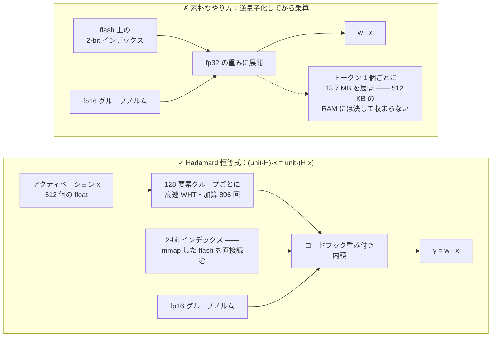
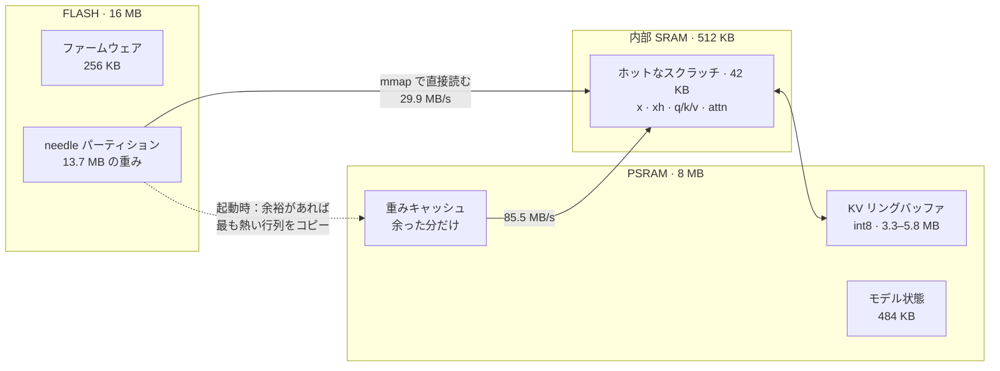
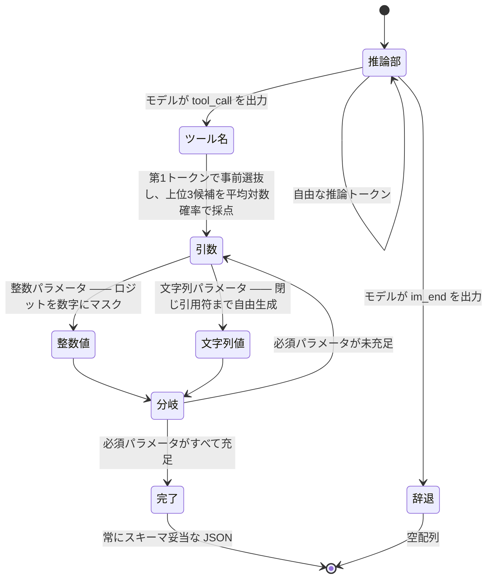
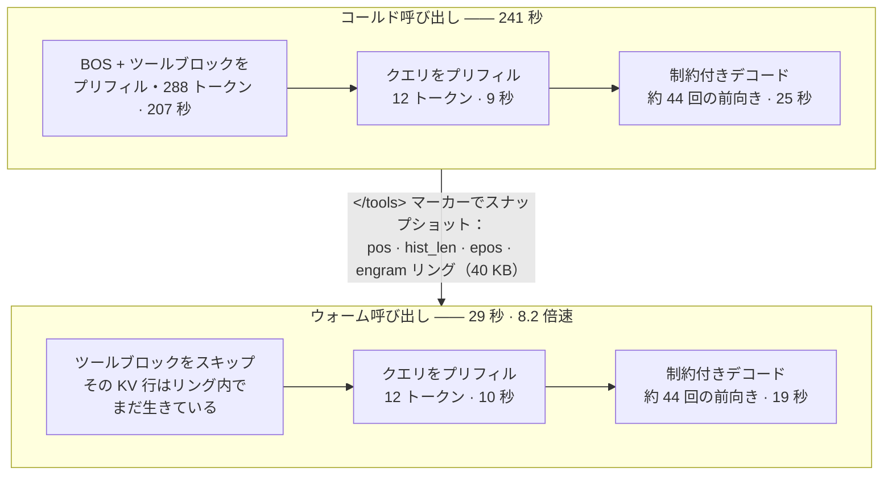
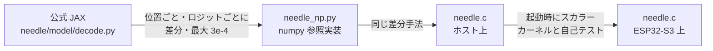

# MimiModel: Tool calling LLM on a $5 chip.


<p>
  <a href="LICENSE"></a>
  <a href="https://discord.gg/r8ZxSvB8Yr"></a>
  <a href="https://x.com/ssslvky"></a>
</p>

MimiModel は、ツール呼び出し、デバイス制御、構造化抽出向けの 45M パラメータ LLM を、
5 ドルの ESP32-S3 上で動かすエンジンです。

[Cactus Compute の Needle 2](https://github.com/cactus-compute/needle) 向けにゼロから書いた
単一ファイルの C 推論エンジン。ESP32-S3 マイコン上で完結して動きます。Linux も Python も
ネットワークも不要。13.7 MB の重みは flash に置いたまま、**一度も** RAM に載せません。

[🇺🇸 English](README.md) · 🇯🇵 日本語 · [🇪🇸 Español](README_ES.md) · [🇨🇳 中文](README_CN.md)

```
$ turn on pin 5
[{"name":"gpio_on","arguments":{"pin":5}}]
```

| | |
|---|---|
| **モデル** | Needle 2 — 45M パラメータ、CQ 2-bit 量子化、13.7 MB の単一ファイル |
| **ハードウェア** | ESP32-S3、240 MHz Xtensa LX7、16 MB flash、8 MB PSRAM（約 750 円） |
| **エンジン** | C99 ファイル 1 本、約 2,000 行、`libm` 以外の依存なし |
| **速度** | ウォーム呼び出し **29 秒** · コールド **241 秒** · プリフィル 1.4 tok/s |
| **メモリ** | 13.7 MB flash（メモリマップ）· 約 7.7 MB PSRAM · ファームウェア 256 KB |
| **精度** | google/mobile-actions 961 件の strict で 49.3% —— 同一入力の公式 engine 2.0.2 は 69.2% |

> **先に正直なことを：** クラウド API より約 5 倍遅く、中国語は理解せず、挨拶しただけでも
> 平気でツールを呼び、同じ評価セットで公式エンジンに大きく劣ります。
> [ベンチマーク](#ベンチマーク)と[制約](#制約)を参照してください。
> 代わりに得られるのは、LAN ケーブルを抜いても動く言語モデルです。

---

## Cactus はここでどのように行き詰まるのか？

公開エンジンは Xtensa 上で 2 つの壁に当たります。Needle の計算コアはビルド済みバイナリとして
配布され、公開カーネルは ARM NEON を対象としています。一方、公開された `.cact` モデル仕様からは、
ESP32-S3 向けの小さな専用エンジンを直接構築できます。

[ソースコードに基づく詳細（英語）](docs/how-it-fails.md)。

## 仕組み

### 1. `.cact` フォーマット

120 バイトのヘッダがアーキテクチャの幾何情報一式を持ち、続いて共有 Lloyd-Max コードブック、
**名前を持たない**テンソルディレクトリ（テンソルは固定の正準順序で位置指定）、そして 64 バイト
アラインされたデータブロックが並びます。幾何情報がヘッダに載っているので、同一バイナリで
このアーキテクチャの任意の構成をロードできます。パーサは C で約 150 行です。

### 2. Cactus Quants と、重みを flash に置いたままにする仕掛け

CQ 量子化された `[out, in]` 行列は、単位球面上の共有コードブックへの 2-bit インデックスと、
128 要素グループごとの fp16 L2 ノルムとして格納されます。グループ単位の復元は次の通りです。

```
w_group = (codebook[idx] * norm) @ H        # H は正規化 Walsh–Hadamard 行列
```

`w · x` を計算するために逆量子化してしまうと、トークン 1 個ごとに 13.7 MB 全部を展開することに
なります。そこでエンジンは `H` が対称かつ直交であることを利用します。

```
(unit · H) · x  ==  unit · (H · x)
```

つまり**アクティベーション側**を 128 要素グループごとに一度だけ高速 Walsh–Hadamard 変換
（O(n log n)、加算 896 回）し、その後の行列ベクトル積は、**パックされた 2-bit バイトを直接読む**
コードブック重み付き内積に還元されます。重みは展開もコピーもされず、`esp_partition_mmap` で
flash にメモリマップされたままです。モデルのロードは **48 ミリ秒**。




### 3. 有界メモリ

Needle は 256 トークンのスライディング注意窓を使います。KV キャッシュは int8（モデル自身の
ヘッダが宣言する、事後学習された幅）で、窓幅＋わずかな余裕にサイズを合わせた**リングバッファ**に
置かれるため、プロンプトの長さに関係なく RAM 使用量は一定です。ある行が上書きされるのは
`kv_alloc` 位置ぶん後なので、`kv_alloc > kv_window` でありさえすれば窓内の行はすべて無傷です。




### 4. 文法制約付きデコード

45M のモデルを自由に走らせると「ほぼ JSON」が出てきます。そこでエンジンはツールスキーマに
沿ってデコードを駆動します。クローズド版のグラマーコンパイラがやっていることと同じ発想です。

- 構造テキスト（`[{"name":"`、`","arguments":{`）は**強制**します。デコーダは「目標文字列の
  接頭辞になるトークン」へロジットをマスクし、トークン ID の直接追加を避けながらモデルの文脈を
  常に正準な状態に保ちます。
- **ツール名**は各候補の完全な平均トークン対数確率をスコアリングして選びます（teacher-forcing と
  安価なカウンタ巻き戻しを併用）。その前に無料の第 1 トークン事前ランキングで上位 3 候補に絞ります。
- **整数引数**は数字マスク、**必須パラメータ**は出現を強制します。




その見返りは、出力が常にスキーマ妥当になることです——45M のモデルを自由に走らせると
そうはなりません。ただし公式エンジンとの差が埋まるわけではありません。相手は同じ重みを
自前のグラマーコンパイラで走らせています（[ベンチマーク](#ベンチマーク)を参照）。

### 5. KV プレフィックスキャッシュ —— 単独で最大の効果

ツール呼び出しエージェントでは `<tools>` ブロックが毎回バイト単位で同一であり、プロンプトの
大半を占めます（300 トークン中 288）。その KV 行はリング内で生き続けるので、プリフィルが必要なのは
クエリ部分だけです。分割点は `</tools>` マーカー——マーカーは原子的なトークンなので、
接頭辞のトークン化がプロンプト全体のトークン化の接頭辞になることが**証明できます**。

**コールド 241 秒 → ウォーム 29 秒（8.2 倍）。**




## 最適化の記録

エンジン素のスループット、いずれも実機計測：

| 変更 | 効果 |
|---|---|
| ベースラインのスカラー C | プリフィル 0.64 tok/s、デコード 0.59 |
| デュアルコア分割（matvec は行で、attention は KV ヘッドで） | 約 1.8 倍 |
| プリフィル中は 8192×512 の logits ヘッドをスキップ | プリフィル +10% |
| バイト LUT による重みデコード ＋ 4 行カーネル（4 行で 1 回のアクティベーション読み出しを共有） | +18% |
| ホットなスクラッチを内部 SRAM へ移動 | +5% |
| PSRAM 重みキャッシュ（余った分を日和見的に使う） | +8% |
| **合計** | **プリフィル 1.72 tok/s（2.7 倍）、デコード 1.38（2.3 倍）** |
| KV プレフィックスキャッシュ（リング拡大のため素の速度を約 20% 犠牲） | **エンドツーエンド 8.2 倍** |

### うまくいかなかったこと

- **ESP32-S3 の PIE 128-bit SIMD。** アセンブリで実装しました（`ee.vmulas.s16.accx`、
  1 命令で 8 積和）。int16 量子化アクティベーション経路つき。数値は正しい（自己テストの相対誤差
  5.5e-5）のに速度は **0.32 倍**——3 倍*遅い*。2-bit 重みを int16 レーンへ展開する処理が実行時間の
  大半を占め、積和の比重は小さく、PIE には 2-bit 展開命令もありません。コードは `-DNEEDLE_PIE` の
  後ろに残してあり、既定では無効です。
- **ホスト側での int16 演算。** ARM/x86 では float より 2.3 倍遅い。コンパイラが float ループを
  自動ベクトル化するためです。SIMD の効果はデータ配置と命令の対応範囲に左右されます。
- **線形空間の Sinkhorn。** 対数空間版と数学的には等価ですが、アンダーフローして NaN になります。
  素直に対数空間版を使うこと。

## 制約

- **1 回あたり約 29 秒。** 同じ質問にクラウド API は 3〜8 秒で答えます。ここでの価値はオフライン
  動作、API 費用ゼロ、端末内でのデータ保持にあります。レイテンシはクラウド API を大幅に上回ります。
- **モデルは中国語に対応していません。** 中国語のデバイス命令は 0/5 で、公式エンジンも同じ結果です。
  これはモデル自体の能力限界を示します。信頼度スコアは 0.02〜0.22 まで落ちるため、検出は可能です。
- **断ってくれません。** 冗談を言ってと頼んでも、モデルはツール呼び出しを出します。実運用の
  ルーティングには信頼度ゲートとテキスト事前フィルタの両方が必要です。
- **真偽値・意味的な引数は不安定。** `gpio_write(pin, state)` の `state` は半分ほど間違えます。
  これを `gpio_on(pin)` / `gpio_off(pin)` に分割する——モデルが実際に得意なこと（名前選択と
  整数抽出）に合わせる——と、書き込みの正答率が 1/5 から 5/6 になります。
- **信頼度ヘッドは未実装。** 重みは `.cact` に入っていますが、エンジンは現状 probe head を
  スキップしています。

## ビルドと実行

### ホスト上（macOS / Linux）

```bash
mkdir -p model && cd model
curl -LO https://huggingface.co/Cactus-Compute/needle2/resolve/main/needle2.cact
cd ..
cc -O3 -o needle needle.c -lm
./needle model/needle2.cact "Set a timer for 10 minutes" \
  '[{"name":"set_timer","description":"Set a countdown timer","parameters":{"type":"object","properties":{"minutes":{"type":"integer","description":"Minutes"}},"required":["minutes"]}}]'
# [{"name":"set_timer","arguments":{"minutes":10}}]
```

`NEEDLE_FREE=1` で制約なしデコード、`NEEDLE_REPEAT=n` でプレフィックスキャッシュの確認ができます。

### ESP32-S3 上

ESP-IDF v5.5 以降と、16 MB flash・8 MB PSRAM のボードが必要です。

```bash
cd needle-esp32s3
idf.py set-target esp32s3
idf.py build
./scripts/flash_weights.sh /dev/ttyUSB0        # 13.7 MB を 0x210000 の生 `needle` パーティションへ
idf.py -p /dev/ttyUSB0 flash monitor
```

起動時にデモのツール呼び出しを 1 回実行し、その後シリアル REPL に入ります。クエリを入力して Enter。

> ⚠️ 重みより**先に、あるいは同時に** app を書き込んでください。パーティションテーブルが SPIFFS
> 領域を重み領域に重ねているファームウェアは、初回起動時にそこを自動フォーマットし、モデルを
> 静かに破壊します（これで半日溶かしました。flash から `0xFFFF` が読め、それは浮動小数点として
> `NaN` になります）。

### ファイル構成

| パス | 内容 |
|---|---|
| `needle.c` | エンジン本体——パーサ、カーネル、トークナイザ、制約デコーダ、CLI |
| `needle_np.py` | numpy 参照実装。公式 JAX デコードと突き合わせ検証済み |
| `needle-esp32s3/` | ESP-IDF プロジェクト（パーティションテーブル、重み書き込みスクリプト、REPL デモ） |
| `bench/` | 評価ハーネス：google/mobile-actions の正解率、速度、ESP32-S3 のシリアルドライバ（[説明](bench/README.md)）|

### 開発環境のセットアップ

エンジン自体に依存はありません。参照実装とベンチマークには必要です。

```bash
# numpy 参照実装と JAX 突き合わせは上流パッケージのソースを読みます
git clone https://github.com/cactus-compute/needle
pip install numpy sentencepiece jax flax

# ベンチマークはさらに公式クローズドソース版をオラクルとして使います
pip install cactus-needle
```

`needle_np.py` はモデルの独立した numpy 実装です。`compare_jax.py` はそれを、クローンした
`needle/` 内の公式 JAX デコードループと突き合わせます——[正しさの担保](#正しさの担保)で触れた
2 つのバグは、この突き合わせで見つかりました。

## ベンチマーク

[google/mobile-actions](https://huggingface.co/datasets/google/mobile-actions)
(CC-BY-4.0)——FunctionGemma と共に公開された 961 件のオンデバイス関数呼び出し
評価セット——を ordered strict exact match(関数名・呼び出し順序・すべての引数が一致)
で採点しました。各レコード固有のツール順、分離した developer/user ターン、元の空白を保持し、
両エンジンとも固有の retrieval を使った新規実行です。

| | 本エンジン | 公式エンジン(同一レコード/schema) |
|---|---|---|
| 正解率 | 49.3% | 69.2% |
| ツール名正解率 | 79.1% | 98.1% |
| 1 呼び出し(640) | 60.3% | 73.6% |
| 2 呼び出し(320) | 27.5% | 60.3% |

旧本エンジン成果物は strict 48.8%、文字列を正規化した場合だけ 50.4% です。旧公式
76.9% は古いフラグを集計しており、63 行が自身の生出力と矛盾します（strict 70.7%）。
新成果物は 49.3%/69.2% で、保存フラグの不一致は 0 件です。

**差はどこにあるか。** 1 呼び出し行で 13.3 ポイント、2 呼び出し行で 32.8 ポイントです。
1 呼び出しの名前選択はより近く（95.8% 対 99.2%）、主因は 2 回目の呼び出し前に停止する
こと、次に引数抽出です。本エンジンは継続を `,` と `]` の logit 一回で決めます。内訳、調整
カーブ、そのために直した 2 つのバグは
[`bench/README.md`](bench/README.md#multi-call) にあります。

Cactus 公開値は exact 63.7%、name 98.3% です。現行公開 package 2.0.6/engine 2.0.2 は
本ハーネスで 69.2%/98.1% でした。サイトは prompt/schema 変換、retrieval 結果、生の行、
binary hash を公開していないため、exact の 5.5 ポイント差は帰属できません。

実際のフェーズ計時では、100 件の監査で prefill/decode は 244/195 tok/s、公式は
1664/996 tok/s でした。公式初期化込みの総レイテンシは 1711 ms 対 667 ms です。

**ESP32-S3 実機監査 (2026-08-19):** 240 MHz、rev 0.2、8 MB Octal PSRAM の
ボードで、修正済みプロトコルの mobile-actions 2 件は通常 364/292 秒、任意の
`-ffast-math` では 352.4/282.8 秒(約 3.2%短縮)で、すべて標準ホストとバイト単位で
一致しました。ホスト側で厳密正解だった別の 1 件は 189.2 秒で、strict exact と
host parity の両方を満たしました。固定 1 ツール負荷の cold/warm は通常
42.895/20.067 秒、fast math で 41.541/19.444 秒です。これは時間と parity の監査で
あり、精度推定ではありません。僅差の greedy 判断が変わり得るため fast math は任意です。
全データは [`bench/results/device_protocol_audit_20260819.json`](bench/results/device_protocol_audit_20260819.json)
にあります。

標準公平ビルドでも固定 seed の比例層化標本（1-call 8 件 + 2-call 4 件）を実行し、
strict exact 5/12、name 9/12、中央値 315.5 秒、prefill/decode 1.39/1.11 tok/s でした。
exact の Wilson 95% 区間は 19.3-68.0% なので母集団精度ではありません。生出力は
arm64 と 10/12、strict/name の成否は 12/12 一致しました。8 件連続実行後の 1 件が
650 秒を超え、リセット後は 355.9 秒で完了したため、安定性問題として保存しています。

[`bench/README.md`](bench/README.md) に実行コマンド、ケースごとの生の結果、
そして再実行時に間違えやすい点をまとめてあります。

## 正しさの担保

このエンジンは、検証済みの等価性を鎖状につないで構築しました。

1. `needle_np.py`（numpy）を、`needle` パッケージの公式 JAX `_forward_cached` と
   **位置ごと・ロジットごと**に差分検証。最大差 3e-4。
2. `needle.c` を同じ方法で `needle_np.py` と差分検証。
3. 実機では、ファームウェアが起動時に SIMD カーネルをスカラー版と自己テスト。




この鎖があったからこそ見つかったバグが 2 つあります。mHC の `a_pre`/`a_post`/`a_res` は層ごとの
*スカラー*であること（numpy のブロードキャストが隠していたが、C では領域外読み出しになる）、
そして engram の `taps` はチャネルごとの `(4, 512)` ベクトル構成で、元の実装が 4 個のスカラーとして
誤読していたことです。

## クレジットと引用

このプロジェクトは*エンジン*です。モデル、アーキテクチャ、量子化方式、フォーマットは、
すべて他の方々の成果です。

- **[Cactus Compute](https://cactuscompute.com)** —— [Needle 2 モデル](https://huggingface.co/Cactus-Compute/needle2)
  （Apache-2.0）、[`needle` Python パッケージ](https://github.com/cactus-compute/needle)（MIT。
  その `export.py` / `decode.py` / `architecture.py` が本エンジンの実装した仕様そのものです）、
  および [`cactus` エンジン](https://github.com/cactus-compute/cactus)。Cactus Quants と `.cact`
  フォーマットは彼らのものです。
- **Ndubuaku, H., Mosoyan, K., Mroz, J., Cylich, N., Kumar, S., Sandhu, P., Shemet, R., & Lee, J. H.**
  *A Controlled Study of Attention-Only Transformers.* [arXiv:2607.18363](https://arxiv.org/abs/2607.18363)
  —— Needle の土台である Simple Attention Network アーキテクチャ。
- **[slvDev/esp32-ai](https://github.com/slvDev/esp32-ai)** —— 先行研究。Per-Layer Embeddings を
  用いて 28.9M パラメータの LLM を ESP32-S3 上で 9.9 tok/s で動かして見せました。挑戦する価値が
  あると思えたのはこれのおかげです。
- **[Andrej Karpathy, llama2.c](https://github.com/karpathy/llama2.c)** —— 単一ファイル・依存なしの
  C 推論エンジンという形。本エンジンはこれに倣っています。
- **[Espressif](https://github.com/espressif/esp-idf)** —— ESP-IDF、および
  [esp-dsp](https://github.com/espressif/esp-dsp)。その `dspi_dotprod_s16_aes3.S` は ESP32-S3 の
  PIE ベクトル命令の構文を確認するための実働リファレンスになりました。
- **[SentencePiece](https://github.com/google/sentencepiece)** —— `.cact` 内のトークナイザ
  ブロブは、その BPE モデルのダンプです。
- Walsh–Hadamard 変換と Lloyd-Max 量子化は古典的手法です。ただし逆量子化を回避するために
  Hadamard 恒等式を用いるこの具体的な応用は Cactus の設計であり、`export.py` に記述されています。

## ライセンス

本リポジトリのエンジンコードは MIT ライセンスです。Needle 2 の重みは Apache-2.0 であり、
ここでは**再配布していません**——Hugging Face から取得してください。`needle` および `cactus`
リポジトリはそれぞれ独自のライセンスを保持します。
