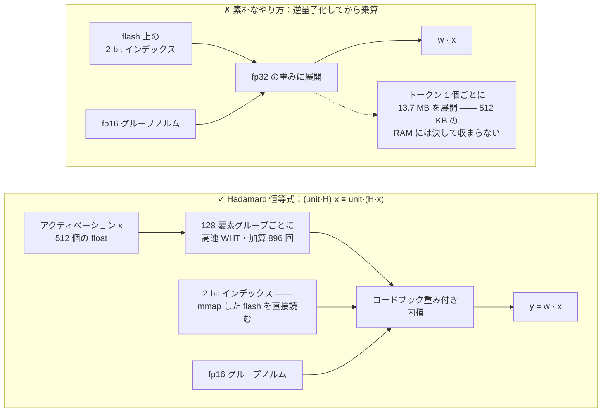
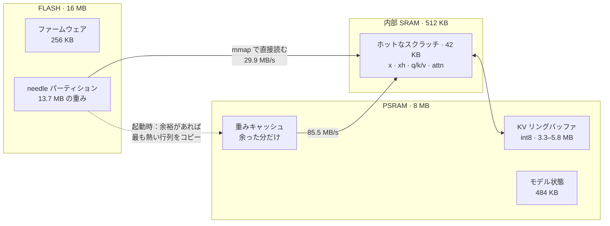
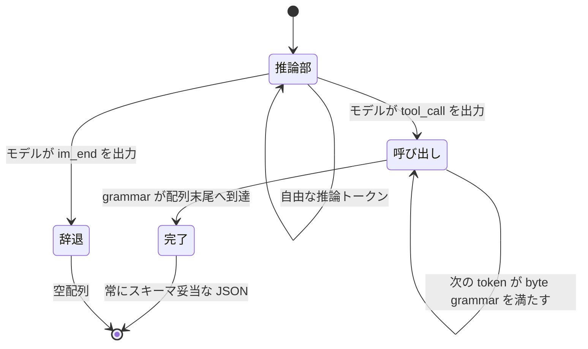
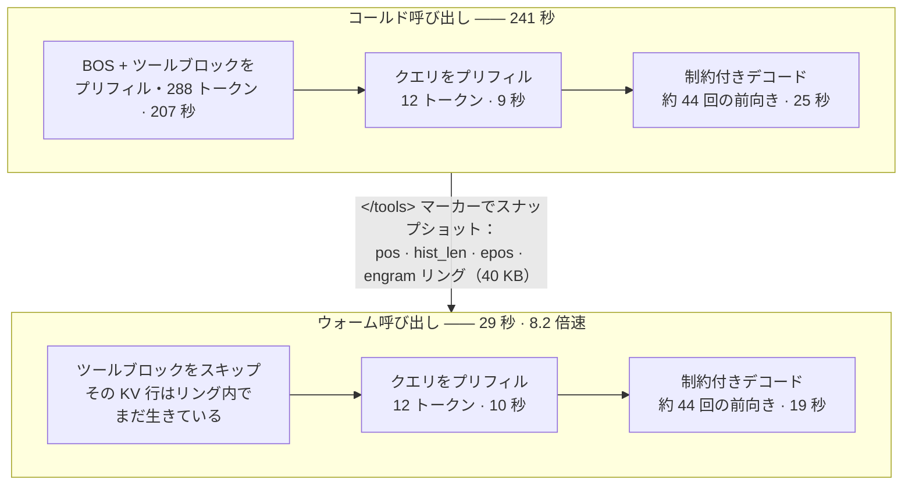
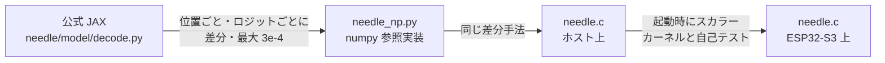

# MimiModel: Tool calling LLM on a $5 chip.


<p>
  <a href="LICENSE"></a>
  <a href="https://discord.gg/r8ZxSvB8Yr"></a>
  <a href="https://x.com/ssslvky"></a>
</p>

MimiModel は、ツール呼び出し、デバイス制御、構造化抽出向けの 45M パラメータ LLM を、
5 ドルの ESP32-S3 上で動かすエンジンです。

[Cactus Compute の Needle 2](https://github.com/cactus-compute/needle) 向けにゼロから書いた
単一ファイルの C 推論エンジン。ESP32-S3 マイコン上で完結して動きます。Linux も Python も
ネットワークも不要。13.7 MB の重みは flash に置いたまま、**一度も** RAM に載せません。

[🇺🇸 English](README.md) · 🇯🇵 日本語 · [🇪🇸 Español](README_ES.md) · [🇨🇳 中文](README_CN.md)

```
$ turn on pin 5
[{"name":"gpio_on","arguments":{"pin":5}}]
```

| | |
|---|---|
| **モデル** | Needle 2 — 45M パラメータ、CQ 2-bit 量子化、13.7 MB の単一ファイル |
| **ハードウェア** | ESP32-S3、240 MHz Xtensa LX7、16 MB flash、8 MB PSRAM（約 750 円） |
| **エンジン** | C99 ファイル 1 本、約 2,000 行、`libm` 以外の依存なし |
| **ESP32 速度** | 固定 1 ツール：**プリフィル 2.11 tok/s · デコード 1.73 tok/s** · ウォーム 14.914 秒 · コールド 32.770 秒 |
| **メモリ** | 13.7 MB flash（メモリマップ）· 約 7.7 MB PSRAM · ファームウェア 256 KB |
| **精度** | google/mobile-actions 961 件の strict で **69.6%** —— 同一入力の公式 engine 2.0.2 は 69.2% |

> **先に正直なことを：** クラウド API より数倍遅く、中国語は理解せず、挨拶しただけでも
> 平気でツールを呼びます。strict スコアは公式に並びましたが、名前精度とエラー分布はまだ異なります。
> [ベンチマーク](#ベンチマーク)と[制約](#制約)を参照してください。
> 代わりに得られるのは、LAN ケーブルを抜いても動く言語モデルです。

---

## Cactus はここでどのように行き詰まるのか？

公開エンジンは Xtensa 上で 2 つの壁に当たります。Needle の計算コアはビルド済みバイナリとして
配布され、公開カーネルは ARM NEON を対象としています。一方、公開された `.cact` モデル仕様からは、
ESP32-S3 向けの小さな専用エンジンを直接構築できます。

[ソースコードに基づく詳細（英語）](docs/how-it-fails.md)。

## クイックスタート

### 1. ホスト CLI をインストール

```bash
python3 -m venv .venv
. .venv/bin/activate
python -m pip install -e .
```

`mimimodel` は macOS または Linux ホストのターミナルで実行します。CLI がシリアル接続を維持し、
コマンド間で KV プレフィックスを再利用します。

### 2. 一度だけビルドして書き込む

ESP-IDF v5.5 以降、16 MB flash・8 MB PSRAM のボード、および
[Hugging Face](https://huggingface.co/Cactus-Compute/needle2) から `model/needle2.cact` に
ダウンロードした重みが必要です。`/dev/ttyUSB0` は実際のポートに置き換えてください。macOS では
通常 `/dev/cu.usbmodem` から始まります。

```bash
cd needle-esp32s3
idf.py set-target esp32s3
idf.py -DNEEDLE_FAST_MATH=ON build
idf.py -p /dev/ttyUSB0 flash
./scripts/flash_weights.sh /dev/ttyUSB0        # 13.7 MB を 0x210000 の `needle` へ
cd ..
```

CLI がシリアルポートを使うため、`idf.py monitor` は起動したままにしないでください。
デバイスの最高速度を得るため、fast math はデフォルトで有効です。IEEE 形式の parity baseline を
再現する場合だけ `-DNEEDLE_FAST_MATH=OFF` を指定します。
精度を合わせたデフォルトは prefix 160 token、reasoning 最大 256 token、連続 byte grammar です。
ESP-IDF の設定名は `NEEDLE_PREFIX_SINK_TOKENS`、`NEEDLE_REASON_MAX_TOKENS`、
`NEEDLE_BYTE_GRAMMAR` です。

### 3. ツールを追加

```bash
mimimodel tools import examples/tools/demo.json --profile demo --activate
mimimodel tools list
```

ツール schema は実行時に設定します。ファームウェアは
[`DEMO_TOOLS`](needle-esp32s3/main/main.c#L19-L22) に 7 個のモバイル操作用フォールバック schema
を持ち、CLI はリクエストごとにアクティブな profile を送信します。JSON ファイルを編集して
`mimimodel tools add FILE`、`tools remove NAME`、`tools import FILE` を実行すれば、再ビルドや重みの
再書き込みなしで変更できます。`mimimodel tools validate FILE` で事前に検証できます。
同梱の 3 ツール profile は、エンジンの 180-token 検索予算内に収まります。より大きな profile も
利用できますが、query ごとのツール枝刈りで実際のプレフィックスが変わり、cache hit しない場合が
あります。

### 4. 実行

```bash
# 単純なツール呼び出し
mimimodel run "Turn on the flashlight."
# [{"name":"turn_on_flashlight","arguments":{}}]

# 構造化抽出を伴う 2 ツール呼び出し
mimimodel run 'Create a calendar event titled "ESP32 demo" for 2026-08-21 at 14:30, then email ada@example.com with the subject "Demo confirmed".'
# [{"name":"create_calendar_event","arguments":{"title":"ESP32 demo","datetime":"2026-08-21T14:30:00"}},{"name":"send_email","arguments":{"subject":"Demo confirmed","to":"ada@example.com"}}]
```

最初の `run` はバックグラウンドのシリアル daemon を起動し、ボードを一度だけリセットします。
同じ profile を使う後続呼び出しは接続とプレフィックスを保持します。`mimimodel status` はポート、
firmware build、プレフィックス hash を表示し、`mimimodel daemon stop` はポートを解放します。入力には英語を
使います。コマンドはツール呼び出し JSON を返しますが、ツール自体は実行しません。

2 ツール出力は両方のツールを選び、日時、メールアドレス、予定タイトル、件名を抽出します。
所要時間は、選ばれた schema、query の長さ、生成する呼び出し数で変わります。再現可能な基準として、
デフォルトの最速 build（`fast_math=1`）と固定 1 ツール schema では、上記ボードでコールド
**32.770 秒**、プレフィックス cache hit 後 **14.914 秒**でした（2026-08-22）。両方とも単純な
例と同一の JSON を返しました。正確な条件は[ベンチマーク](#ベンチマーク)にあります。

> ⚠️ 重みより**先に、あるいは同時に** app を書き込んでください。パーティションテーブルが SPIFFS
> 領域を重み領域に重ねているファームウェアは、初回起動時にそこを自動フォーマットし、モデルを
> 静かに破壊します（これで半日溶かしました。flash から `0xFFFF` が読め、それは浮動小数点として
> `NaN` になります）。

## 仕組み

### 1. `.cact` フォーマット

120 バイトのヘッダがアーキテクチャの幾何情報一式を持ち、続いて共有 Lloyd-Max コードブック、
**名前を持たない**テンソルディレクトリ（テンソルは固定の正準順序で位置指定）、そして 64 バイト
アラインされたデータブロックが並びます。幾何情報がヘッダに載っているので、同一バイナリで
このアーキテクチャの任意の構成をロードできます。パーサは C で約 150 行です。

### 2. Cactus Quants と、重みを flash に置いたままにする仕掛け

CQ 量子化された `[out, in]` 行列は、単位球面上の共有コードブックへの 2-bit インデックスと、
128 要素グループごとの fp16 L2 ノルムとして格納されます。グループ単位の復元は次の通りです。

```
w_group = (codebook[idx] * norm) @ H        # H は正規化 Walsh–Hadamard 行列
```

`w · x` を計算するために逆量子化してしまうと、トークン 1 個ごとに 13.7 MB 全部を展開することに
なります。そこでエンジンは `H` が対称かつ直交であることを利用します。

```
(unit · H) · x  ==  unit · (H · x)
```

つまり**アクティベーション側**を 128 要素グループごとに一度だけ高速 Walsh–Hadamard 変換
（O(n log n)、加算 896 回）し、その後の行列ベクトル積は、**パックされた 2-bit バイトを直接読む**
コードブック重み付き内積に還元されます。重みは展開もコピーもされず、`esp_partition_mmap` で
flash にメモリマップされたままです。モデルのロードは **48 ミリ秒**。




### 3. 有界メモリ

Needle は直近 256 トークンの注意窓を使います。MimiModel はプロンプト先頭 160 トークンも保護し、
最新 256 トークンと同時に参照します。int8 KV cache は従来と同じ 416 物理行のまま、system 指示と
tool block の先頭が decode 中に窓外へ落ちるのを防ぎます。




### 4. 文法制約付きデコード

45M モデルを自由に走らせると「ほぼ JSON」になります。MimiModel は active tool schema から一つの
連続 byte grammar を作り、候補 token の全 byte を検証します。token は JSON 境界を自然にまたげます。
tool/parameter 名は schema 内に限定され、必須 parameter と整数型も grammar が保証します。




これで schema-valid 出力を保ちながら自然な token history を維持できます。今回の公式精度差の
帰属では最大の改善でした（[ベンチマーク](#ベンチマーク)を参照）。

### 5. KV プレフィックスキャッシュ —— 単独で最大の効果

ツール呼び出しエージェントでは `<tools>` ブロックが毎回バイト単位で同一であり、プロンプトの
大半を占めます（300 トークン中 288）。その KV 行はリング内で生き続けるので、プリフィルが必要なのは
クエリ部分だけです。分割点は `</tools>` マーカー——マーカーは原子的なトークンなので、
接頭辞のトークン化がプロンプト全体のトークン化の接頭辞になることが**証明できます**。

**過去の 3 ツール trace：コールド 241 秒 → ウォーム 29 秒（8.2 倍）。** 現在の TIE728 build は
さらに高速です。この trace は、cache がどの処理を段階ごとに省くかを示すために残しています。




## 最適化の記録

エンジン素のスループット、いずれも実機計測：

| 変更 | 効果 |
|---|---|
| ベースラインのスカラー C | プリフィル 0.64 tok/s、デコード 0.59 |
| デュアルコア分割（matvec は行で、attention は KV ヘッドで） | 約 1.8 倍 |
| プリフィル中は 8192×512 の logits ヘッドをスキップ | プリフィル +10% |
| バイト LUT による重みデコード ＋ 4 行カーネル（4 行で 1 回のアクティベーション読み出しを共有） | +18% |
| ホットなスクラッチを内部 SRAM へ移動 | +5% |
| PSRAM 重みキャッシュ（余った分を日和見的に使う） | +8% |
| TIE728 の aligned float load + 2 行/8 accumulator CQ2 kernel | 512×512 matvec：single-core 5.272 → 3.781 ms、dual-core 2.700 → 1.960 ms |
| 演算子間スケジューリング（mHC/Sinkhorn と gate を core 0 の独立処理と並行実行） | コールド latency -5.9%、ウォーム -5.6% |
| リクエスト単位で容量を決め、profile のコスト順に並べた PSRAM 重み tier | ウォーム latency -2.3%、KV resize 前に自動解放 |
| **デフォルト最速の固定 1 ツール実測** | **プリフィル 2.11 tok/s、デコード 1.73、コールド 32.770 秒、ウォーム 14.914 秒** |
| KV プレフィックスキャッシュ（リング拡大のため素の速度を約 20% 犠牲） | **エンドツーエンド 8.2 倍** |

### うまくいかなかったこと

- **密な int16 PIE 経路。** アセンブリで実装しました（`ee.vmulas.s16.accx`、
  1 命令で 8 積和）。int16 量子化アクティベーション経路つき。数値は正しい（自己テストの相対誤差
  5.5e-5）のに速度は **0.32 倍**——3 倍*遅い*。2-bit 重みを int16 レーンへ展開する処理が実行時間の
  大半を占め、積和の比重は小さく、PIE には 2-bit 展開命令もありません。コードは `-DNEEDLE_PIE` の
  後ろに残してあり、既定では無効です。現在の TIE728 kernel は CQ2 の byte-LUT decode を維持し、
  vector float load と accumulator scheduling で高速化するため、重みの拡張を回避できます。
- **ホスト側での int16 演算。** ARM/x86 では float より 2.3 倍遅い。コンパイラが float ループを
  自動ベクトル化するためです。SIMD の効果はデータ配置と命令の対応範囲に左右されます。
- **線形空間の Sinkhorn。** 対数空間版と数学的には等価ですが、アンダーフローして NaN になります。
  素直に対数空間版を使うこと。
- **2 token blocked CQ2 kernel。** packed weight の各 load を 2 個の activation vector で再利用し、
  数値は一致しましたが、2 回分の matvec は 1.11 倍にしかなりませんでした。DFlash 型 block
  verification の target path 全体には追加 state と causal attention も必要なため、prototype は削除しました。
  実測は[演算子 overlap audit](docs/esp32s3-overlap-audit.md)にあります。

## 制約

- **レイテンシは schema に依存します。** 制御した 1 ツール負荷はウォーム 14.914 秒、コールド
  32.770 秒です。大きい schema や複数呼び出し出力には数分かかる場合があります。クラウド API は
  依然として大幅に高速です。価値はオフライン動作、API 費用ゼロ、端末内でのデータ保持にあります。
- **モデルは中国語に対応していません。** 中国語のデバイス命令は 0/5 で、公式エンジンも同じ結果です。
  これはモデル自体の能力限界を示します。信頼度スコアは 0.02〜0.22 まで落ちるため、検出は可能です。
- **断ってくれません。** 冗談を言ってと頼んでも、モデルはツール呼び出しを出します。実運用の
  ルーティングには信頼度ゲートとテキスト事前フィルタの両方が必要です。
- **真偽値・意味的な引数は不安定。** `gpio_write(pin, state)` の `state` は半分ほど間違えます。
  これを `gpio_on(pin)` / `gpio_off(pin)` に分割する——モデルが実際に得意なこと（名前選択と
  整数抽出）に合わせる——と、書き込みの正答率が 1/5 から 5/6 になります。
- **信頼度ヘッドは未実装。** 重みは `.cact` に入っていますが、エンジンは現状 probe head を
  スキップしています。

## 開発

### ファイル構成

| パス | 内容 |
|---|---|
| `needle.c` | エンジン本体——パーサ、カーネル、トークナイザ、制約デコーダ、CLI |
| `mimimodel_cli.py` | ホスト CLI、ツール profile、常駐シリアル daemon |
| `examples/tools/demo.json` | 編集可能な実行時ツール schema の例 |
| `needle_np.py` | numpy 参照実装。公式 JAX デコードと突き合わせ検証済み |
| `needle-esp32s3/` | ESP-IDF プロジェクト（パーティションテーブル、重み書き込みスクリプト、REPL デモ） |
| `bench/` | 評価ハーネス：google/mobile-actions の正解率、速度、ESP32-S3 のシリアルドライバ（[説明](bench/README.md)）|

### 開発環境のセットアップ

C エンジン自体に依存はありません。`pip install -e .` でホスト CLI と pyserial が入ります。
参照実装とベンチマークには、さらに次のパッケージが必要です。

```bash
# numpy 参照実装と JAX 突き合わせは上流パッケージのソースを読みます
git clone https://github.com/cactus-compute/needle
pip install numpy sentencepiece jax flax

# ベンチマークはさらに公式クローズドソース版をオラクルとして使います
pip install cactus-needle
```

`needle_np.py` はモデルの独立した numpy 実装です。`compare_jax.py` はそれを、クローンした
`needle/` 内の公式 JAX デコードループと突き合わせます——[正しさの担保](#正しさの担保)で触れた
2 つのバグは、この突き合わせで見つかりました。

## ベンチマーク

[google/mobile-actions](https://huggingface.co/datasets/google/mobile-actions)
(CC-BY-4.0)——FunctionGemma と共に公開された 961 件のオンデバイス関数呼び出し
評価セット——を ordered strict exact match(関数名・呼び出し順序・すべての引数が一致)
で採点しました。本エンジンは 2026-08-22 に再実行しました。公式 engine と dataset の hash は
変わらないため、直接比較可能な成果物を再利用します。両方とも各レコード固有のツール順、分離した
developer/user ターン、元の空白、それぞれの native retrieval を維持します。

| | 本エンジン | 公式エンジン(同一レコード/schema) |
|---|---|---|
| 正解率 | **69.6%** | 69.2% |
| ツール名正解率 | 90.8% | **98.1%** |
| 1 呼び出し(640) | **76.2%** | 73.6% |
| 2 呼び出し(320) | 56.2% | **60.3%** |

旧エンジンは 469/961（48.8%）でした。公式 dylib と本リポジトリの重みは byte 単位で同一です。
961 行の paired ablation では、reasoning 上限を 90 から 256 にして 44 行、prompt prefix の保持で
さらに 63 行、分割 teacher-forcing を連続 byte grammar に置き換えてさらに 96 行を回復しました。
ESP32 向け 160-token prefix cap は full prefix より 3 行だけ低く、従来の KV メモリに収まります。

strict 合計が公式をわずかに上回っても token 単位の同一性は意味しません。本エンジンは名前精度が低く
under-call が多い一方、引数行では勝ちが多いです。完全な根因と raw paired report は
[公式 Needle 精度差の根因レポート](docs/official-engine-accuracy-gap.md)にあります。

Cactus 公開値は exact 63.7%、name 98.3% です。現行公開 package 2.0.6/engine 2.0.2 は
本ハーネスで 69.2%/98.1% でした。サイトは prompt/schema 変換、retrieval 結果、生の行、
binary hash を公開していないため、exact の 5.5 ポイント差は帰属できません。

**ローカル M4 ベンチマーク（2026-08-22）：** Apple M4、16 GB RAM で canonical tool order、
native retrieval の 200 件を直列実行しました。本エンジンは prefill/decode 191/141 tok/s、
completion 中央値 2259 ms。変更のない公式 engine 2.0.2 は 1204/702 tok/s、completion 665 ms、
初期化中央値 293 ms を含めると 948 ms でした。いずれも実際の phase timer による値です。
[コマンド、hash、raw artifact、根因](docs/benchmark-20260822.md)は別文書に保存しています。

**現在の ESP32-S3 実測速度（2026-08-22）：** デフォルト最速 build（`fast_math=1`、`profile=0`）は、
固定 1 ツール prompt をコールド 32.770 秒、ウォーム 14.914 秒で処理しました。
コールド時の prefill/decode は 2.11/1.73 tok/s で、反復実行はすべて同一の flashlight call を出力しました。
TIE728 の起動時自己テストは scalar C に対する最大絶対誤差 8.583e-06 で合格しました。
252-token の mobile-actions 行は 158.111 秒で strict exact を達成し、旧 firmware より 6.5% 高速で、
host と byte 単位で一致しました。
333-token の複雑な mobile-actions 入力は 413.742 秒で 2 件の strict-exact tool call を完了し、
現在の host と byte 単位で一致しました。以前の指定 3 行も 169.1/319.6/255.4 秒で host と一致しました。
これらの device sample は parity 確認であり、母集団精度ではありません。
[overlap の設計、設定、却下した実験、raw evidence](docs/esp32s3-overlap-audit.md)は別文書に保存しています。

**TIE728 導入前の監査（2026-08-19）：** 同じ 240 MHz rev 0.2、8 MB Octal PSRAM のボードで、
固定 1 ツール負荷は cold/warm 42.895/20.067 秒でした。当時任意だった `-ffast-math` は
41.541/19.444 秒でした。
修正済みプロトコルの mobile-actions 2 行は標準 host と byte 単位で一致しました。全データは
[`bench/results/device_protocol_audit_20260819.json`](bench/results/device_protocol_audit_20260819.json)
にあります。

標準公平ビルドでも固定 seed の比例層化標本（1-call 8 件 + 2-call 4 件）を実行し、
strict exact 5/12、name 9/12、中央値 315.5 秒、prefill/decode 1.39/1.11 tok/s でした。
exact の Wilson 95% 区間は 19.3-68.0% なので母集団精度ではありません。生出力は
arm64 と 10/12、strict/name の成否は 12/12 一致しました。8 件連続実行後の 1 件が
650 秒を超え、リセット後は 355.9 秒で完了したため、安定性問題として保存しています。

[`bench/README.md`](bench/README.md) に実行コマンド、ケースごとの生の結果、
そして再実行時に間違えやすい点をまとめてあります。

## 正しさの担保

このエンジンは、検証済みの等価性を鎖状につないで構築しました。

1. `needle_np.py`（numpy）を、`needle` パッケージの公式 JAX `_forward_cached` と
   **位置ごと・ロジットごと**に差分検証。最大差 3e-4。
2. `needle.c` を同じ方法で `needle_np.py` と差分検証。
3. 実機では、ファームウェアが起動時に SIMD カーネルをスカラー版と自己テスト。




この鎖があったからこそ見つかったバグが 2 つあります。mHC の `a_pre`/`a_post`/`a_res` は層ごとの
*スカラー*であること（numpy のブロードキャストが隠していたが、C では領域外読み出しになる）、
そして engram の `taps` はチャネルごとの `(4, 512)` ベクトル構成で、元の実装が 4 個のスカラーとして
誤読していたことです。

## クレジットと引用

このプロジェクトは*エンジン*です。モデル、アーキテクチャ、量子化方式、フォーマットは、
すべて他の方々の成果です。

- **[Cactus Compute](https://cactuscompute.com)** —— [Needle 2 モデル](https://huggingface.co/Cactus-Compute/needle2)
  （Apache-2.0）、[`needle` Python パッケージ](https://github.com/cactus-compute/needle)（MIT。
  その `export.py` / `decode.py` / `architecture.py` が本エンジンの実装した仕様そのものです）、
  および [`cactus` エンジン](https://github.com/cactus-compute/cactus)。Cactus Quants と `.cact`
  フォーマットは彼らのものです。
- **Ndubuaku, H., Mosoyan, K., Mroz, J., Cylich, N., Kumar, S., Sandhu, P., Shemet, R., & Lee, J. H.**
  *A Controlled Study of Attention-Only Transformers.* [arXiv:2607.18363](https://arxiv.org/abs/2607.18363)
  —— Needle の土台である Simple Attention Network アーキテクチャ。
- **[slvDev/esp32-ai](https://github.com/slvDev/esp32-ai)** —— 先行研究。Per-Layer Embeddings を
  用いて 28.9M パラメータの LLM を ESP32-S3 上で 9.9 tok/s で動かして見せました。挑戦する価値が
  あると思えたのはこれのおかげです。
- **[Andrej Karpathy, llama2.c](https://github.com/karpathy/llama2.c)** —— 単一ファイル・依存なしの
  C 推論エンジンという形。本エンジンはこれに倣っています。
- **[Espressif](https://github.com/espressif/esp-idf)** —— ESP-IDF、
  [esp-dsp](https://github.com/espressif/esp-dsp)、
  [esp-dl](https://github.com/espressif/esp-dl)。これらの Xtensa assembly は ESP32-S3 の
  PIE/TIE728 構文、aligned vector load、accumulator scheduling の実働リファレンスになりました。
- **[SentencePiece](https://github.com/google/sentencepiece)** —— `.cact` 内のトークナイザ
  ブロブは、その BPE モデルのダンプです。
- Walsh–Hadamard 変換と Lloyd-Max 量子化は古典的手法です。ただし逆量子化を回避するために
  Hadamard 恒等式を用いるこの具体的な応用は Cactus の設計であり、`export.py` に記述されています。

## ライセンス

本リポジトリのエンジンコードは MIT ライセンスです。Needle 2 の重みは Apache-2.0 であり、
ここでは**再配布していません**——Hugging Face から取得してください。`needle` および `cactus`
リポジトリはそれぞれ独自のライセンスを保持します。
